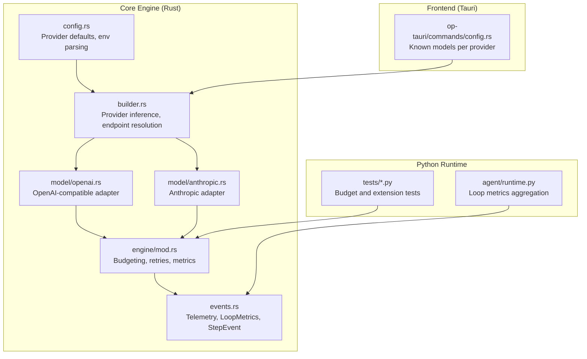
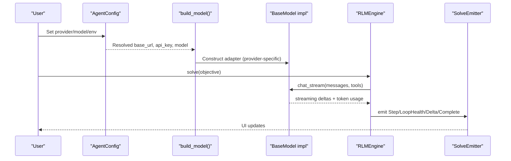
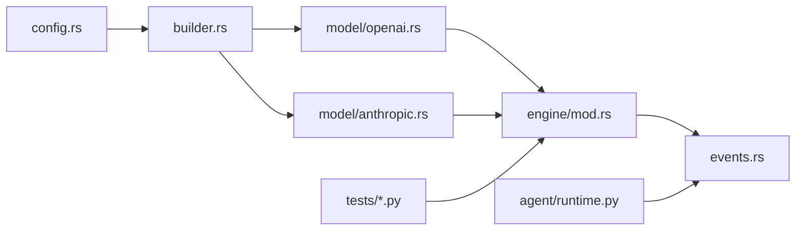

# Performance Optimization

<cite>
**Referenced Files in This Document**
- [config.rs](file://openplanter-desktop/crates/op-core/src/config.rs)
- [builder.rs](file://openplanter-desktop/crates/op-core/src/builder.rs)
- [engine/mod.rs](file://openplanter-desktop/crates/op-core/src/engine/mod.rs)
- [events.rs](file://openplanter-desktop/crates/op-core/src/events.rs)
- [openai.rs](file://openplanter-desktop/crates/op-core/src/model/openai.rs)
- [anthropic.rs](file://openplanter-desktop/crates/op-core/src/model/anthropic.rs)
- [config.rs](file://openplanter-desktop/crates/op-tauri/src/commands/config.rs)
- [runtime.py](file://agent/runtime.py)
- [test_engine.py](file://tests/test_engine.py)
- [test_engine_complex.py](file://tests/test_engine_complex.py)
- [timing_analysis.py](file://scripts/timing_analysis.py)
</cite>

## Table of Contents
1. [Introduction](#introduction)
2. [Project Structure](#project-structure)
3. [Core Components](#core-components)
4. [Architecture Overview](#architecture-overview)
5. [Detailed Component Analysis](#detailed-component-analysis)
6. [Dependency Analysis](#dependency-analysis)
7. [Performance Considerations](#performance-considerations)
8. [Troubleshooting Guide](#troubleshooting-guide)
9. [Conclusion](#conclusion)
10. [Appendices](#appendices)

## Introduction
This document provides a comprehensive guide to performance optimization for multi-provider AI environments in OpenPlanter. It focuses on maximizing efficiency across providers (Anthropic, OpenAI-compatible, OpenRouter, Cerebras, Z.AI, Ollama), covering model selection criteria, cost optimization, latency reduction, provider-specific tuning, token usage patterns, memory management, benchmarking, caching, load balancing, monitoring, profiling, bottleneck identification, scaling, and operational best practices.

## Project Structure
OpenPlanter’s performance-critical stack is primarily implemented in Rust for the core engine and model adapters, with Python utilities for research and analysis. Key areas relevant to performance:
- Configuration and provider resolution
- Model abstraction and provider adapters
- Engine orchestration and budget controls
- Telemetry and event streams for monitoring
- Python-side runtime and tests for budgeting and metrics

**Diagram sources**
- [config.rs:34-81](file://openplanter-desktop/crates/op-core/src/config.rs#L34-L81)
- [builder.rs:26-77](file://openplanter-desktop/crates/op-core/src/builder.rs#L26-L77)
- [engine/mod.rs:1-120](file://openplanter-desktop/crates/op-core/src/engine/mod.rs#L1-L120)
- [events.rs:39-61](file://openplanter-desktop/crates/op-core/src/events.rs#L39-L61)
- [openai.rs:31-95](file://openplanter-desktop/crates/op-core/src/model/openai.rs#L31-L95)
- [anthropic.rs:13-37](file://openplanter-desktop/crates/op-core/src/model/anthropic.rs#L13-L37)
- [config.rs:205-250](file://openplanter-desktop/crates/op-tauri/src/commands/config.rs#L205-L250)
- [runtime.py:963-973](file://agent/runtime.py#L963-L973)
- [test_engine.py:631-642](file://tests/test_engine.py#L631-L642)
- [test_engine_complex.py:70-93](file://tests/test_engine_complex.py#L70-L93)

**Section sources**
- [config.rs:34-81](file://openplanter-desktop/crates/op-core/src/config.rs#L34-L81)
- [builder.rs:26-77](file://openplanter-desktop/crates/op-core/src/builder.rs#L26-L77)
- [engine/mod.rs:1-120](file://openplanter-desktop/crates/op-core/src/engine/mod.rs#L1-L120)
- [events.rs:39-61](file://openplanter-desktop/crates/op-core/src/events.rs#L39-L61)
- [openai.rs:31-95](file://openplanter-desktop/crates/op-core/src/model/openai.rs#L31-L95)
- [anthropic.rs:13-37](file://openplanter-desktop/crates/op-core/src/model/anthropic.rs#L13-L37)
- [config.rs:205-250](file://openplanter-desktop/crates/op-tauri/src/commands/config.rs#L205-L250)
- [runtime.py:963-973](file://agent/runtime.py#L963-L973)
- [test_engine.py:631-642](file://tests/test_engine.py#L631-L642)
- [test_engine_complex.py:70-93](file://tests/test_engine_complex.py#L70-L93)

## Core Components
- Configuration and provider defaults: centralizes provider defaults, base URLs, API keys, and environment-driven normalization.
- Builder: resolves provider, validates model/provider compatibility, and constructs model instances with provider-specific headers and runtime tweaks.
- Engine: orchestrates solving loops, enforces budgets, applies rate-limit backoff, and aggregates metrics for monitoring.
- Events: defines telemetry structures (LoopMetrics, StepEvent) enabling performance monitoring and profiling.
- Model adapters: OpenAI-compatible and Anthropic implementations with streaming, token accounting, and provider-specific behavior.

Key performance-relevant elements:
- Rate-limit backoff and retry controls
- Budget extension policies and termination conditions
- Streaming token usage reporting
- Provider-specific headers and fallback base URLs
- Tier-based model selection and executor model promotion

**Section sources**
- [config.rs:254-437](file://openplanter-desktop/crates/op-core/src/config.rs#L254-L437)
- [builder.rs:234-282](file://openplanter-desktop/crates/op-core/src/builder.rs#L234-L282)
- [engine/mod.rs:415-483](file://openplanter-desktop/crates/op-core/src/engine/mod.rs#L415-L483)
- [events.rs:39-61](file://openplanter-desktop/crates/op-core/src/events.rs#L39-L61)
- [openai.rs:45-95](file://openplanter-desktop/crates/op-core/src/model/openai.rs#L45-L95)
- [anthropic.rs:138-193](file://openplanter-desktop/crates/op-core/src/model/anthropic.rs#L138-L193)

## Architecture Overview
The system routes objectives through a configurable pipeline:
- Configuration resolution selects provider and model, normalizes aliases, and sets base URLs/API keys.
- The builder validates compatibility and constructs the appropriate model adapter.
- The engine executes iterative solving with streaming deltas, enforcing budgets and rate limits.
- Events stream telemetry for monitoring and profiling.
- Frontend lists known models per provider and surfaces configuration.

**Diagram sources**
- [config.rs:440-674](file://openplanter-desktop/crates/op-core/src/config.rs#L440-L674)
- [builder.rs:234-282](file://openplanter-desktop/crates/op-core/src/builder.rs#L234-L282)
- [openai.rs:664-736](file://openplanter-desktop/crates/op-core/src/model/openai.rs#L664-L736)
- [anthropic.rs:195-460](file://openplanter-desktop/crates/op-core/src/model/anthropic.rs#L195-L460)
- [engine/mod.rs:133-248](file://openplanter-desktop/crates/op-core/src/engine/mod.rs#L133-L248)
- [events.rs:12-27](file://openplanter-desktop/crates/op-core/src/events.rs#L12-L27)

## Detailed Component Analysis

### Model Selection Criteria and Provider Resolution
- Provider inference uses regex heuristics to map model names to providers, with precedence for specific prefixes and keywords.
- Validation ensures model/provider compatibility, preventing misconfiguration.
- Endpoint resolution selects base URLs and API keys per provider, with special handling for Foundry and OAuth tokens.

Practical guidance:
- Prefer explicit provider/model combinations when mixing providers.
- Use environment variables to override defaults and enable provider switching without code changes.
- Normalize model aliases to canonical names to avoid ambiguity.

**Section sources**
- [builder.rs:26-77](file://openplanter-desktop/crates/op-core/src/builder.rs#L26-L77)
- [builder.rs:79-94](file://openplanter-desktop/crates/op-core/src/builder.rs#L79-L94)
- [builder.rs:118-152](file://openplanter-desktop/crates/op-core/src/builder.rs#L118-L152)
- [builder.rs:154-232](file://openplanter-desktop/crates/op-core/src/builder.rs#L154-L232)
- [config.rs:122-149](file://openplanter-desktop/crates/op-core/src/config.rs#L122-L149)

### Cost Optimization Techniques
- Environment-driven configuration enables selecting cheaper endpoints and models per provider.
- Reasoning effort controls reduce token usage for providers supporting thinking/budget tokens.
- Budget extension limits prevent runaway costs by gating additional steps.

Recommendations:
- Tune reasoning effort to balance quality and cost.
- Monitor token usage via streaming events and adjust prompts/messages to reduce input tokens.
- Use budget extension judiciously; enable caps to avoid excessive spending.

**Section sources**
- [config.rs:440-674](file://openplanter-desktop/crates/op-core/src/config.rs#L440-L674)
- [anthropic.rs:138-193](file://openplanter-desktop/crates/op-core/src/model/anthropic.rs#L138-L193)
- [engine/mod.rs:2264-2301](file://openplanter-desktop/crates/op-core/src/engine/mod.rs#L2264-L2301)

### Latency Reduction Strategies
- Streaming deltas minimize perceived latency by delivering incremental text and tool-call arguments.
- Rate-limit backoff with capped delays prevents stalls and reduces retry overhead.
- Provider-specific headers and fallback base URLs improve resilience and throughput.

Implementation tips:
- Enable streaming for interactive UIs.
- Configure retry caps and backoff parameters to balance reliability and responsiveness.
- Use provider-specific headers (e.g., OpenRouter referer) to optimize routing.

**Section sources**
- [openai.rs:476-661](file://openplanter-desktop/crates/op-core/src/model/openai.rs#L476-L661)
- [anthropic.rs:207-451](file://openplanter-desktop/crates/op-core/src/model/anthropic.rs#L207-L451)
- [engine/mod.rs:415-483](file://openplanter-desktop/crates/op-core/src/engine/mod.rs#L415-L483)

### Provider-Specific Optimizations
- Anthropic: supports adaptive thinking for Opus variants and budget tokens for others; disables temperature when thinking is enabled.
- OpenAI-compatible: includes tool-call streaming, thinking toggles, and provider-specific fallback base URLs for Z.AI.
- OpenRouter: injects referer/title headers for attribution and routing.
- Ollama: local endpoint with minimal overhead.

Best practices:
- For reasoning-heavy tasks, select models with built-in thinking support.
- For cost-sensitive tasks, disable thinking or reduce reasoning effort.
- Use provider-specific base URLs and headers to leverage routing and performance characteristics.

**Section sources**
- [anthropic.rs:138-193](file://openplanter-desktop/crates/op-core/src/model/anthropic.rs#L138-L193)
- [openai.rs:69-95](file://openplanter-desktop/crates/op-core/src/model/openai.rs#L69-L95)
- [openai.rs:209-222](file://openplanter-desktop/crates/op-core/src/model/openai.rs#L209-L222)
- [builder.rs:248-279](file://openplanter-desktop/crates/op-core/src/builder.rs#L248-L279)

### Token Usage Patterns and Memory Management
- Streaming adapters report input/output tokens per delta, enabling precise token accounting.
- Conversation compaction trims older tool results to keep context manageable.
- Budget extension and termination logic prevent unbounded growth.

Guidelines:
- Monitor input/output token counters in events to detect token bloat.
- Keep prompts concise and leverage summarization to reduce input tokens.
- Use compaction thresholds to cap context size.

**Section sources**
- [openai.rs:546-553](file://openplanter-desktop/crates/op-core/src/model/openai.rs#L546-L553)
- [anthropic.rs:416-423](file://openplanter-desktop/crates/op-core/src/model/anthropic.rs#L416-L423)
- [engine/mod.rs:391-413](file://openplanter-desktop/crates/op-core/src/engine/mod.rs#L391-L413)
- [engine/mod.rs:2264-2301](file://openplanter-desktop/crates/op-core/src/engine/mod.rs#L2264-L2301)

### Benchmarking Different Providers
- Use environment variables to switch providers/models and compare latency and token usage.
- Aggregate metrics via LoopMetrics and StepEvent to quantify differences.
- For statistical comparisons, apply permutation-style tests to timing data.

Example approach:
- Run identical objectives across providers and capture StepEvent.elapsed_ms and token usage.
- Compare distributions and significance to choose optimal provider/model for workload.

**Section sources**
- [events.rs:12-27](file://openplanter-desktop/crates/op-core/src/events.rs#L12-L27)
- [timing_analysis.py:95-157](file://scripts/timing_analysis.py#L95-L157)

### Caching Strategies
- Model factory caching avoids repeated construction of equivalent models.
- Budget extension evaluation caches decisions to reduce redundant checks.

Operational tips:
- Reuse model instances when switching only effort or minor parameters.
- Cache model factories keyed by (model_name, reasoning_effort) to avoid recreation.

**Section sources**
- [engine/mod.rs:1507-1531](file://openplanter-desktop/crates/op-core/src/engine/mod.rs#L1507-L1531)
- [runtime.py:2025-2046](file://agent/runtime.py#L2025-L2046)

### Load Balancing Across Providers
- Provider inference and endpoint resolution allow dynamic selection based on environment.
- Known models listing per provider helps surface options for load balancing UIs.

Approach:
- Maintain a ranked list of providers/models based on latency and cost.
- Route requests probabilistically or round-robin with health checks.

**Section sources**
- [builder.rs:118-152](file://openplanter-desktop/crates/op-core/src/builder.rs#L118-L152)
- [config.rs:205-250](file://openplanter-desktop/crates/op-tauri/src/commands/config.rs#L205-L250)

### Performance Monitoring and Profiling
- LoopMetrics tracks cumulative statistics across solving phases.
- StepEvent records per-step elapsed time and token usage.
- Runtime aggregates loop metrics across sessions.

Use cases:
- Identify phases with high elapsed time or token usage.
- Detect budget exhaustion or extension denials.
- Correlate metrics with user feedback for tuning.

**Section sources**
- [events.rs:39-61](file://openplanter-desktop/crates/op-core/src/events.rs#L39-L61)
- [events.rs:12-27](file://openplanter-desktop/crates/op-core/src/events.rs#L12-L27)
- [runtime.py:963-973](file://agent/runtime.py#L963-L973)

### Scaling Considerations and Resource Allocation
- Budget extension controls enable controlled scaling of steps per call.
- Termination reasons and stall detection prevent infinite loops.
- Rate-limit backoff and retry caps protect upstream providers.

Recommendations:
- Set conservative max_steps_per_call and budget_extension caps for production.
- Monitor termination_reason and extension denial counters to tune budgets.
- Apply backpressure via retry caps and jitter to avoid thundering herds.

**Section sources**
- [engine/mod.rs:2264-2301](file://openplanter-desktop/crates/op-core/src/engine/mod.rs#L2264-L2301)
- [engine/mod.rs:415-483](file://openplanter-desktop/crates/op-core/src/engine/mod.rs#L415-L483)
- [config.rs:440-674](file://openplanter-desktop/crates/op-core/src/config.rs#L440-L674)

## Dependency Analysis
Provider selection and model construction depend on configuration and builder logic. The engine consumes model outputs and emits telemetry. Tests validate budgeting and extension behavior.

**Diagram sources**
- [config.rs:440-674](file://openplanter-desktop/crates/op-core/src/config.rs#L440-L674)
- [builder.rs:234-282](file://openplanter-desktop/crates/op-core/src/builder.rs#L234-L282)
- [openai.rs:664-736](file://openplanter-desktop/crates/op-core/src/model/openai.rs#L664-L736)
- [anthropic.rs:195-460](file://openplanter-desktop/crates/op-core/src/model/anthropic.rs#L195-L460)
- [engine/mod.rs:133-248](file://openplanter-desktop/crates/op-core/src/engine/mod.rs#L133-L248)
- [events.rs:312-322](file://openplanter-desktop/crates/op-core/src/events.rs#L312-L322)
- [runtime.py:963-973](file://agent/runtime.py#L963-L973)
- [test_engine.py:631-642](file://tests/test_engine.py#L631-L642)
- [test_engine_complex.py:70-93](file://tests/test_engine_complex.py#L70-L93)

**Section sources**
- [config.rs:440-674](file://openplanter-desktop/crates/op-core/src/config.rs#L440-L674)
- [builder.rs:234-282](file://openplanter-desktop/crates/op-core/src/builder.rs#L234-L282)
- [engine/mod.rs:133-248](file://openplanter-desktop/crates/op-core/src/engine/mod.rs#L133-L248)
- [events.rs:312-322](file://openplanter-desktop/crates/op-core/src/events.rs#L312-L322)
- [runtime.py:963-973](file://agent/runtime.py#L963-L973)
- [test_engine.py:631-642](file://tests/test_engine.py#L631-L642)
- [test_engine_complex.py:70-93](file://tests/test_engine_complex.py#L70-L93)

## Performance Considerations
- Model selection: Choose models aligned with workload (reasoning vs. speed) and provider capabilities.
- Cost control: Use reasoning effort, prompt engineering, and budget caps.
- Latency: Favor streaming, tune backoff, and leverage provider-specific headers.
- Memory: Apply compaction and monitor token usage; avoid oversized contexts.
- Observability: Use LoopMetrics and StepEvent to profile and detect regressions.

[No sources needed since this section provides general guidance]

## Troubleshooting Guide
Common issues and remedies:
- Rate limiting: Backoff and retry logic automatically handles provider rate limits; inspect LoopMetrics and error traces for retry patterns.
- Budget exhaustion: Review termination_reason and extension denial counters; adjust budget_extension parameters.
- Streaming failures: Check SSE timeouts and provider error messages; enable fallback base URLs for Z.AI.
- Misconfigured provider/model: Use validation and provider inference to ensure compatibility.

**Section sources**
- [engine/mod.rs:415-483](file://openplanter-desktop/crates/op-core/src/engine/mod.rs#L415-L483)
- [engine/mod.rs:2264-2301](file://openplanter-desktop/crates/op-core/src/engine/mod.rs#L2264-L2301)
- [openai.rs:404-474](file://openplanter-desktop/crates/op-core/src/model/openai.rs#L404-L474)
- [builder.rs:79-94](file://openplanter-desktop/crates/op-core/src/builder.rs#L79-L94)

## Conclusion
OpenPlanter’s multi-provider architecture offers robust levers for performance optimization. By combining environment-driven configuration, careful model selection, streaming telemetry, and disciplined budgeting, teams can achieve low-latency, cost-effective, and scalable AI workflows across providers.

[No sources needed since this section summarizes without analyzing specific files]

## Appendices

### Practical Benchmarks and Comparisons
- Use environment variables to toggle providers and models.
- Capture StepEvent.elapsed_ms and token usage to compare providers.
- Apply statistical tests to timing data for significance.

**Section sources**
- [timing_analysis.py:95-157](file://scripts/timing_analysis.py#L95-L157)