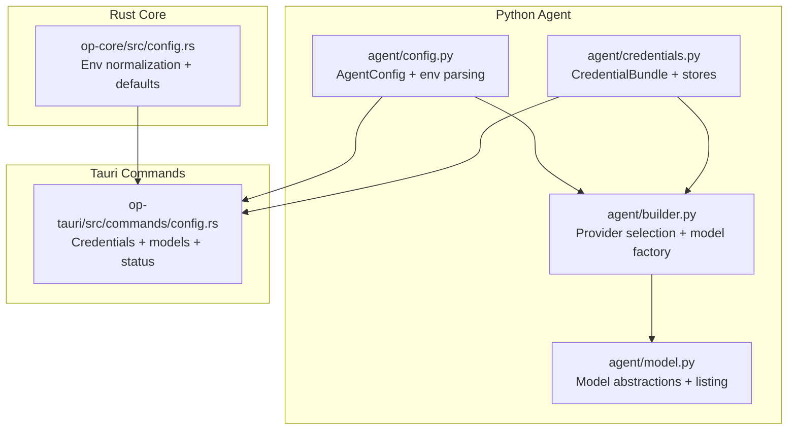
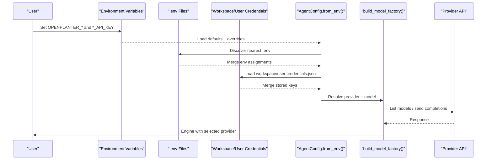
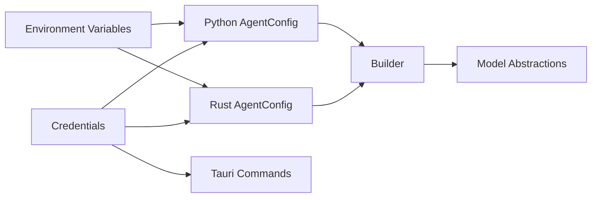

# Provider Configuration

<cite>
**Referenced Files in This Document**
- [README.md](file://README.md)
- [agent/config.py](file://agent/config.py)
- [agent/credentials.py](file://agent/credentials.py)
- [agent/builder.py](file://agent/builder.py)
- [agent/model.py](file://agent/model.py)
- [openplanter-desktop/crates/op-core/src/config.rs](file://openplanter-desktop/crates/op-core/src/config.rs)
- [openplanter-desktop/crates/op-tauri/src/commands/config.rs](file://openplanter-desktop/crates/op-tauri/src/commands/config.rs)
</cite>

## Table of Contents
1. [Introduction](#introduction)
2. [Project Structure](#project-structure)
3. [Core Components](#core-components)
4. [Architecture Overview](#architecture-overview)
5. [Detailed Component Analysis](#detailed-component-analysis)
6. [Dependency Analysis](#dependency-analysis)
7. [Performance Considerations](#performance-considerations)
8. [Troubleshooting Guide](#troubleshooting-guide)
9. [Conclusion](#conclusion)

## Introduction
This document explains how OpenPlanter manages multiple AI providers (OpenAI, Anthropic, OpenRouter, Cerebras, Z.AI, and Ollama). It covers configuration systems, environment variable handling, provider selection logic, credential storage patterns, authentication methods, endpoint customization, fallback strategies, and security considerations for production deployments.

## Project Structure
OpenPlanter provides a unified configuration system across both the Python CLI agent and the Tauri desktop application:
- Python agent: configuration dataclass, credential parsing, and model factory logic
- Rust core: environment-based configuration normalization and provider constants
- Tauri commands: credential persistence, runtime fallbacks, and model listing

**Diagram sources**
- [agent/config.py:146-495](file://agent/config.py#L146-L495)
- [agent/credentials.py:12-424](file://agent/credentials.py#L12-L424)
- [agent/builder.py:12-351](file://agent/builder.py#L12-L351)
- [agent/model.py:609-771](file://agent/model.py#L609-L771)
- [openplanter-desktop/crates/op-core/src/config.rs:254-675](file://openplanter-desktop/crates/op-core/src/config.rs#L254-L675)
- [openplanter-desktop/crates/op-tauri/src/commands/config.rs:19-532](file://openplanter-desktop/crates/op-tauri/src/commands/config.rs#L19-L532)

**Section sources**
- [README.md:92-178](file://README.md#L92-L178)
- [agent/config.py:146-495](file://agent/config.py#L146-L495)
- [agent/credentials.py:12-424](file://agent/credentials.py#L12-L424)
- [agent/builder.py:12-351](file://agent/builder.py#L12-L351)
- [agent/model.py:609-771](file://agent/model.py#L609-L771)
- [openplanter-desktop/crates/op-core/src/config.rs:254-675](file://openplanter-desktop/crates/op-core/src/config.rs#L254-L675)
- [openplanter-desktop/crates/op-tauri/src/commands/config.rs:19-532](file://openplanter-desktop/crates/op-tauri/src/commands/config.rs#L19-L532)

## Core Components
- AgentConfig: central configuration dataclass with provider defaults, base URLs, API keys, and environment variable mappings
- CredentialBundle: structured storage for provider credentials with merge and persistence helpers
- Provider selection and model factory: inference of provider from model names, validation, and model instantiation
- Model listing and streaming: provider-specific model discovery and OpenAI-compatible streaming

Key provider defaults and endpoints:
- OpenAI: default base URL points to Azure Foundry proxy; supports API key or ChatGPT OAuth token
- Anthropic: default base URL points to Anthropic Foundry proxy; supports API key
- OpenRouter: OpenAI-compatible with custom base URL and special headers
- Cerebras: OpenAI-compatible base URL
- Z.AI: dual endpoint plan selection (PAYGO vs Coding) with plan-aware base URL resolution
- Ollama: local endpoint with no API key required

**Section sources**
- [agent/config.py:32-39](file://agent/config.py#L32-L39)
- [agent/config.py:146-235](file://agent/config.py#L146-L235)
- [agent/config.py:262-495](file://agent/config.py#L262-L495)
- [openplanter-desktop/crates/op-core/src/config.rs:34-45](file://openplanter-desktop/crates/op-core/src/config.rs#L34-L45)
- [openplanter-desktop/crates/op-core/src/config.rs:254-347](file://openplanter-desktop/crates/op-core/src/config.rs#L254-L347)
- [openplanter-desktop/crates/op-tauri/src/commands/config.rs:205-260](file://openplanter-desktop/crates/op-tauri/src/commands/config.rs#L205-L260)

## Architecture Overview
The configuration pipeline resolves credentials and provider settings from highest-priority sources to lowest, then constructs models and engines accordingly.

**Diagram sources**
- [agent/config.py:262-495](file://agent/config.py#L262-L495)
- [agent/credentials.py:180-278](file://agent/credentials.py#L180-L278)
- [agent/credentials.py:304-321](file://agent/credentials.py#L304-L321)
- [openplanter-desktop/crates/op-tauri/src/commands/config.rs:357-373](file://openplanter-desktop/crates/op-tauri/src/commands/config.rs#L357-L373)

**Section sources**
- [README.md:363-374](file://README.md#L363-L374)
- [agent/config.py:262-495](file://agent/config.py#L262-L495)
- [agent/credentials.py:180-278](file://agent/credentials.py#L180-L278)
- [agent/credentials.py:304-321](file://agent/credentials.py#L304-L321)
- [openplanter-desktop/crates/op-tauri/src/commands/config.rs:357-373](file://openplanter-desktop/crates/op-tauri/src/commands/config.rs#L357-L373)

## Detailed Component Analysis

### Configuration Dataclass (AgentConfig)
- Defines provider defaults, base URLs, and API key fields for all supported providers
- Normalizes environment variables and applies provider-specific rules (e.g., Foundry proxies)
- Supports OpenAI OAuth token fallback and Z.AI plan-aware base URL resolution

Provider defaults and base URLs:
- OpenAI default model: azure-foundry/gpt-5.4
- Anthropic default model: anthropic-foundry/claude-opus-4-6
- OpenRouter default base URL: https://openrouter.ai/api/v1
- Cerebras default base URL: https://api.cerebras.ai/v1
- Z.AI default base URL: PAYGO plan endpoint
- Ollama default base URL: http://localhost:11434/v1

Environment variable mappings:
- OPENPLANTER_*_API_KEY and *_API_KEY for each provider
- OPENPLANTER_*_BASE_URL for provider endpoints
- OPENPLANTER_ZAI_PLAN selects PAYGO or Coding plan
- OPENPLANTER_ZAI_BASE_URL overrides both plans

**Section sources**
- [agent/config.py:32-39](file://agent/config.py#L32-L39)
- [agent/config.py:146-235](file://agent/config.py#L146-L235)
- [agent/config.py:262-495](file://agent/config.py#L262-L495)
- [openplanter-desktop/crates/op-core/src/config.rs:34-45](file://openplanter-desktop/crates/op-core/src/config.rs#L34-L45)
- [openplanter-desktop/crates/op-core/src/config.rs:254-347](file://openplanter-desktop/crates/op-core/src/config.rs#L254-L347)

### Credential Management
- CredentialBundle holds provider keys and merges missing values from other sources
- Workspace and user credential stores persist keys to JSON with restrictive permissions
- Environment and .env file parsing supports both prefixed and unprefixed keys

Credential storage patterns:
- Workspace store: .openplanter/credentials.json
- User store: ~/.openplanter/credentials.json
- Priority: CLI flags > environment variables > .env files > workspace store > user store

**Section sources**
- [agent/credentials.py:12-88](file://agent/credentials.py#L12-L88)
- [agent/credentials.py:180-278](file://agent/credentials.py#L180-L278)
- [agent/credentials.py:304-351](file://agent/credentials.py#L304-L351)
- [openplanter-desktop/crates/op-tauri/src/commands/config.rs:506-522](file://openplanter-desktop/crates/op-tauri/src/commands/config.rs#L506-L522)

### Provider Selection Logic
- Model inference identifies provider by model name prefixes and patterns
- Provider selection validates compatibility and raises errors for mismatches
- Auto-selection prefers configured providers; otherwise falls back to Anthropic

Selection rules:
- OpenAI: azure-foundry/... or OpenAI-like names
- Anthropic: anthropic-foundry/... or Claude-like names
- OpenRouter: names with "/" separator
- Cerebras: Qwen/Llama Cerebras patterns
- Z.AI: GLM/Z.AI patterns
- Ollama: common model names

**Section sources**
- [agent/builder.py:36-67](file://agent/builder.py#L36-L67)
- [agent/builder.py:70-82](file://agent/builder.py#L70-L82)
- [agent/__main__.py:234-250](file://agent/__main__.py#L234-L250)

### Authentication Methods and Endpoints
- OpenAI: API key or ChatGPT OAuth token; Foundry proxy support
- Anthropic: API key; Foundry proxy support
- OpenRouter: API key; custom base URL with special headers
- Cerebras: API key; OpenAI-compatible base URL
- Z.AI: API key; plan-aware base URL (PAYGO/Coding) with override capability
- Ollama: local endpoint with no API key

Endpoint customization:
- OPENPLANTER_*_BASE_URL for each provider
- Z.AI base URL resolution based on plan or explicit override
- Ollama base URL defaults to localhost

**Section sources**
- [agent/config.py:104-134](file://agent/config.py#L104-L134)
- [agent/config.py:83-89](file://agent/config.py#L83-L89)
- [openplanter-desktop/crates/op-core/src/config.rs:194-240](file://openplanter-desktop/crates/op-core/src/config.rs#L194-L240)
- [openplanter-desktop/crates/op-core/src/config.rs:83-89](file://openplanter-desktop/crates/op-core/src/config.rs#L83-L89)
- [openplanter-desktop/crates/op-tauri/src/commands/config.rs:329-355](file://openplanter-desktop/crates/op-tauri/src/commands/config.rs#L329-L355)

### Model Listing and Streaming
- Provider-specific model listing functions for OpenAI, Anthropic, OpenRouter, Cerebras, Z.AI, and Ollama
- OpenAI-compatible streaming with SSE, retry logic, and rate-limit handling
- Special handling for reasoning models and thinking modes

Streaming characteristics:
- First-byte timeouts and extended timeouts for SSE streams
- Retry counts configurable per provider (e.g., Z.AI stream retries)
- Rate limit backoff and jitter for robustness

**Section sources**
- [agent/model.py:609-771](file://agent/model.py#L609-L771)
- [agent/model.py:819-965](file://agent/model.py#L819-L965)
- [agent/model.py:1048-1187](file://agent/model.py#L1048-L1187)
- [openplanter-desktop/crates/op-tauri/src/commands/config.rs:205-260](file://openplanter-desktop/crates/op-tauri/src/commands/config.rs#L205-L260)

### Practical Configuration Examples
- OpenAI with OAuth token fallback:
  - Set OPENAI_OAUTH_TOKEN or OPENPLANTER_OPENAI_OAUTH_TOKEN
  - Optionally set OPENPLANTER_OPENAI_BASE_URL to Foundry proxy
- Anthropic with API key:
  - Set ANTHROPIC_API_KEY or OPENPLANTER_ANTHROPIC_API_KEY
  - Optionally set OPENPLANTER_ANTHROPIC_BASE_URL
- OpenRouter with custom base URL:
  - Set OPENROUTER_API_KEY and OPENPLANTER_OPENROUTER_BASE_URL
- Cerebras with API key:
  - Set CEREBRAS_API_KEY and OPENPLANTER_CEREBRAS_BASE_URL
- Z.AI with plan selection:
  - Set ZAI_API_KEY and OPENPLANTER_ZAI_PLAN=paygo or coding
  - Override base URL with OPENPLANTER_ZAI_BASE_URL
- Ollama with local endpoint:
  - No API key required; set OPENPLANTER_OLLAMA_BASE_URL if not default

**Section sources**
- [README.md:92-178](file://README.md#L92-L178)
- [agent/config.py:262-495](file://agent/config.py#L262-L495)
- [openplanter-desktop/crates/op-core/src/config.rs:441-675](file://openplanter-desktop/crates/op-core/src/config.rs#L441-L675)

## Dependency Analysis
The configuration system exhibits clear separation of concerns:
- Python AgentConfig encapsulates provider defaults and environment parsing
- Rust AgentConfig mirrors Python fields and normalizes environment variables
- Tauri commands coordinate credential persistence, runtime fallbacks, and model listing
- Builder module orchestrates provider selection and model instantiation

**Diagram sources**
- [agent/config.py:262-495](file://agent/config.py#L262-L495)
- [openplanter-desktop/crates/op-core/src/config.rs:441-675](file://openplanter-desktop/crates/op-core/src/config.rs#L441-L675)
- [agent/builder.py:157-233](file://agent/builder.py#L157-L233)
- [openplanter-desktop/crates/op-tauri/src/commands/config.rs:357-373](file://openplanter-desktop/crates/op-tauri/src/commands/config.rs#L357-L373)

**Section sources**
- [agent/config.py:262-495](file://agent/config.py#L262-L495)
- [openplanter-desktop/crates/op-core/src/config.rs:441-675](file://openplanter-desktop/crates/op-core/src/config.rs#L441-L675)
- [agent/builder.py:157-233](file://agent/builder.py#L157-L233)
- [openplanter-desktop/crates/op-tauri/src/commands/config.rs:357-373](file://openplanter-desktop/crates/op-tauri/src/commands/config.rs#L357-L373)

## Performance Considerations
- Streaming timeouts: first-byte and stream timeouts vary by provider (e.g., Ollama uses extended first-byte timeout)
- Retry strategies: rate limit backoff and jitter; Z.AI stream retries configurable
- Model listing caching: consider caching provider model lists to reduce repeated API calls
- Environment parsing overhead: minimize repeated .env scanning by resolving once at startup

[No sources needed since this section provides general guidance]

## Troubleshooting Guide
Common configuration issues and resolutions:
- Missing provider key:
  - Symptom: ModelError indicating provider not configured
  - Resolution: Set *_API_KEY or *_BASE_URL; verify OPENPLANTER_*_BASE_URL if overriding
- Provider/model mismatch:
  - Symptom: ModelError about inferred provider mismatch
  - Resolution: Use correct provider flag or select a compatible model
- Z.AI endpoint plan confusion:
  - Symptom: Unexpected base URL behavior
  - Resolution: Set OPENPLANTER_ZAI_PLAN or OPENPLANTER_ZAI_BASE_URL explicitly
- Ollama connectivity:
  - Symptom: Slow first request or connection errors
  - Resolution: Verify OPENPLANTER_OLLAMA_BASE_URL; ensure Ollama is running locally
- Credential precedence:
  - Symptom: Keys not taking effect
  - Resolution: Confirm priority order and clear conflicting sources

Security considerations:
- Restrict file permissions on credentials.json
- Prefer environment variables over plaintext files
- Avoid committing secrets to version control
- Use provider-specific base URLs and keys per environment

**Section sources**
- [agent/builder.py:70-82](file://agent/builder.py#L70-L82)
- [agent/builder.py:84-139](file://agent/builder.py#L84-L139)
- [agent/model.py:183-216](file://agent/model.py#L183-L216)
- [openplanter-desktop/crates/op-tauri/src/commands/config.rs:329-355](file://openplanter-desktop/crates/op-tauri/src/commands/config.rs#L329-L355)
- [README.md:363-374](file://README.md#L363-L374)

## Conclusion
OpenPlanter’s provider configuration system offers flexible, layered credential management, robust provider selection, and extensive endpoint customization. By leveraging environment variables, workspace/user credential stores, and explicit overrides, teams can configure multiple providers securely and reliably. The included fallback strategies and streaming resilience help maintain productivity in diverse deployment environments.