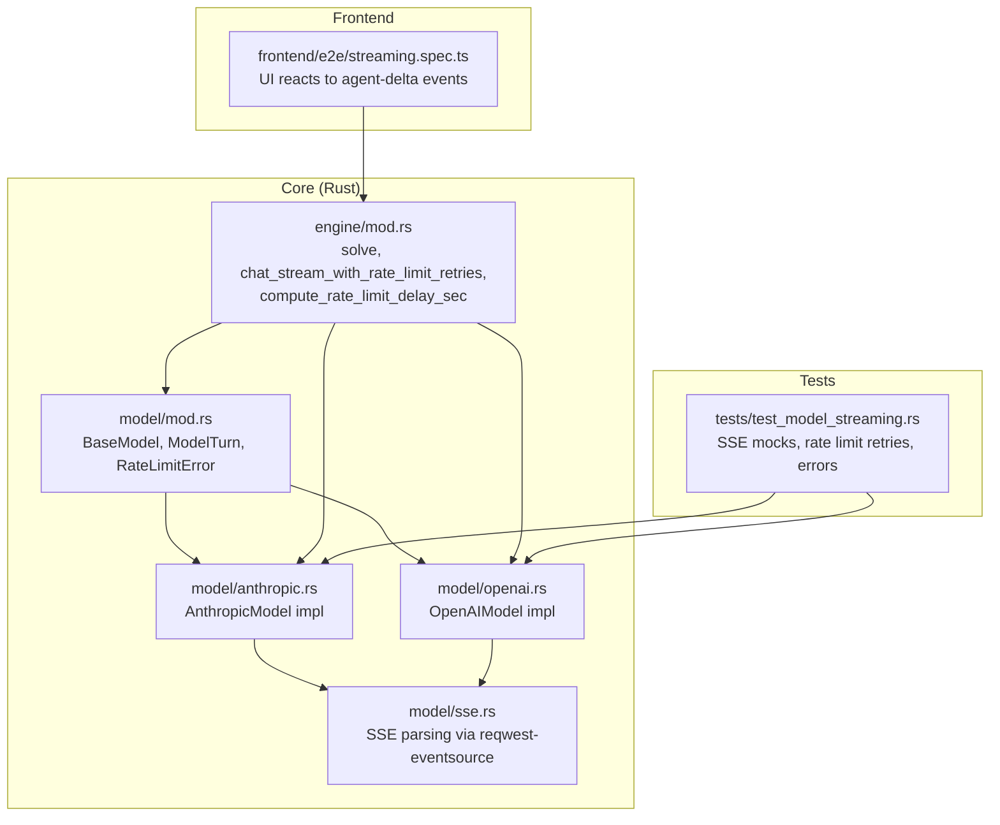
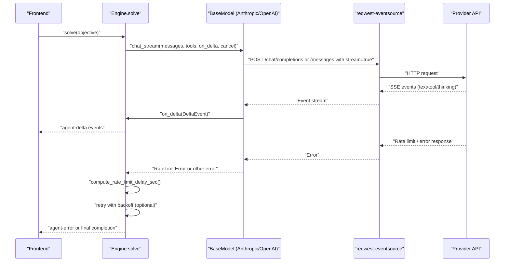
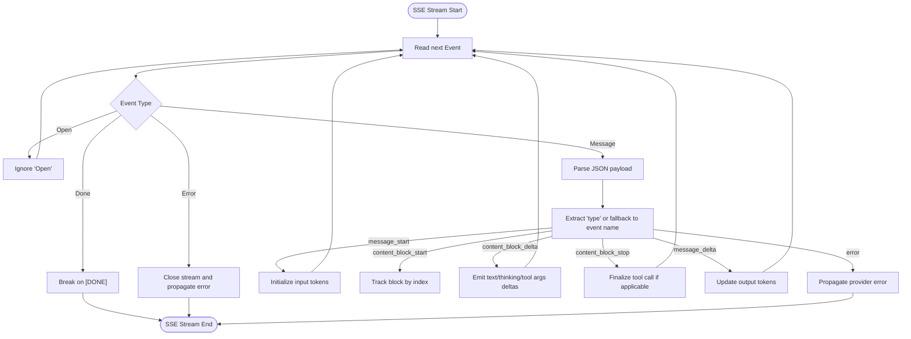
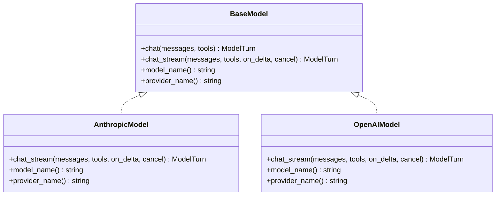
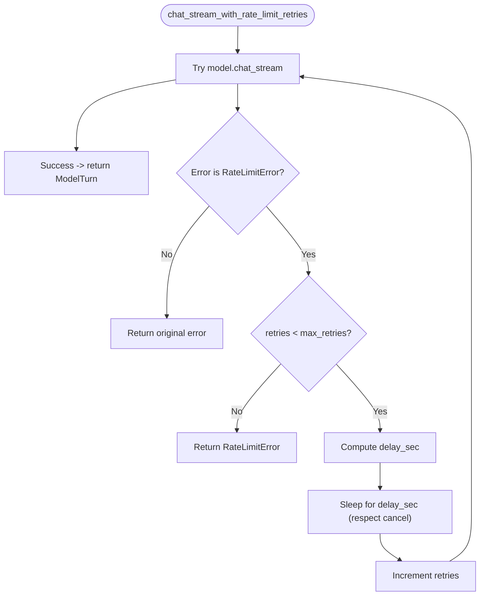
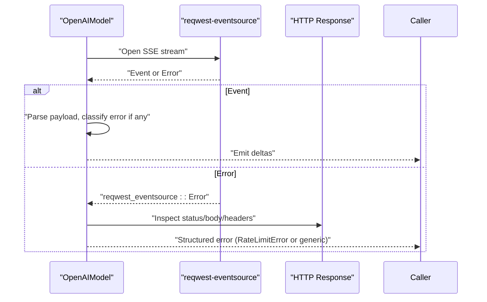
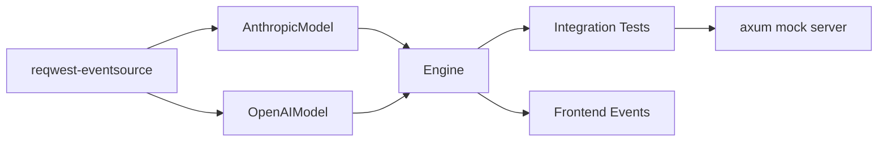

# Streaming and Rate Limiting

<cite>
**Referenced Files in This Document**
- [sse.rs](file://openplanter-desktop/crates/op-core/src/model/sse.rs)
- [mod.rs](file://openplanter-desktop/crates/op-core/src/model/mod.rs)
- [anthropic.rs](file://openplanter-desktop/crates/op-core/src/model/anthropic.rs)
- [openai.rs](file://openplanter-desktop/crates/op-core/src/model/openai.rs)
- [mod.rs](file://openplanter-desktop/crates/op-core/src/engine/mod.rs)
- [test_model_streaming.rs](file://openplanter-desktop/crates/op-core/tests/test_model_streaming.rs)
- [streaming.spec.ts](file://openplanter-desktop/frontend/e2e/streaming.spec.ts)
</cite>

## Table of Contents
1. [Introduction](#introduction)
2. [Project Structure](#project-structure)
3. [Core Components](#core-components)
4. [Architecture Overview](#architecture-overview)
5. [Detailed Component Analysis](#detailed-component-analysis)
6. [Dependency Analysis](#dependency-analysis)
7. [Performance Considerations](#performance-considerations)
8. [Troubleshooting Guide](#troubleshooting-guide)
9. [Conclusion](#conclusion)

## Introduction
This document explains the streaming and rate limiting mechanisms used to handle real-time model responses and manage provider limitations. It covers:
- SSE (Server-Sent Events) implementation and event processing
- Response reconstruction for different providers (Anthropic Messages API and OpenAI-compatible APIs)
- Rate limiting detection, classification, and retry strategies
- Practical handling of timeouts, connection failures, and provider-specific rate limit headers
- HTTP error handling, retry logic, and graceful degradation patterns
- Monitoring provider quotas, implementing backoff, and optimizing streaming performance for large responses

## Project Structure
The streaming and rate limiting logic is primarily implemented in the Rust core crate under the model and engine modules, with tests validating end-to-end behavior and frontend tests verifying UI reactions to streaming events.

**Diagram sources**
- [mod.rs:1-85](file://openplanter-desktop/crates/op-core/src/model/mod.rs#L1-L85)
- [sse.rs:1-2](file://openplanter-desktop/crates/op-core/src/model/sse.rs#L1-L2)
- [anthropic.rs:1-685](file://openplanter-desktop/crates/op-core/src/model/anthropic.rs#L1-L685)
- [openai.rs:1-988](file://openplanter-desktop/crates/op-core/src/model/openai.rs#L1-L988)
- [mod.rs:415-483](file://openplanter-desktop/crates/op-core/src/engine/mod.rs#L415-L483)
- [test_model_streaming.rs:1-2534](file://openplanter-desktop/crates/op-core/tests/test_model_streaming.rs#L1-L2534)
- [streaming.spec.ts:1-349](file://openplanter-desktop/frontend/e2e/streaming.spec.ts#L1-L349)

**Section sources**
- [mod.rs:1-85](file://openplanter-desktop/crates/op-core/src/model/mod.rs#L1-L85)
- [sse.rs:1-2](file://openplanter-desktop/crates/op-core/src/model/sse.rs#L1-L2)
- [anthropic.rs:1-685](file://openplanter-desktop/crates/op-core/src/model/anthropic.rs#L1-L685)
- [openai.rs:1-988](file://openplanter-desktop/crates/op-core/src/model/openai.rs#L1-L988)
- [mod.rs:415-483](file://openplanter-desktop/crates/op-core/src/engine/mod.rs#L415-L483)
- [test_model_streaming.rs:1-2534](file://openplanter-desktop/crates/op-core/tests/test_model_streaming.rs#L1-L2534)
- [streaming.spec.ts:1-349](file://openplanter-desktop/frontend/e2e/streaming.spec.ts#L1-L349)

## Core Components
- BaseModel trait defines the contract for model implementations, including synchronous and streaming chat methods with cancellation support.
- ModelTurn encapsulates reconstructed text, optional thinking content, tool calls, and token usage.
- RateLimitError carries structured rate limit information including status code, provider code, raw body, and retry-after seconds.
- AnthropicModel and OpenAIModel implement streaming via SSE, reconstructing deltas into ModelTurn and emitting DeltaEvent callbacks.
- Engine integrates rate limiting retries and computes backoff delays based on configuration and provider signals.

Key responsibilities:
- SSE parsing and streaming lifecycle are handled by reqwest-eventsource.
- Provider-specific message/event formats are normalized into unified DeltaEvent and ModelTurn structures.
- Rate limiting is detected, classified, and retried with exponential backoff and configurable caps.

**Section sources**
- [mod.rs:60-85](file://openplanter-desktop/crates/op-core/src/model/mod.rs#L60-L85)
- [anthropic.rs:196-460](file://openplanter-desktop/crates/op-core/src/model/anthropic.rs#L196-L460)
- [openai.rs:664-736](file://openplanter-desktop/crates/op-core/src/model/openai.rs#L664-L736)
- [mod.rs:415-483](file://openplanter-desktop/crates/op-core/src/engine/mod.rs#L415-L483)

## Architecture Overview
The streaming pipeline connects the engine’s solve loop to provider-specific model implementations, which in turn use SSE to stream chunks. The engine coordinates retries and backoff on rate limits.

**Diagram sources**
- [mod.rs:432-483](file://openplanter-desktop/crates/op-core/src/engine/mod.rs#L432-L483)
- [anthropic.rs:207-451](file://openplanter-desktop/crates/op-core/src/model/anthropic.rs#L207-L451)
- [openai.rs:476-661](file://openplanter-desktop/crates/op-core/src/model/openai.rs#L476-L661)
- [test_model_streaming.rs:847-904](file://openplanter-desktop/crates/op-core/tests/test_model_streaming.rs#L847-L904)

## Detailed Component Analysis

### SSE Implementation and Event Processing
- SSE parsing is delegated to reqwest-eventsource, which exposes an iterator over server-sent events. The model implementations wrap this to process provider-specific event formats.
- Anthropic uses the Messages API with SSE, emitting message_start, content_block_start/delta/stop, message_delta, and message_stop events. The implementation reconstructs text, thinking, and tool call arguments into ModelTurn.
- OpenAI-compatible APIs emit data chunks ending with [DONE]; the implementation parses choices deltas for content, reasoning/thinking, and tool_calls arrays, reconstructing tool call arguments by index.

**Diagram sources**
- [anthropic.rs:242-438](file://openplanter-desktop/crates/op-core/src/model/anthropic.rs#L242-L438)
- [openai.rs:520-636](file://openplanter-desktop/crates/op-core/src/model/openai.rs#L520-L636)

**Section sources**
- [sse.rs:1-2](file://openplanter-desktop/crates/op-core/src/model/sse.rs#L1-L2)
- [anthropic.rs:207-451](file://openplanter-desktop/crates/op-core/src/model/anthropic.rs#L207-L451)
- [openai.rs:476-661](file://openplanter-desktop/crates/op-core/src/model/openai.rs#L476-L661)

### Response Reconstruction and Delta Emission
- Anthropic:
  - Tracks content blocks by index to reconstruct tool call arguments incrementally.
  - Emits DeltaKind::Text, DeltaKind::Thinking, DeltaKind::ToolCallStart, and DeltaKind::ToolCallArgs.
  - Builds ModelTurn with text, optional thinking, collected tool calls, and input/output tokens.
- OpenAI-compatible:
  - Aggregates tool_calls deltas by index and emits corresponding deltas.
  - Emits reasoning/thinking deltas under multiple recognized field names.
  - Builds ModelTurn with text, optional thinking, collected tool calls, and usage fields.

**Diagram sources**
- [mod.rs:60-85](file://openplanter-desktop/crates/op-core/src/model/mod.rs#L60-L85)
- [anthropic.rs:196-460](file://openplanter-desktop/crates/op-core/src/model/anthropic.rs#L196-L460)
- [openai.rs:664-736](file://openplanter-desktop/crates/op-core/src/model/openai.rs#L664-L736)

**Section sources**
- [anthropic.rs:232-451](file://openplanter-desktop/crates/op-core/src/model/anthropic.rs#L232-L451)
- [openai.rs:494-661](file://openplanter-desktop/crates/op-core/src/model/openai.rs#L494-L661)

### Rate Limiting Detection, Classification, and Retries
- RateLimitError captures structured rate limit information: message, status_code, provider_code, body, and retry_after_sec.
- OpenAIModel extracts provider codes and retry-after values from both JSON payloads and HTTP headers, classifying various forms of rate limit errors.
- Engine wraps model chat_stream with chat_stream_with_rate_limit_retries:
  - Detects RateLimitError and computes delay using compute_rate_limit_delay_sec.
  - Applies exponential backoff capped by configuration, with optional jitter-like behavior via sleep.
  - Limits total retries by configuration and re-emits trace events indicating retry attempts.

**Diagram sources**
- [mod.rs:432-483](file://openplanter-desktop/crates/op-core/src/engine/mod.rs#L432-L483)
- [mod.rs:415-431](file://openplanter-desktop/crates/op-core/src/engine/mod.rs#L415-L431)
- [openai.rs:349-474](file://openplanter-desktop/crates/op-core/src/model/openai.rs#L349-L474)

**Section sources**
- [mod.rs:11-20](file://openplanter-desktop/crates/op-core/src/model/mod.rs#L11-L20)
- [openai.rs:349-474](file://openplanter-desktop/crates/op-core/src/model/openai.rs#L349-L474)
- [mod.rs:415-483](file://openplanter-desktop/crates/op-core/src/engine/mod.rs#L415-L483)

### HTTP Error Handling and Graceful Degradation
- OpenAIModel classifies invalid status codes and SSE errors, extracting structured messages, provider codes, and retry-after values from headers or JSON payloads.
- Tests demonstrate handling of HTTP 401, 429 with retry-after headers, and provider-specific codes, ensuring errors propagate with sufficient context.
- Frontend reacts to agent-delta events and step summaries, displaying thinking, streaming text, and tool execution states.

**Diagram sources**
- [openai.rs:404-474](file://openplanter-desktop/crates/op-core/src/model/openai.rs#L404-L474)
- [openai.rs:476-661](file://openplanter-desktop/crates/op-core/src/model/openai.rs#L476-L661)
- [test_model_streaming.rs:433-514](file://openplanter-desktop/crates/op-core/tests/test_model_streaming.rs#L433-L514)
- [streaming.spec.ts:145-260](file://openplanter-desktop/frontend/e2e/streaming.spec.ts#L145-L260)

**Section sources**
- [openai.rs:404-474](file://openplanter-desktop/crates/op-core/src/model/openai.rs#L404-L474)
- [test_model_streaming.rs:433-514](file://openplanter-desktop/crates/op-core/tests/test_model_streaming.rs#L433-L514)
- [streaming.spec.ts:145-260](file://openplanter-desktop/frontend/e2e/streaming.spec.ts#L145-L260)

### Practical Examples and Patterns
- Timeouts: Anthropic streaming enforces a 120-second timeout on SSE reads; on timeout, the stream is closed and an error is returned.
- Connection failures and provider-specific headers: Tests simulate 429 with retry-after headers and provider codes, verifying structured RateLimitError propagation and subsequent retries.
- Multi-step loop integration: Tests demonstrate a stateful mock server returning tool calls followed by a final answer, validating the full agentic loop with streaming deltas and step summaries.

**Section sources**
- [anthropic.rs:254-263](file://openplanter-desktop/crates/op-core/src/model/anthropic.rs#L254-L263)
- [test_model_streaming.rs:847-904](file://openplanter-desktop/crates/op-core/tests/test_model_streaming.rs#L847-L904)
- [test_model_streaming.rs:1062-1114](file://openplanter-desktop/crates/op-core/tests/test_model_streaming.rs#L1062-L1114)

## Dependency Analysis
- AnthropicModel depends on reqwest-eventsource for SSE and emits provider-specific events.
- OpenAIModel depends on reqwest-eventsource and normalizes diverse provider formats into unified deltas.
- Engine depends on both model implementations and orchestrates retries and backoff.
- Tests depend on axum to mock SSE endpoints and HTTP servers, asserting end-to-end behavior.

**Diagram sources**
- [anthropic.rs:6-7](file://openplanter-desktop/crates/op-core/src/model/anthropic.rs#L6-L7)
- [openai.rs:11-11](file://openplanter-desktop/crates/op-core/src/model/openai.rs#L11-L11)
- [mod.rs:432-483](file://openplanter-desktop/crates/op-core/src/engine/mod.rs#L432-L483)
- [test_model_streaming.rs:44-82](file://openplanter-desktop/crates/op-core/tests/test_model_streaming.rs#L44-L82)
- [streaming.spec.ts:75-114](file://openplanter-desktop/frontend/e2e/streaming.spec.ts#L75-L114)

**Section sources**
- [anthropic.rs:6-7](file://openplanter-desktop/crates/op-core/src/model/anthropic.rs#L6-L7)
- [openai.rs:11-11](file://openplanter-desktop/crates/op-core/src/model/openai.rs#L11-L11)
- [mod.rs:432-483](file://openplanter-desktop/crates/op-core/src/engine/mod.rs#L432-L483)
- [test_model_streaming.rs:44-82](file://openplanter-desktop/crates/op-core/tests/test_model_streaming.rs#L44-L82)
- [streaming.spec.ts:75-114](file://openplanter-desktop/frontend/e2e/streaming.spec.ts#L75-L114)

## Performance Considerations
- Streaming reconstruction:
  - Anthropic tracks content blocks by index to reconstruct tool call arguments incrementally, minimizing memory overhead.
  - OpenAI-compatible tool_calls are aggregated by index to preserve argument order and reduce re-parsing.
- Backpressure and cancellation:
  - Both implementations poll cancellation tokens and close SSE streams promptly upon cancellation.
  - Engine respects cancellation during sleep intervals to avoid unnecessary waits.
- Timeout handling:
  - Anthropic enforces a strict SSE read timeout to prevent indefinite hangs.
- Large responses:
  - Frontend tests validate long streamed previews and tool call arguments without breaking layout, indicating robust rendering under heavy content.

[No sources needed since this section provides general guidance]

## Troubleshooting Guide
Common scenarios and remedies:
- Rate limit errors:
  - Detect structured RateLimitError with provider_code and retry_after_sec.
  - Configure max retries and backoff caps; engine applies exponential backoff with computed delays.
- HTTP errors:
  - 401 Unauthorized: Verify API keys and base URLs; tests show proper error propagation.
  - 429 Too Many Requests: Respect retry-after headers; engine retries automatically up to configured limits.
- SSE stream errors:
  - Invalid status codes or broken streams are classified and surfaced with contextual messages.
- Timeouts:
  - Anthropic SSE timeout triggers an error; consider retrying or adjusting upstream timeouts.
- Cancellation:
  - Immediate cancellation closes SSE and returns a clear error; ensure cancellation tokens are propagated.

**Section sources**
- [openai.rs:404-474](file://openplanter-desktop/crates/op-core/src/model/openai.rs#L404-L474)
- [anthropic.rs:254-263](file://openplanter-desktop/crates/op-core/src/model/anthropic.rs#L254-L263)
- [mod.rs:415-483](file://openplanter-desktop/crates/op-core/src/engine/mod.rs#L415-L483)
- [test_model_streaming.rs:433-514](file://openplanter-desktop/crates/op-core/tests/test_model_streaming.rs#L433-L514)

## Conclusion
The system provides a robust, provider-agnostic streaming pipeline with strong error classification and retry semantics. Anthropic and OpenAI-compatible implementations normalize diverse SSE formats into unified deltas and turns, while the engine coordinates rate limiting retries with exponential backoff and configurable caps. Integration tests and frontend coverage validate end-to-end behavior, including timeouts, connection failures, and UI reactions to streaming events.