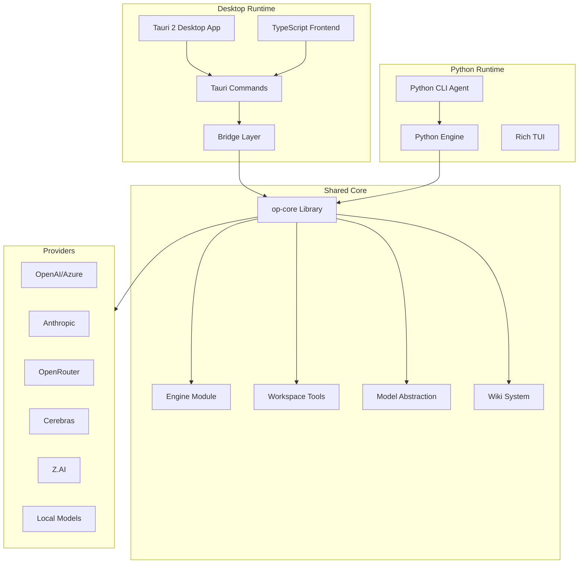
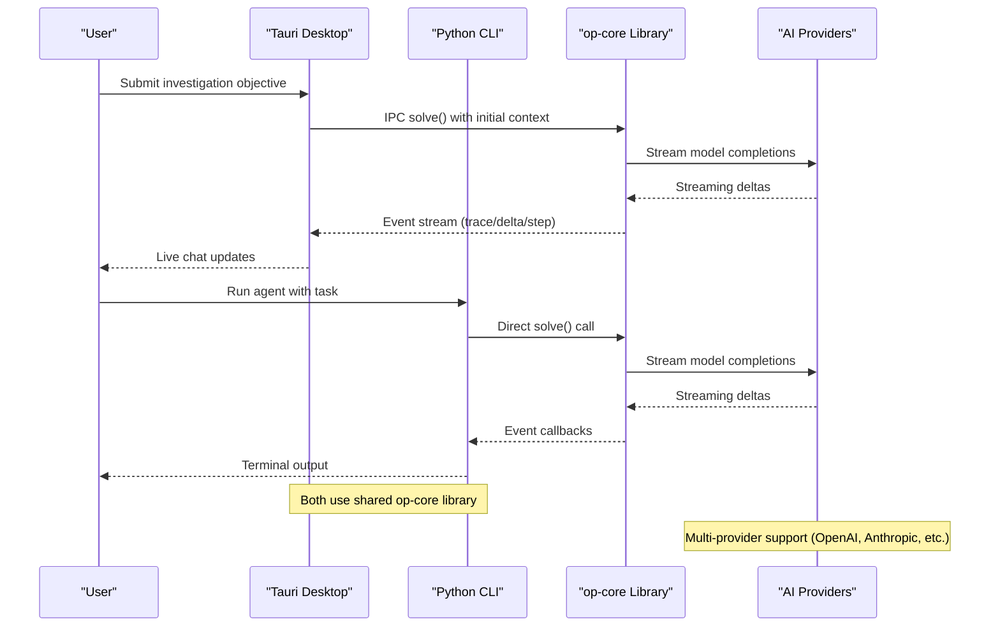
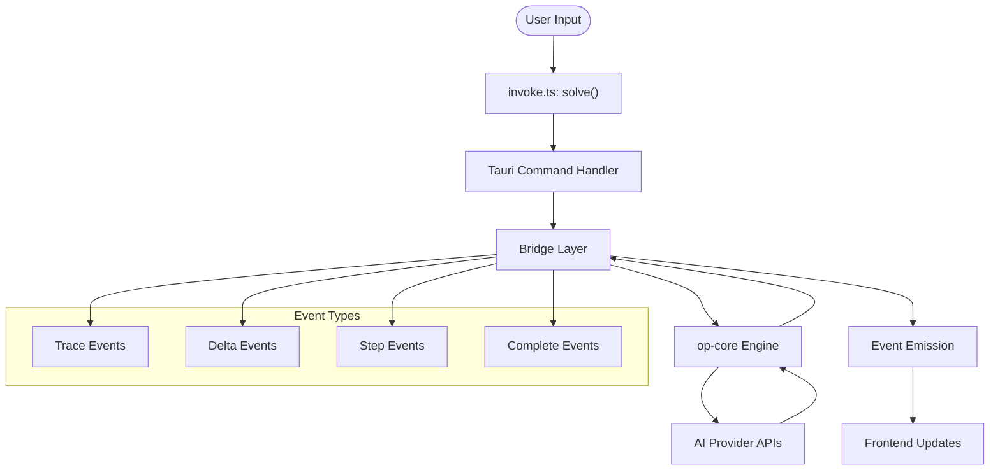
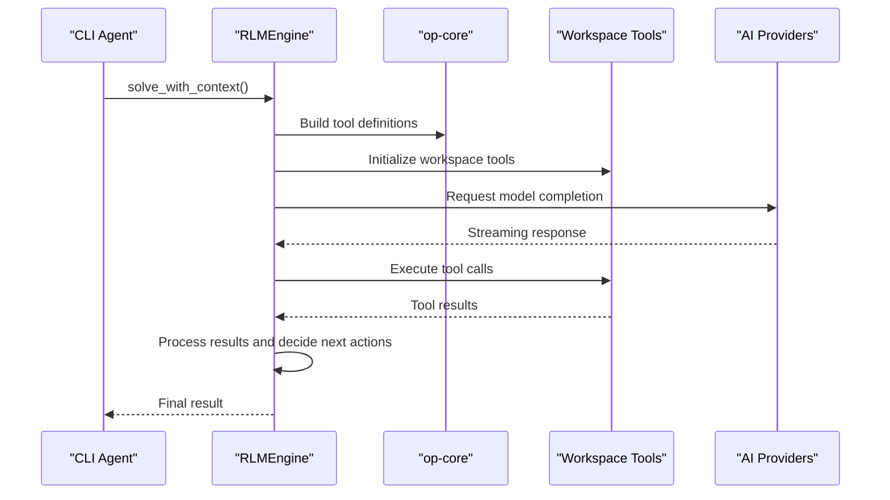
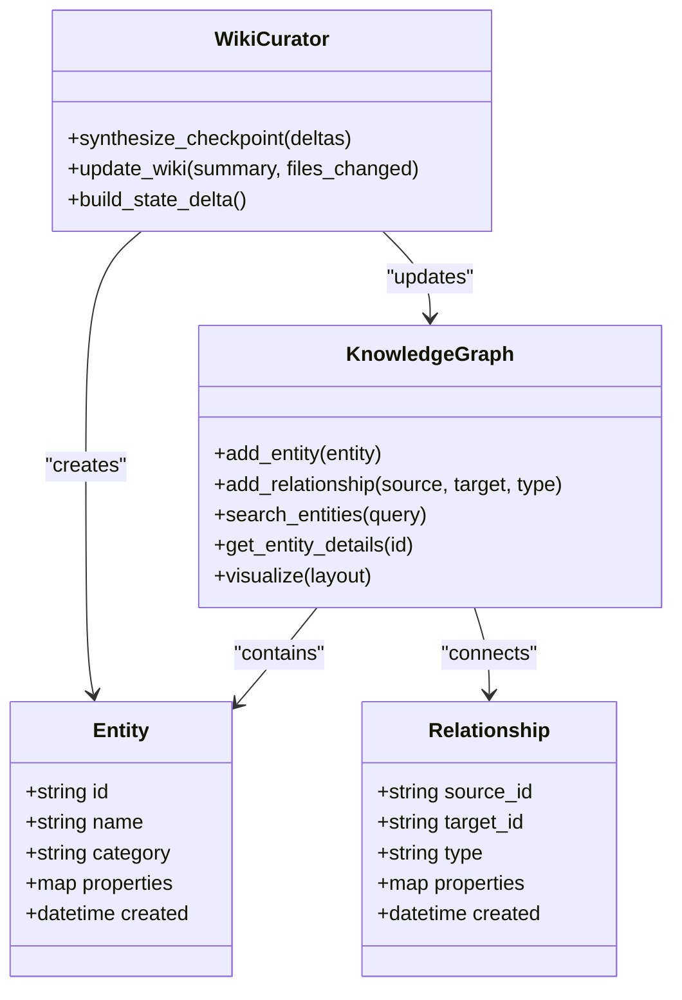

# Architecture Overview

<cite>
**Referenced Files in This Document**
- [README.md](file://README.md)
- [Cargo.toml](file://openplanter-desktop/Cargo.toml)
- [pyproject.toml](file://pyproject.toml)
- [package.json](file://openplanter-desktop/frontend/package.json)
- [tauri.conf.json](file://openplanter-desktop/crates/op-tauri/tauri.conf.json)
- [lib.rs](file://openplanter-desktop/crates/op-core/src/lib.rs)
- [main.rs](file://openplanter-desktop/crates/op-tauri/src/main.rs)
- [bridge.rs](file://openplanter-desktop/crates/op-tauri/src/bridge.rs)
- [state.rs](file://openplanter-desktop/crates/op-tauri/src/state.rs)
- [mod.rs](file://openplanter-desktop/crates/op-core/src/engine/mod.rs)
- [invoke.ts](file://openplanter-desktop/frontend/src/api/invoke.ts)
- [init.ts](file://openplanter-desktop/frontend/src/commands/init.ts)
- [__main__.py](file://agent/__main__.py)
- [engine.py](file://agent/engine.py)
</cite>

## Table of Contents
1. [Introduction](#introduction)
2. [Project Structure](#project-structure)
3. [Core Components](#core-components)
4. [Architecture Overview](#architecture-overview)
5. [Detailed Component Analysis](#detailed-component-analysis)
6. [Dependency Analysis](#dependency-analysis)
7. [Performance Considerations](#performance-considerations)
8. [Troubleshooting Guide](#troubleshooting-guide)
9. [Conclusion](#conclusion)

## Introduction
OpenPlanter implements a hybrid desktop/CLI architecture that combines a Tauri 2 desktop application with a Python CLI agent. The system separates concerns across three layers:
- Rust core library (op-core): Shared engine, models, tools, and session management
- TypeScript frontend (Tauri): Desktop GUI with live knowledge graph and chat interface
- Python CLI agent: Headless/terminal-based agent with TUI and standalone operation

The desktop app communicates with the Rust core through Tauri IPC commands, while the CLI agent operates independently using the same Rust core library. Both components share the same investigation engine, workspace tools, and knowledge graph system.

## Project Structure
The repository follows a clear separation of concerns with distinct modules for each runtime:

**Diagram sources**
- [Cargo.toml:1-24](file://openplanter-desktop/Cargo.toml#L1-L24)
- [main.rs:10-51](file://openplanter-desktop/crates/op-tauri/src/main.rs#L10-L51)
- [lib.rs:1-15](file://openplanter-desktop/crates/op-core/src/lib.rs#L1-L15)

**Section sources**
- [README.md:17-51](file://README.md#L17-L51)
- [Cargo.toml:1-24](file://openplanter-desktop/Cargo.toml#L1-L24)
- [pyproject.toml:1-35](file://pyproject.toml#L1-L35)

## Core Components
The architecture consists of three primary components working in tandem:

### Rust Core Library (op-core)
The shared foundation providing:
- **Engine**: Recursive language model orchestration with streaming events
- **Model Abstraction**: Provider-agnostic LLM interface supporting multiple AI providers
- **Workspace Tools**: File I/O, shell execution, web search, and document processing
- **Session Management**: Replay logging, continuation, and state persistence
- **Wiki System**: Knowledge graph construction and maintenance

### Tauri Desktop Application
A three-pane desktop interface featuring:
- **Sidebar**: Session management, provider/model settings, and API credential status
- **Chat Pane**: Real-time conversation display with syntax-highlighted code blocks
- **Knowledge Graph**: Interactive Cytoscape.js visualization of discovered entities

### Python CLI Agent
A flexible terminal-based agent offering:
- **Rich TUI**: Full-featured terminal interface with progress indicators
- **Headless Mode**: Non-interactive execution for CI/automation
- **Standalone Operation**: Independent of the desktop application

**Section sources**
- [README.md:17-31](file://README.md#L17-L31)
- [README.md:55-82](file://README.md#L55-L82)
- [lib.rs:1-15](file://openplanter-desktop/crates/op-core/src/lib.rs#L1-L15)

## Architecture Overview
The hybrid architecture leverages Tauri for desktop GUI capabilities while maintaining Python CLI flexibility. Both runtimes share the Rust core library through separate IPC channels:

**Diagram sources**
- [main.rs:20-49](file://openplanter-desktop/crates/op-tauri/src/main.rs#L20-L49)
- [invoke.ts:24-26](file://openplanter-desktop/frontend/src/api/invoke.ts#L24-L26)
- [engine.py:586-628](file://agent/engine.py#L586-L628)

The architecture enables:
- **Desktop GUI**: Rich visual interface with live knowledge graph
- **CLI Flexibility**: Headless operation, automation, and script integration
- **Shared Intelligence**: Consistent investigation engine across both runtimes
- **Multi-Provider Support**: Pluggable AI provider architecture

**Section sources**
- [README.md:92-162](file://README.md#L92-L162)
- [tauri.conf.json:1-39](file://openplanter-desktop/crates/op-tauri/tauri.conf.json#L1-L39)

## Detailed Component Analysis

### Desktop IPC Communication Flow
The Tauri desktop application uses a typed IPC layer to communicate with the Rust core:

**Diagram sources**
- [invoke.ts:24-26](file://openplanter-desktop/frontend/src/api/invoke.ts#L24-L26)
- [bridge.rs:133-246](file://openplanter-desktop/crates/op-tauri/src/bridge.rs#L133-L246)
- [main.rs:23-47](file://openplanter-desktop/crates/op-tauri/src/main.rs#L23-L47)

### CLI Agent Execution Pipeline
The Python CLI agent operates independently using the same core engine:

**Diagram sources**
- [engine.py:586-628](file://agent/engine.py#L586-L628)
- [engine.py:504-527](file://agent/engine.py#L504-L527)

**Section sources**
- [invoke.ts:1-131](file://openplanter-desktop/frontend/src/api/invoke.ts#L1-L131)
- [bridge.rs:1-800](file://openplanter-desktop/crates/op-tauri/src/bridge.rs#L1-L800)
- [engine.py:1-800](file://agent/engine.py#L1-L800)

### Knowledge Graph System
Both runtimes utilize a sophisticated knowledge graph system:

**Diagram sources**
- [mod.rs:49-127](file://openplanter-desktop/crates/op-core/src/engine/mod.rs#L49-L127)

**Section sources**
- [README.md:25-31](file://README.md#L25-L31)
- [mod.rs:1-800](file://openplanter-desktop/crates/op-core/src/engine/mod.rs#L1-L800)

## Dependency Analysis
The architecture maintains clean separation of concerns through well-defined dependencies:

```mermaid
graph TB
subgraph "Desktop Dependencies"
TauriCLI["@tauri-apps/cli"]
TauriAPI["@tauri-apps/api"]
Cytoscape["cytoscape"]
Highlight["highlight.js"]
end
subgraph "Python Dependencies"
Rich["rich"]
PromptToolkit["prompt_toolkit"]
PyFiglet["pyfiglet"]
end
subgraph "Shared Dependencies"
Serde["serde"]
Tokio["tokio"]
Anyhow["anyhow"]
Regex["regex"]
end
subgraph "Development Tools"
Vite["vite"]
Vitest["vitest"]
Playwright["@playwright/test"]
end
TauriCLI --> TauriAPI
TauriAPI --> Cytoscape
Cytoscape --> Highlight
Rich --> PromptToolkit
PromptToolkit --> PyFiglet
Serde --> Tokio
Tokio --> Anyhow
Anyhow --> Regex
Vite --> Vitest
Vitest --> Playwright
```

**Diagram sources**
- [package.json:14-31](file://openplanter-desktop/frontend/package.json#L14-L31)
- [pyproject.toml:11-28](file://pyproject.toml#L11-L28)
- [Cargo.toml:11-21](file://openplanter-desktop/Cargo.toml#L11-L21)

**Section sources**
- [package.json:1-32](file://openplanter-desktop/frontend/package.json#L1-L32)
- [pyproject.toml:1-35](file://pyproject.toml#L1-L35)
- [Cargo.toml:1-24](file://openplanter-desktop/Cargo.toml#L1-L24)

## Performance Considerations
The hybrid architecture balances performance across both runtimes:

### Desktop Performance
- **Event Streaming**: Real-time event emission prevents UI blocking
- **Memory Management**: Structured event buffering with truncation limits
- **Graph Rendering**: Efficient Cytoscape.js integration with incremental updates
- **Cancellation**: Proper token-based cancellation for long-running operations

### CLI Performance
- **Thread Safety**: Engine operations protected by locks and thread-local storage
- **Resource Limits**: Shell command deduplication and runtime policy enforcement
- **Streaming**: Efficient delta processing with character limits
- **Background Tasks**: Proper cleanup of background processes

### Shared Optimizations
- **Model Caching**: Engine maintains model instances in cache for reuse
- **Token Budgeting**: Context window management with intelligent truncation
- **Retry Logic**: Exponential backoff for rate-limited providers
- **Observation Buffering**: Efficient handling of large observation streams

**Section sources**
- [bridge.rs:25-28](file://openplanter-desktop/crates/op-tauri/src/bridge.rs#L25-L28)
- [engine.py:504-527](file://agent/engine.py#L504-L527)
- [engine.py:643-658](file://agent/engine.py#L643-L658)

## Troubleshooting Guide

### Desktop Issues
Common desktop application problems and solutions:
- **Workspace Initialization**: Use `/init` commands to check and complete workspace setup
- **IPC Communication**: Verify Tauri command registration and event emission
- **Chrome MCP Integration**: Ensure Node.js availability for Chrome DevTools MCP
- **Event Streaming**: Check bridge layer for proper event forwarding

### CLI Issues
Common CLI agent problems and solutions:
- **Credential Management**: Use `--configure-keys` to set up API credentials
- **Workspace Resolution**: Verify workspace directory permissions and existence
- **Model Availability**: Check provider API keys and model listings
- **Rate Limiting**: Configure retry policies for provider rate limits

### Shared Issues
- **Multi-Provider Configuration**: Ensure consistent provider setup across both runtimes
- **Session Persistence**: Verify session directory permissions and disk space
- **Tool Execution**: Check shell command availability and workspace file permissions

**Section sources**
- [init.ts:22-134](file://openplanter-desktop/frontend/src/commands/init.ts#L22-L134)
- [__main__.py:281-416](file://agent/__main__.py#L281-L416)
- [state.rs:320-363](file://openplanter-desktop/crates/op-tauri/src/state.rs#L320-L363)

## Conclusion
OpenPlanter's hybrid desktop/CLI architecture successfully combines the strengths of both approaches:
- **Desktop GUI**: Rich visual interface with live knowledge graph and chat
- **CLI Flexibility**: Headless operation, automation capabilities, and script integration
- **Shared Intelligence**: Consistent investigation engine across both platforms
- **Multi-Provider Support**: Flexible AI provider ecosystem with robust error handling

The architecture demonstrates excellent separation of concerns, with the Rust core library serving as the unified foundation while allowing both desktop and CLI runtimes to operate independently. This design enables users to choose the most appropriate interface for their needs while maintaining consistent functionality and data flows.

The technology stack leverages mature, production-ready components:
- **Rust/Tauri**: Secure desktop application framework
- **TypeScript**: Modern web technologies for desktop interface
- **Python**: Mature ecosystem for CLI agent and TUI
- **Multiple AI Providers**: Flexible integration with various LLM providers

This architecture provides a solid foundation for scalable, maintainable investigative AI applications with clear upgrade paths and extensibility points.