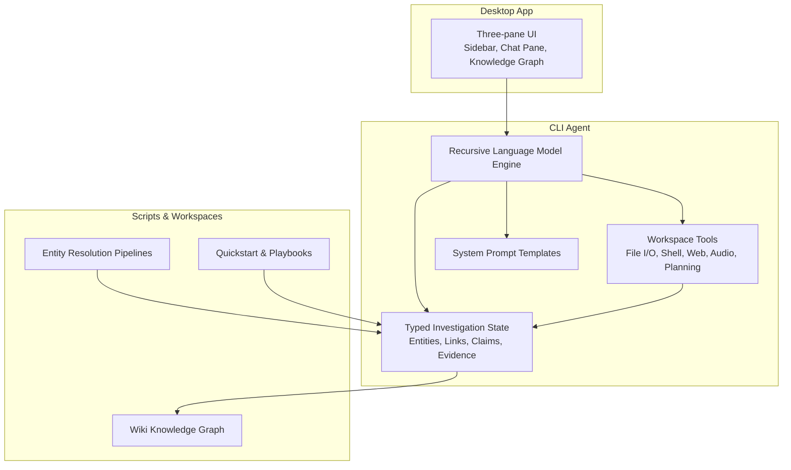
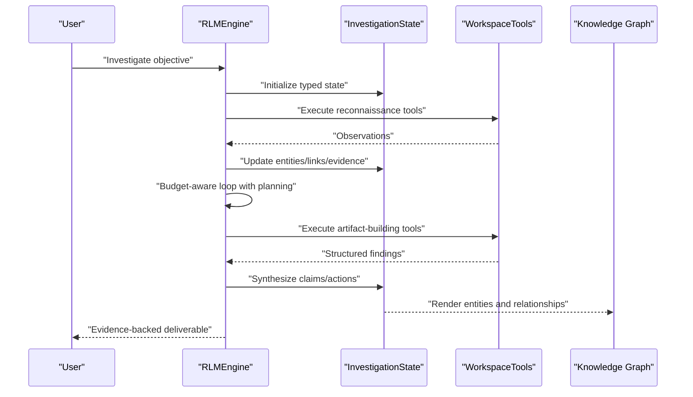
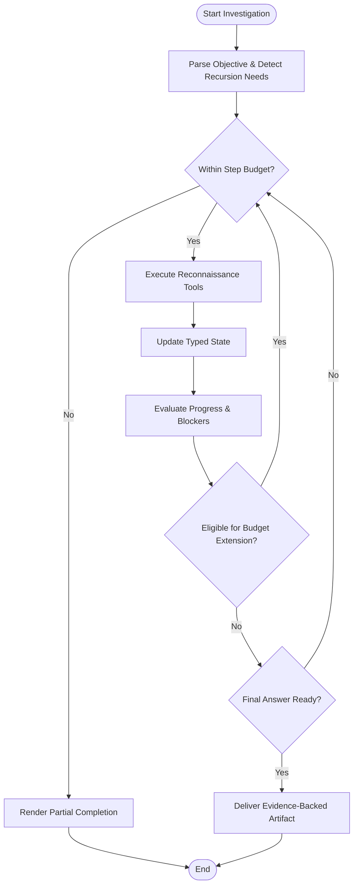
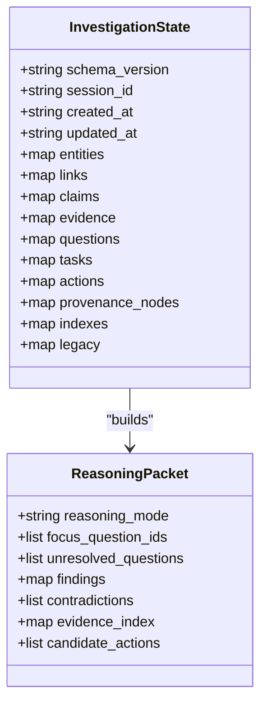
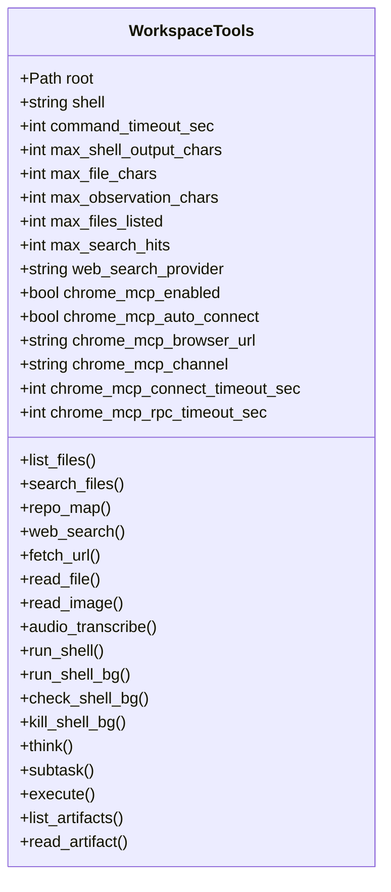
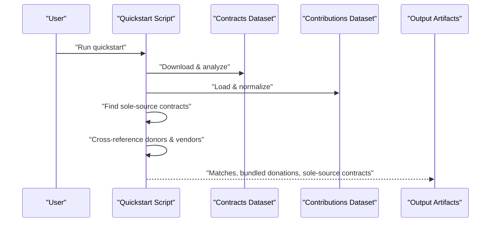
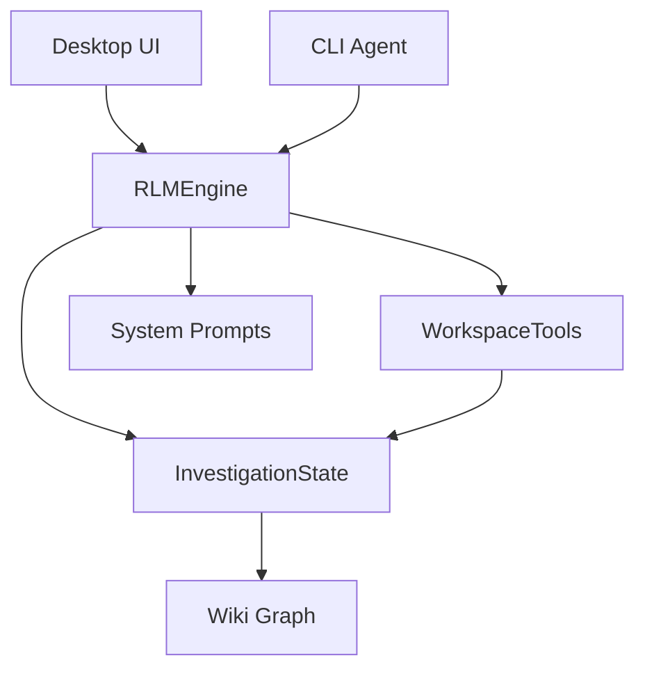

# Introduction and Purpose

<cite>
**Referenced Files in This Document**
- [README.md](file://README.md)
- [VISION.md](file://VISION.md)
- [agent/__main__.py](file://agent/__main__.py)
- [agent/engine.py](file://agent/engine.py)
- [agent/investigation_state.py](file://agent/investigation_state.py)
- [agent/prompts.py](file://agent/prompts.py)
- [agent/tools.py](file://agent/tools.py)
- [agent/tool_defs.py](file://agent/tool_defs.py)
- [scripts/entity_resolution.py](file://scripts/entity_resolution.py)
- [quickstart_investigation.py](file://quickstart_investigation.py)
- [central-fl-ice-workspace/INVESTIGATION_SUMMARY.md](file://central-fl-ice-workspace/INVESTIGATION_SUMMARY.md)
</cite>

## Table of Contents
1. [Introduction](#introduction)
2. [Project Structure](#project-structure)
3. [Core Components](#core-components)
4. [Architecture Overview](#architecture-overview)
5. [Detailed Component Analysis](#detailed-component-analysis)
6. [Dependency Analysis](#dependency-analysis)
7. [Performance Considerations](#performance-considerations)
8. [Troubleshooting Guide](#troubleshooting-guide)
9. [Conclusion](#conclusion)

## Introduction
OpenPlanter is a recursive-language-model investigation agent designed to analyze heterogeneous datasets through evidence-backed reasoning. It operates across corporate registries, campaign finance records, lobbying disclosures, government contracts, and more—resolving entities across sources and surfacing non-obvious connections. The system provides both a desktop application with a live knowledge graph and a Python CLI/TUI for autonomous operation with file I/O, shell execution, web search, and recursive sub-agent delegation.

OpenPlanter’s mission is to make Palantir-class capabilities accessible to organizations that cannot afford proprietary platforms, do not want vendor lock-in, or need the transparency that open source provides. It achieves this by unifying data integration, semantic modeling, entity resolution, visual analysis, AI reasoning, and operational action into a single coherent system.

Practical value:
- Cross-dataset analysis: Linking campaign finance donors to government contractors to identify potential conflicts of interest.
- Relationship discovery: Resolving entities across registries and disclosures to reveal hidden ownership or influence networks.
- Evidence-backed findings: Structured outputs with clear provenance chains and confidence levels.

**Section sources**
- [README.md:1-5](file://README.md#L1-L5)
- [VISION.md:127-139](file://VISION.md#L127-L139)

## Project Structure
OpenPlanter is organized into:
- Desktop application (Tauri 2) with a three-pane interface (sidebar, chat pane, knowledge graph).
- Python CLI agent with a terminal UI and rich tooling for investigation workflows.
- Scripts and workspaces demonstrating real-world investigations and entity resolution pipelines.
- Wiki-based knowledge graph and evidence chain construction for transparent reasoning.

**Diagram sources**
- [README.md:17-31](file://README.md#L17-L31)
- [agent/engine.py:504-528](file://agent/engine.py#L504-L528)
- [agent/tools.py:121-184](file://agent/tools.py#L121-L184)
- [agent/prompts.py:8-28](file://agent/prompts.py#L8-L28)
- [agent/investigation_state.py:35-68](file://agent/investigation_state.py#L35-L68)
- [scripts/entity_resolution.py:1-200](file://scripts/entity_resolution.py#L1-L200)
- [quickstart_investigation.py:1-395](file://quickstart_investigation.py#L1-L395)

**Section sources**
- [README.md:375-407](file://README.md#L375-L407)

## Core Components
- Recursive Language Model Engine: Orchestrates investigation loops, tool calls, and iterative refinement with budget-aware step management and optional acceptance criteria.
- Typed Investigation State: Canonical, schema-versioned state for entities, links, claims, evidence, hypotheses, questions, tasks, actions, and provenance nodes—enabling structured reasoning and evidence chain construction.
- Workspace Tools: Provider-neutral tool definitions and implementations for dataset ingestion, shell execution, web search, audio transcription, and planning/delegation.
- System Prompts: Epistemological discipline and operational guidance for skeptical, evidence-backed analysis with strict hard rules and planning protocols.
- Knowledge Graph & Wiki: Live graph visualization and wiki-backed provenance for transparent, collaborative investigations.

Key capabilities:
- Investigation workflow: Dataset ingestion, entity resolution, cross-dataset linking, evidence chain construction, and synthesis.
- Recursive mode: Subtask delegation and parallelized entity resolution across large investigations.
- Evidence-backed outputs: Structured findings with methodology, confidence levels, and source citations.

**Section sources**
- [agent/engine.py:504-528](file://agent/engine.py#L504-L528)
- [agent/investigation_state.py:35-68](file://agent/investigation_state.py#L35-L68)
- [agent/tool_defs.py:10-200](file://agent/tool_defs.py#L10-L200)
- [agent/prompts.py:8-200](file://agent/prompts.py#L8-L200)
- [README.md:25-31](file://README.md#L25-L31)

## Architecture Overview
OpenPlanter’s architecture centers on a recursive language model engine that coordinates a typed investigation state, a comprehensive toolset, and a wiki-driven knowledge graph. The engine enforces epistemological discipline, budget-aware iteration, and optional acceptance criteria to ensure robust, evidence-backed outcomes.

**Diagram sources**
- [agent/engine.py:586-628](file://agent/engine.py#L586-L628)
- [agent/investigation_state.py:35-68](file://agent/investigation_state.py#L35-L68)
- [agent/tools.py:121-184](file://agent/tools.py#L121-L184)
- [README.md:25-31](file://README.md#L25-L31)

## Detailed Component Analysis

### Recursive Language Model Investigation Engine
The engine implements a step-limited loop with budget-aware progression, pattern-based recursion detection, and optional acceptance criteria. It builds tool definitions dynamically (including Chrome MCP tools), enforces runtime policies, and manages cancellation and cleanup.

Key behaviors:
- Objective parsing and recursion policy: Automatically determines when to delegate subtasks based on multi-phase intent and multi-surface patterns.
- Budget extension evaluation: Analyzes recent progress, tool repetition, and failure ratios to decide whether to extend the step budget.
- Finalization safeguards: Prevents meta-final text, ensures substantive completion, and can rescue rejected candidates into final deliverables.
- Runtime policies: Blocks repeated identical shell commands at the same depth to prevent stalls.

**Diagram sources**
- [agent/engine.py:559-569](file://agent/engine.py#L559-L569)
- [agent/engine.py:357-428](file://agent/engine.py#L357-L428)
- [agent/engine.py:777-800](file://agent/engine.py#L777-L800)

**Section sources**
- [agent/engine.py:559-569](file://agent/engine.py#L559-L569)
- [agent/engine.py:357-428](file://agent/engine.py#L357-L428)
- [agent/engine.py:777-800](file://agent/engine.py#L777-L800)

### Typed Investigation State and Evidence Chain Construction
The investigation state defines a canonical schema for entities, links, claims, evidence, hypotheses, questions, tasks, actions, provenance nodes, and indexes. It supports:
- Question-centric reasoning packets to drive candidate actions and evidence gaps.
- Confidence profiles and prioritization for claims and questions.
- Evidence indexing by external references and tags for efficient retrieval.
- Migration and legacy projection for backward compatibility.

**Diagram sources**
- [agent/investigation_state.py:35-68](file://agent/investigation_state.py#L35-L68)
- [agent/investigation_state.py:235-385](file://agent/investigation_state.py#L235-L385)

**Section sources**
- [agent/investigation_state.py:35-68](file://agent/investigation_state.py#L35-L68)
- [agent/investigation_state.py:235-385](file://agent/investigation_state.py#L235-L385)

### System Prompts and Epistemological Discipline
The system prompts establish strict epistemological discipline:
- Skepticism: Assume nothing until confirmed; verify empty outputs and cross-check mechanisms.
- Hard rules: Never overwrite existing files from memory, preserve exact numeric precision, avoid heredoc syntax, and always write required output files.
- Data management: Ingest and verify before analyzing; preserve originals; record provenance; prefer tool-generated sidecars.
- Entity resolution: Normalize names, build canonical entity maps, document linking logic, and flag uncertain matches.
- Evidence chains: Every claim must trace to specific records; distinguish direct, circumstantial, and absence of evidence; structure findings with methodology and confidence.

**Section sources**
- [agent/prompts.py:8-200](file://agent/prompts.py#L8-L200)

### Workspace Tools and Investigation Workflow
Workspace tools provide a provider-neutral set of capabilities:
- Dataset ingestion & workspace: list/search/repo mapping, read/edit/write files, apply patches.
- Shell execution: run/check/kill background jobs with timeouts and runtime policies.
- Web: web search and URL fetching via configurable providers.
- Audio: transcription with diarization, timestamps, and chunking for long-form content.
- Planning & delegation: think, subtask, execute, and artifact management for recursive investigation.

**Diagram sources**
- [agent/tools.py:121-184](file://agent/tools.py#L121-L184)
- [agent/tool_defs.py:10-200](file://agent/tool_defs.py#L10-L200)

**Section sources**
- [agent/tools.py:121-184](file://agent/tools.py#L121-L184)
- [agent/tool_defs.py:10-200](file://agent/tool_defs.py#L10-L200)

### Practical Examples: Cross-Dataset Analysis and Relationship Discovery
Common use cases include:
- Cross-reference vendor payments against lobbying disclosures to flag overlaps.
- Resolve entities across campaign finance and corporate registries to uncover hidden relationships.
- Identify sole-source contracts and correlate with bundled donations to highlight potential coordination.

Examples in the repository:
- Quickstart script demonstrates downloading datasets, analyzing contracts, identifying non-competitive procurements, and cross-referencing donors with vendors.
- Entity resolution pipeline extracts candidate IDs, links reports across years, and extracts contributions to identify potential pay-to-play indicators.

**Diagram sources**
- [quickstart_investigation.py:354-395](file://quickstart_investigation.py#L354-L395)
- [scripts/entity_resolution.py:1-200](file://scripts/entity_resolution.py#L1-L200)

**Section sources**
- [quickstart_investigation.py:1-395](file://quickstart_investigation.py#L1-L395)
- [scripts/entity_resolution.py:1-200](file://scripts/entity_resolution.py#L1-L200)

## Dependency Analysis
OpenPlanter’s dependencies span:
- Desktop runtime: Tauri 2 backend and TypeScript frontend with Cytoscape.js for graph visualization.
- CLI runtime: Python agent with provider-agnostic model abstraction and tool orchestration.
- Investigation workflow: Typed state, system prompts, and workspace tools form a cohesive loop.
- Knowledge graph: Wiki-backed provenance and evidence chain construction.

**Diagram sources**
- [agent/engine.py:504-528](file://agent/engine.py#L504-L528)
- [agent/investigation_state.py:35-68](file://agent/investigation_state.py#L35-L68)
- [agent/tools.py:121-184](file://agent/tools.py#L121-L184)
- [README.md:17-31](file://README.md#L17-L31)

**Section sources**
- [agent/engine.py:504-528](file://agent/engine.py#L504-L528)
- [agent/investigation_state.py:35-68](file://agent/investigation_state.py#L35-L68)
- [agent/tools.py:121-184](file://agent/tools.py#L121-L184)
- [README.md:17-31](file://README.md#L17-L31)

## Performance Considerations
- Budget-aware loops: The engine evaluates progress and blockers to extend budgets judiciously, preventing wasted steps on stalled patterns.
- Tool repetition prevention: Runtime policies block repeated identical shell commands at the same depth.
- Streaming and chunking: Audio transcription supports chunking for long-form content to improve reliability and throughput.
- Polyglot persistence (visionary): The platform’s architecture anticipates polyglot storage for graph, search, and relational backends to optimize traversal, full-text search, and analytics.

[No sources needed since this section provides general guidance]

## Troubleshooting Guide
Common issues and remedies:
- Empty tool outputs: Verify with size checks and cross-check mechanisms; re-run with explicit redirection when capture failures occur.
- Repeated identical commands: Change strategy entirely; the engine blocks repeated identical shell commands at the same depth.
- Acceptance criteria failures: Use the lightweight judge model to evaluate subtask results; adjust criteria or approach accordingly.
- Chrome MCP connectivity: Ensure Node/npm availability and Chrome remote debugging; the engine falls back gracefully if unavailable.

**Section sources**
- [agent/engine.py:643-658](file://agent/engine.py#L643-L658)
- [agent/engine.py:660-704](file://agent/engine.py#L660-L704)
- [README.md:247-291](file://README.md#L247-L291)

## Conclusion
OpenPlanter bridges the gap between fragmented data and actionable insights by uniting heterogeneous datasets through a recursive language model investigation agent. Its typed investigation state, structured evidence chains, and provider-agnostic tooling enable investigators to uncover non-obvious connections across corporate registries, campaign finance records, lobbying disclosures, and government contracts. Whether deployed as a desktop application or a CLI/TUI, OpenPlanter offers a transparent, extensible platform for evidence-backed analysis and operational action.

[No sources needed since this section summarizes without analyzing specific files]