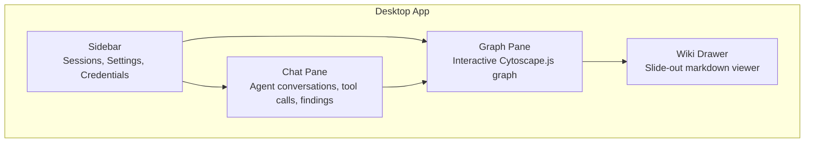
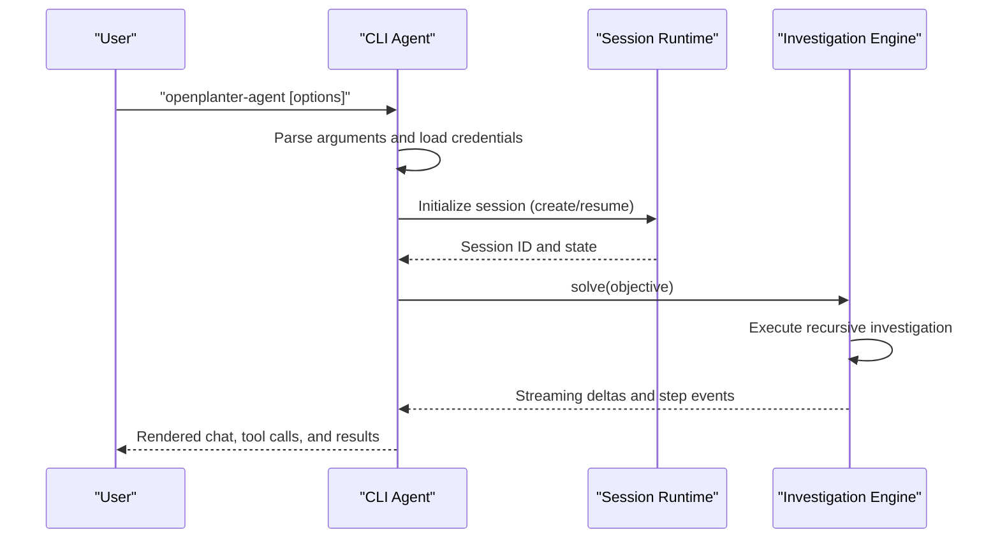
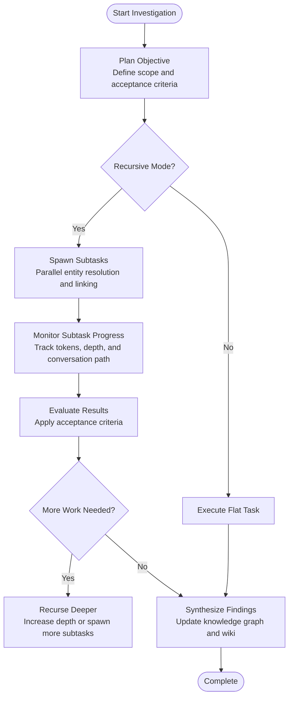
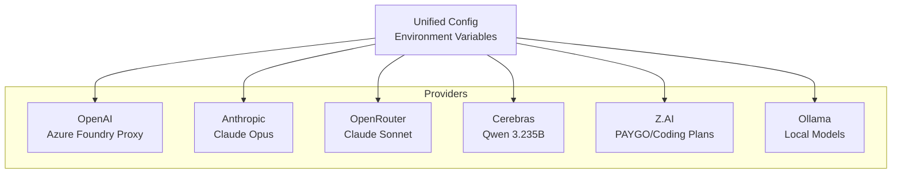
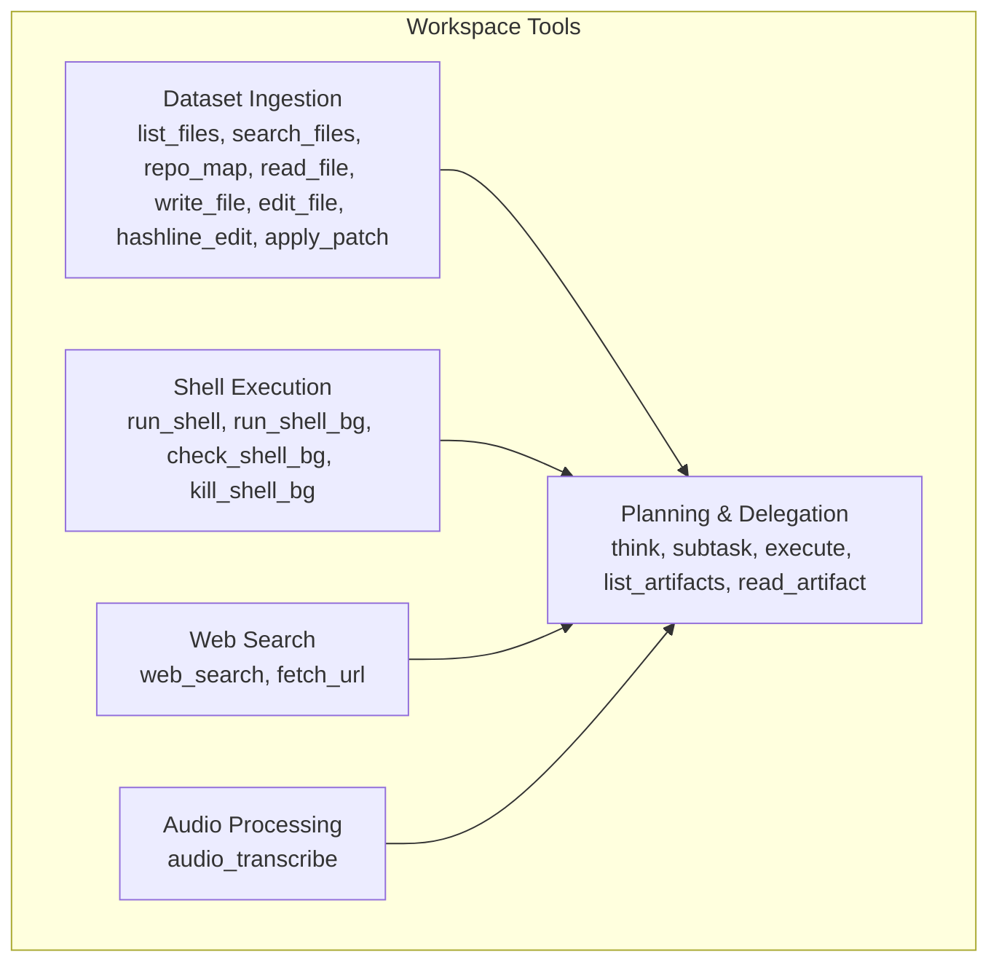
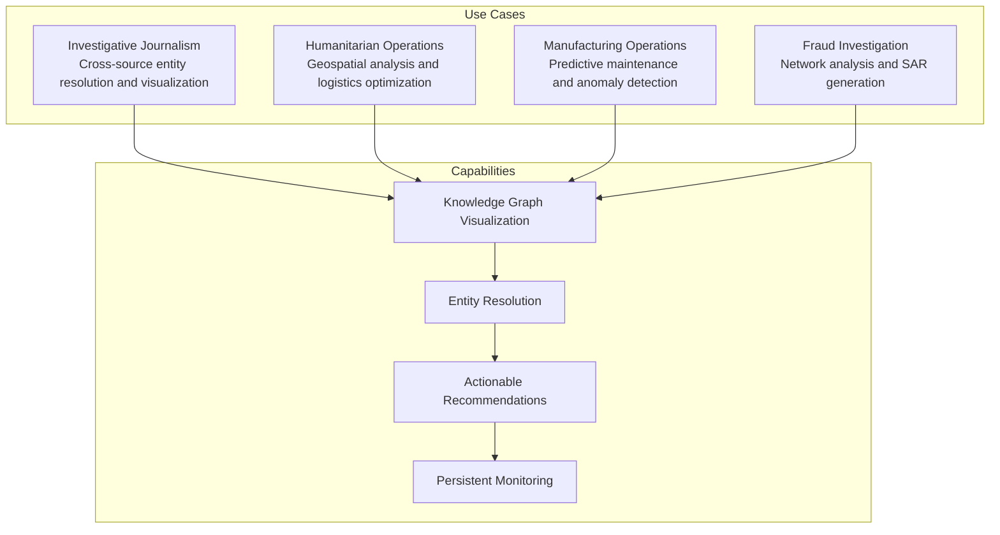
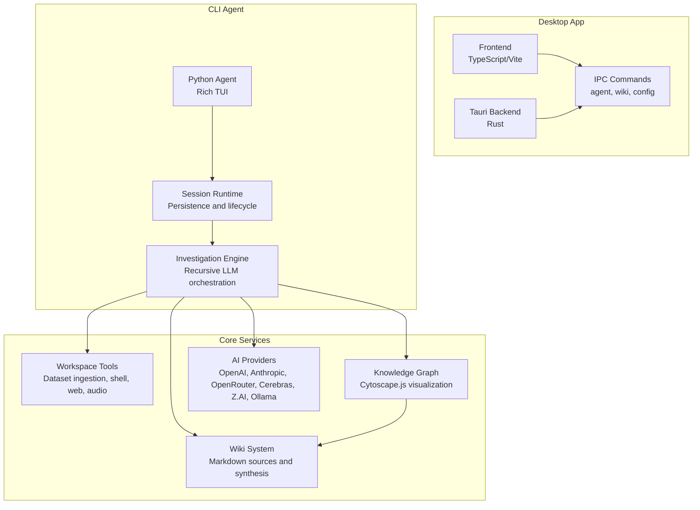

# Key Features

<cite>
**Referenced Files in This Document**
- [README.md](file://README.md)
- [DEMO.md](file://DEMO.md)
- [VISION.md](file://VISION.md)
- [openplanter-desktop/frontend/src/main.ts](file://openplanter-desktop/frontend/src/main.ts)
- [openplanter-desktop/frontend/src/components/App.ts](file://openplanter-desktop/frontend/src/components/App.ts)
- [openplanter-desktop/frontend/src/components/GraphPane.ts](file://openplanter-desktop/frontend/src/components/GraphPane.ts)
- [openplanter-desktop/frontend/src/components/ChatPane.ts](file://openplanter-desktop/frontend/src/components/ChatPane.ts)
- [openplanter-desktop/frontend/src/components/OverviewPane.ts](file://openplanter-desktop/frontend/src/components/OverviewPane.ts)
- [openplanter-desktop/frontend/src/components/InputBar.ts](file://openplanter-desktop/frontend/src/components/InputBar.ts)
- [agent/__main__.py](file://agent/__main__.py)
</cite>

## Table of Contents
1. [Introduction](#introduction)
2. [Desktop Application Features](#desktop-application-features)
3. [CLI Agent Functionality](#cli-agent-functionality)
4. [Investigation Engine Capabilities](#investigation-engine-capabilities)
5. [Multi-Provider AI Integration](#multi-provider-ai-integration)
6. [Workspace Tools](#workspace-tools)
7. [Audio Processing Pipeline](#audio-processing-pipeline)
8. [Practical Examples and Use Cases](#practical-examples-and-use-cases)
9. [Architecture Overview](#architecture-overview)
10. [Conclusion](#conclusion)

## Introduction
OpenPlanter is an agent-driven investigation platform that unifies heterogeneous datasets, constructs a structured knowledge graph, and automates discovery and action. It offers both a desktop application with a three-pane interface and a CLI agent with terminal UI, headless operation, and interactive mode. The platform supports multi-provider AI, live knowledge graph visualization, wiki source integration, session persistence, and a broad set of workspace tools including dataset ingestion, file operations, web search, shell execution, and Chrome MCP automation. It also includes an audio processing pipeline powered by Mistral for transcription and speaker diarization.

## Desktop Application Features
The desktop application is a Tauri 2-based interface featuring a three-pane layout designed for seamless investigation workflows:

- Sidebar: Session management, provider/model settings, and API credential status
- Chat pane: Conversational interface showing agent objectives, reasoning steps, tool calls, and findings with syntax-highlighted code blocks
- Knowledge graph: Interactive Cytoscape.js visualization of entities and relationships discovered during investigation. Nodes are color-coded by category, and clicking a source node opens a slide-out drawer with the full rendered wiki document

Key capabilities:
- Live knowledge graph: Entities and connections render in real time as the agent works. Switch between force-directed, hierarchical, and circular layouts. Search and filter by category.
- Wiki source drawer: Click any source node to read the full markdown document in a slide-out panel. Internal wiki links navigate between documents and focus the corresponding graph node.
- Session persistence: Investigations are saved automatically. Resume previous sessions or start new ones from the sidebar.
- Checkpointed wiki curator synthesizer: A focused synthesizer runs at explicit loop phase boundaries and projects typed state deltas into concise, provenance-aware wiki updates.
- Multi-provider support: Switch between OpenAI, Anthropic, OpenRouter, Cerebras, Z.AI, and Ollama (local) from the sidebar.

**Diagram sources**
- [openplanter-desktop/frontend/src/components/App.ts:55-145](file://openplanter-desktop/frontend/src/components/App.ts#L55-L145)
- [openplanter-desktop/frontend/src/components/GraphPane.ts:47-149](file://openplanter-desktop/frontend/src/components/GraphPane.ts#L47-L149)
- [openplanter-desktop/frontend/src/components/ChatPane.ts:243-692](file://openplanter-desktop/frontend/src/components/ChatPane.ts#L243-L692)

**Section sources**
- [README.md:17-31](file://README.md#L17-L31)
- [openplanter-desktop/frontend/src/components/App.ts:55-145](file://openplanter-desktop/frontend/src/components/App.ts#L55-L145)
- [openplanter-desktop/frontend/src/components/GraphPane.ts:47-149](file://openplanter-desktop/frontend/src/components/GraphPane.ts#L47-L149)
- [openplanter-desktop/frontend/src/main.ts:85-340](file://openplanter-desktop/frontend/src/main.ts#L85-L340)

## CLI Agent Functionality
The Python CLI agent provides flexible operation modes:

- Terminal UI: Rich REPL with streaming deltas, markdown rendering, and tool call visualization
- Headless operation: Non-interactive mode suitable for CI or scripted tasks
- Interactive mode: Full conversational experience with slash commands and session management

Core features:
- Slash commands: Workspace initialization, session management, provider configuration, retrieval toggles, and operational controls
- Session persistence: Automatic creation and resumption of sessions with replay history
- Provider switching: Dynamic selection among OpenAI, Anthropic, OpenRouter, Cerebras, Z.AI, and Ollama
- Chrome DevTools MCP integration: Native Chrome automation tools when enabled
- Persistent defaults: Save provider, model, embeddings, and Chrome MCP settings to workspace configuration

**Diagram sources**
- [agent/__main__.py:708-800](file://agent/__main__.py#L708-L800)
- [openplanter-desktop/frontend/src/main.ts:185-325](file://openplanter-desktop/frontend/src/main.ts#L185-L325)

**Section sources**
- [README.md:55-82](file://README.md#L55-L82)
- [agent/__main__.py:41-225](file://agent/__main__.py#L41-L225)
- [openplanter-desktop/frontend/src/components/InputBar.ts:51-177](file://openplanter-desktop/frontend/src/components/InputBar.ts#L51-L177)

## Investigation Engine Capabilities
OpenPlanter’s investigation engine is designed for recursive problem solving with robust controls:

- Recursive problem solving: Default recursive mode spawns sub-agents via subtask and execute to parallelize entity resolution, cross-dataset linking, and evidence-chain construction across large investigations
- Budget management: Configurable maximum recursion depth, maximum steps per call, and shell command timeouts
- Progress tracking: Real-time step summaries, token usage, conversation path tracking, and loop health metrics
- Subtask delegation: Planning and delegation tools enable focused sub-tasks with acceptance criteria and independent verification

**Diagram sources**
- [README.md:243-245](file://README.md#L243-L245)
- [agent/__main__.py:167-169](file://agent/__main__.py#L167-L169)

**Section sources**
- [README.md:243-245](file://README.md#L243-L245)
- [agent/__main__.py:167-169](file://agent/__main__.py#L167-L169)

## Multi-Provider AI Integration
OpenPlanter supports multiple AI providers with unified configuration and runtime switching:

Supported providers:
- OpenAI (Azure Foundry proxy)
- Anthropic (Anthropic Foundry proxy)
- OpenRouter
- Cerebras
- Z.AI (with distinct PAYGO and Coding plans)
- Ollama (local models)

Provider-specific features:
- OpenAI-compatible endpoints with OAuth token support
- Anthropic Foundry proxy for Claude models
- Z.AI plan selection (PAYGO vs Coding) with configurable base URLs
- Ollama local model serving with configurable base URL and model lists
- Unified credential management and environment variable overrides

**Diagram sources**
- [README.md:92-121](file://README.md#L92-L121)
- [README.md:122-162](file://README.md#L122-L162)

**Section sources**
- [README.md:92-162](file://README.md#L92-L162)

## Workspace Tools
OpenPlanter provides a comprehensive toolkit for workspace operations:

Dataset ingestion & workspace:
- list_files, search_files, repo_map, read_file, write_file, edit_file, hashline_edit, apply_patch
- Load, inspect, and transform source datasets; write structured findings

Shell execution:
- run_shell, run_shell_bg, check_shell_bg, kill_shell_bg
- Run analysis scripts, data pipelines, and validation checks

Web:
- web_search (via Exa, Firecrawl, Brave, or Tavily), fetch_url
- Pull public records, verify entities, and retrieve supplementary data

Audio:
- audio_transcribe (Mistral offline transcription)
- Transcribe local audio/video with optional timestamps, diarization, and automatic chunking for long recordings

Planning & delegation:
- think, subtask, execute, list_artifacts, read_artifact
- Decompose investigations into focused sub-tasks with acceptance criteria and independent verification

**Diagram sources**
- [README.md:229-246](file://README.md#L229-L246)

**Section sources**
- [README.md:229-246](file://README.md#L229-L246)

## Audio Processing Pipeline
OpenPlanter includes a dedicated audio processing pipeline powered by Mistral:

Capabilities:
- Mistral transcription: Offline transcription API with configurable model selection and base URL overrides
- Speaker diarization: Optional speaker identification and segmentation
- Long-form recording support: Automatic chunking with configurable chunk size, overlap, and maximum chunk count
- FFmpeg integration: Required for video input extraction and audio chunking
- Context biasing: Optional phrase-based context normalization for improved accuracy
- Partial output handling: Continue-on-chunk-error mode for resilient processing

Configuration options:
- MISTRAL_API_KEY (shared key for embeddings, Document AI/OCR, and transcription)
- OPENPLANTER_MISTRAL_TRANSCRIPTION_BASE_URL
- OPENPLANTER_MISTRAL_TRANSCRIPTION_MODEL
- OPENPLANTER_MISTRAL_TRANSCRIPTION_MAX_BYTES
- OPENPLANTER_MISTRAL_TRANSCRIPTION_CHUNK_MAX_SECONDS
- OPENPLANTER_MISTRAL_TRANSCRIPTION_CHUNK_OVERLAP_SECONDS
- OPENPLANTER_MISTRAL_TRANSCRIPTION_MAX_CHUNKS
- OPENPLANTER_MISTRAL_TRANSCRIPTION_REQUEST_TIMEOUT_SEC

**Section sources**
- [README.md:181-227](file://README.md#L181-L227)

## Practical Examples and Use Cases
OpenPlanter demonstrates real-world value across diverse domains:

Investigative journalism:
- Cross-reference shell companies with campaign finance records and property deeds
- Resolve entities across heterogeneous sources and visualize connections in the knowledge graph
- Generate timelines and coverage gaps for editorial workflows

Humanitarian operations:
- Integrate beneficiary registries, supply chain inventories, GPS check-ins, and satellite imagery
- Identify underserved areas and supply shortages through geospatial analysis
- Generate actionable logistics recommendations grounded in the data

Manufacturing operations:
- Connect ERP, IoT sensors, maintenance tickets, and supplier quality reports
- Identify root causes of increased downtime through cross-system correlation
- Deploy predictive agents for anomaly detection and automated maintenance workflows

Fraud investigation:
- Investigate suspicious account applications by searching across internal and public sources
- Build entity networks and assess risk using graph topology and attribute analysis
- Generate SAR narratives and deploy persistent monitoring agents

**Diagram sources**
- [DEMO.md:9-242](file://DEMO.md#L9-L242)

**Section sources**
- [DEMO.md:9-242](file://DEMO.md#L9-L242)

## Architecture Overview
OpenPlanter combines a desktop application with a CLI agent, both communicating with a shared investigation engine and workspace runtime:

**Diagram sources**
- [README.md:375-407](file://README.md#L375-L407)
- [openplanter-desktop/frontend/src/main.ts:1-340](file://openplanter-desktop/frontend/src/main.ts#L1-L340)
- [agent/__main__.py:1-800](file://agent/__main__.py#L1-L800)

**Section sources**
- [README.md:375-407](file://README.md#L375-L407)

## Conclusion
OpenPlanter distinguishes itself through its integrated approach to investigation: a unified knowledge graph, live visualization, recursive AI reasoning, and actionable workflows. The desktop application’s three-pane interface, combined with the CLI agent’s flexibility, enables both guided exploration and automated execution. Multi-provider AI support, comprehensive workspace tools, and specialized audio processing deliver a complete platform for complex investigations across diverse domains.