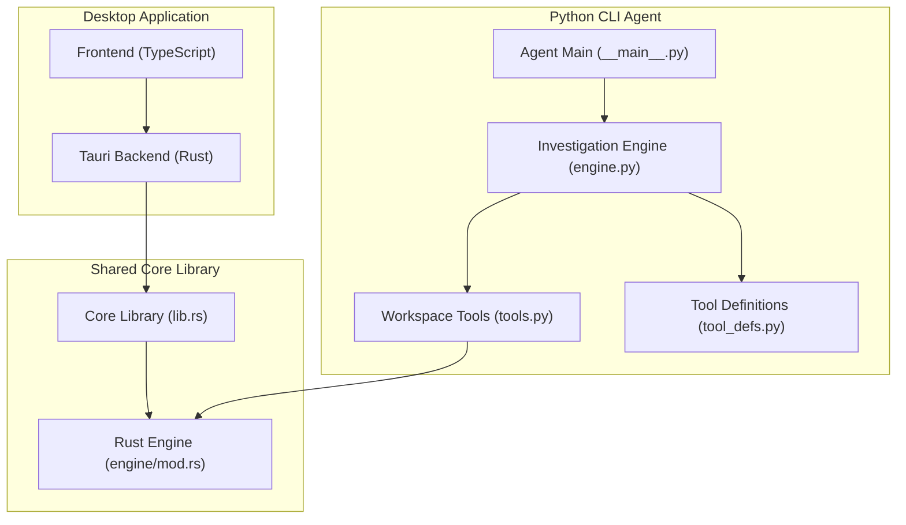
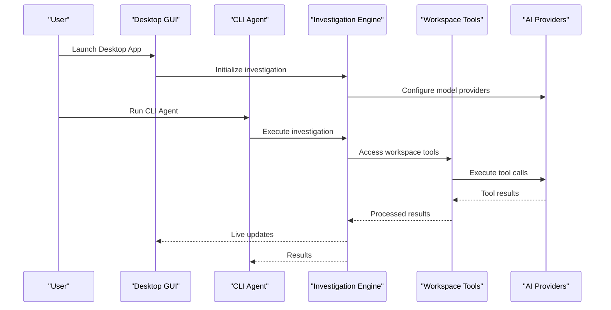
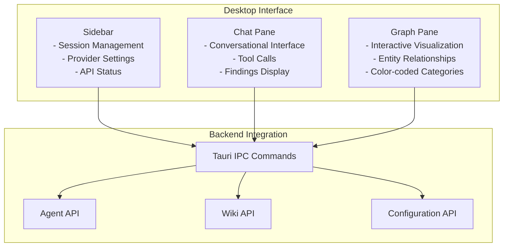
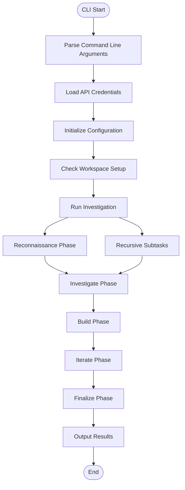
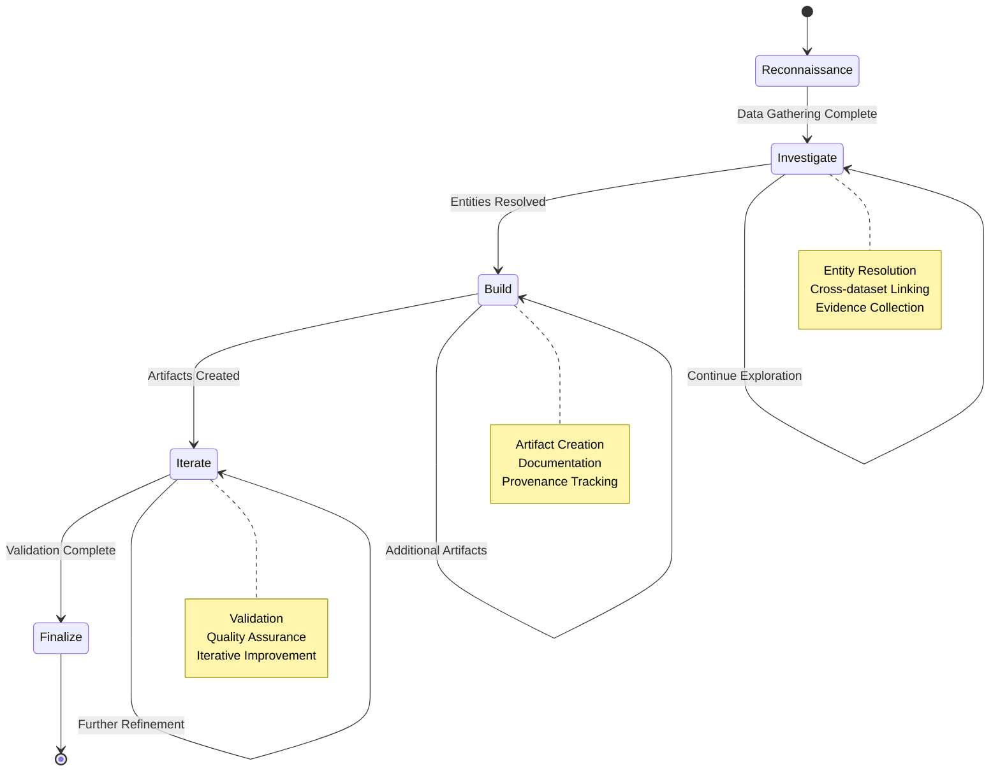
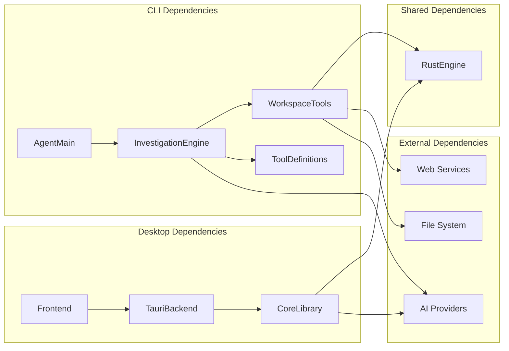

# Project Overview

<cite>
**Referenced Files in This Document**
- [README.md](file://README.md)
- [VISION.md](file://VISION.md)
- [__main__.py](file://agent/__main__.py)
- [engine.py](file://agent/engine.py)
- [tools.py](file://agent/tools.py)
- [tool_defs.py](file://agent/tool_defs.py)
- [main.rs](file://openplanter-desktop/crates/op-tauri/src/main.rs)
- [lib.rs](file://openplanter-desktop/crates/op-core/src/lib.rs)
- [mod.rs](file://openplanter-desktop/crates/op-core/src/engine/mod.rs)
- [main.ts](file://openplanter-desktop/frontend/src/main.ts)
</cite>

## Table of Contents
1. [Introduction](#introduction)
2. [Project Structure](#project-structure)
3. [Core Components](#core-components)
4. [Architecture Overview](#architecture-overview)
5. [Detailed Component Analysis](#detailed-component-analysis)
6. [Dependency Analysis](#dependency-analysis)
7. [Performance Considerations](#performance-considerations)
8. [Troubleshooting Guide](#troubleshooting-guide)
9. [Conclusion](#conclusion)

## Introduction
OpenPlanter is a recursive-language-model investigation agent designed to analyze heterogeneous datasets through evidence-backed reasoning. It combines a Tauri 2 desktop application with a Python CLI agent to deliver a hybrid desktop/CLI architecture. The system integrates multiple AI providers, a robust investigation workflow, and a knowledge graph system to surface non-obvious connections across datasets such as corporate registries, campaign finance records, lobbying disclosures, and government contracts.

At its core, OpenPlanter operates as an autonomous agent capable of file I/O, shell execution, web search, and recursive sub-agent delegation. The desktop GUI provides a conversational interface with live knowledge graph visualization, while the CLI agent offers a terminal-based experience with rich tooling for investigation tasks.

## Project Structure
The repository is organized into three primary components:
- Desktop Application: Tauri 2-based frontend with Rust backend and TypeScript frontend
- Python CLI Agent: Command-line interface with terminal UI and investigation engine
- Shared Core Library: Rust-based investigation engine and tooling used by both desktop and CLI

**Diagram sources**
- [main.rs:10-49](file://openplanter-desktop/crates/op-tauri/src/main.rs#L10-L49)
- [lib.rs:1-15](file://openplanter-desktop/crates/op-core/src/lib.rs#L1-L15)
- [__main__.py:708-800](file://agent/__main__.py#L708-L800)
- [engine.py:586-628](file://agent/engine.py#L586-L628)
- [tools.py:121-184](file://agent/tools.py#L121-L184)

**Section sources**
- [README.md:375-407](file://README.md#L375-L407)
- [main.rs:10-49](file://openplanter-desktop/crates/op-tauri/src/main.rs#L10-L49)
- [lib.rs:1-15](file://openplanter-desktop/crates/op-core/src/lib.rs#L1-L15)

## Core Components
OpenPlanter's investigation engine centers around a recursive language model architecture that orchestrates multiple phases of investigation:

### Investigation Engine
The investigation engine implements a sophisticated multi-phase workflow:
- **Reconnaissance Phase**: Initial data gathering and exploration
- **Investigate Phase**: Deep analysis and entity resolution
- **Build Phase**: Artifact creation and documentation
- **Iterate Phase**: Refinement and validation
- **Finalize Phase**: Evidence synthesis and conclusion

### Workspace Tools
The workspace tools system provides comprehensive capabilities for data manipulation:
- Dataset ingestion and workspace management
- Shell execution with security policies
- Web search integration with multiple providers
- Audio transcription with Mistral AI
- Document AI processing and OCR
- File patching and content modification

### Knowledge Graph System
The knowledge graph system maintains an evolving semantic model of discovered entities and relationships, with real-time visualization capabilities and provenance tracking.

**Section sources**
- [engine.py:504-528](file://agent/engine.py#L504-L528)
- [tools.py:121-184](file://agent/tools.py#L121-L184)
- [README.md:25-31](file://README.md#L25-L31)

## Architecture Overview
OpenPlanter employs a hybrid desktop/CLI architecture that leverages both Tauri 2 and Python technologies:

**Diagram sources**
- [main.rs:23-47](file://openplanter-desktop/crates/op-tauri/src/main.rs#L23-L47)
- [__main__.py:708-770](file://agent/__main__.py#L708-L770)
- [engine.py:586-628](file://agent/engine.py#L586-L628)

The architecture supports both desktop and CLI usage patterns while maintaining a shared investigation engine and workspace tools system. The Rust-based core library provides the foundational engine capabilities, while the Python CLI agent offers flexible command-line access.

**Section sources**
- [README.md:17-82](file://README.md#L17-L82)
- [VISION.md:305-356](file://VISION.md#L305-L356)

## Detailed Component Analysis

### Desktop Application Architecture
The desktop application follows a three-pane layout design with integrated knowledge graph visualization:

**Diagram sources**
- [main.rs:23-47](file://openplanter-desktop/crates/op-tauri/src/main.rs#L23-L47)
- [main.ts:1-340](file://openplanter-desktop/frontend/src/main.ts#L1-L340)

The desktop application provides live knowledge graph updates, wiki source integration, and session persistence capabilities. The interface supports real-time collaboration and evidence synthesis.

### CLI Agent Implementation
The Python CLI agent offers comprehensive investigation capabilities through a structured workflow:

**Diagram sources**
- [__main__.py:708-770](file://agent/__main__.py#L708-L770)
- [engine.py:586-628](file://agent/engine.py#L586-L628)

The CLI agent supports both interactive and headless modes, with comprehensive tool definitions and dynamic Chrome DevTools MCP integration.

### Investigation Workflow System
The investigation workflow implements a sophisticated multi-phase approach:

**Diagram sources**
- [engine.py:504-528](file://agent/engine.py#L504-L528)
- [engine.py:749-765](file://agent/engine.py#L749-L765)

**Section sources**
- [engine.py:504-800](file://agent/engine.py#L504-L800)
- [tool_defs.py:10-586](file://agent/tool_defs.py#L10-L586)

## Dependency Analysis
The system exhibits clear separation of concerns with well-defined dependencies:

**Diagram sources**
- [lib.rs:1-15](file://openplanter-desktop/crates/op-core/src/lib.rs#L1-L15)
- [tools.py:121-184](file://agent/tools.py#L121-L184)

The dependency structure ensures maintainability and modularity, with the Rust core library providing foundational capabilities shared across both desktop and CLI interfaces.

**Section sources**
- [lib.rs:1-15](file://openplanter-desktop/crates/op-core/src/lib.rs#L1-L15)
- [README.md:375-407](file://README.md#L375-L407)

## Performance Considerations
OpenPlanter incorporates several performance optimization strategies:

- **Rate Limit Management**: Automatic retry mechanisms with exponential backoff for AI provider rate limits
- **Context Window Management**: Intelligent message truncation and token estimation for efficient model usage
- **Parallel Processing**: Background shell execution and concurrent tool operations
- **Memory Management**: Streaming responses and progressive artifact synthesis
- **Caching Strategies**: Model definition caching and workspace tool state management

The system balances computational efficiency with thorough investigation capabilities, particularly important for large-scale entity resolution and cross-dataset analysis tasks.

## Troubleshooting Guide
Common issues and solutions:

### Desktop Application Issues
- **Startup Failures**: Check Tauri prerequisites and platform-specific dependencies
- **IPC Communication**: Verify Tauri command handler registration and frontend-backend communication
- **Graph Rendering**: Ensure Cytoscape.js dependencies and proper node positioning

### CLI Agent Issues
- **Credential Configuration**: Use `--configure-keys` to properly set up API credentials
- **Workspace Resolution**: Verify workspace directory permissions and structure
- **Model Provider Issues**: Check provider-specific API keys and endpoint configurations

### Investigation Engine Issues
- **Rate Limiting**: Monitor provider rate limits and adjust retry configurations
- **Tool Execution**: Review shell command policies and workspace path restrictions
- **Memory Usage**: Monitor context window size and implement progressive refinement

**Section sources**
- [README.md:363-374](file://README.md#L363-L374)
- [__main__.py:281-417](file://agent/__main__.py#L281-L417)

## Conclusion
OpenPlanter represents a sophisticated investigation platform that successfully combines desktop GUI capabilities with CLI flexibility through a shared Rust-based core library. The recursive language model investigation agent provides a comprehensive solution for analyzing heterogeneous datasets, with robust multi-provider AI integration, extensive workspace tooling, and real-time knowledge graph visualization.

The hybrid architecture enables both guided desktop interaction and flexible command-line automation, making it suitable for diverse use cases from investigative journalism to enterprise data operations. The modular design ensures maintainability while the evidence-backed analysis workflow provides reliable, reproducible results for complex cross-dataset entity resolution tasks.