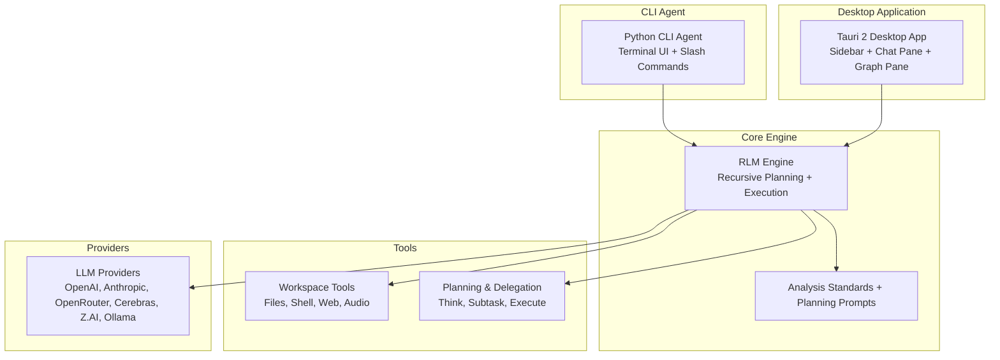
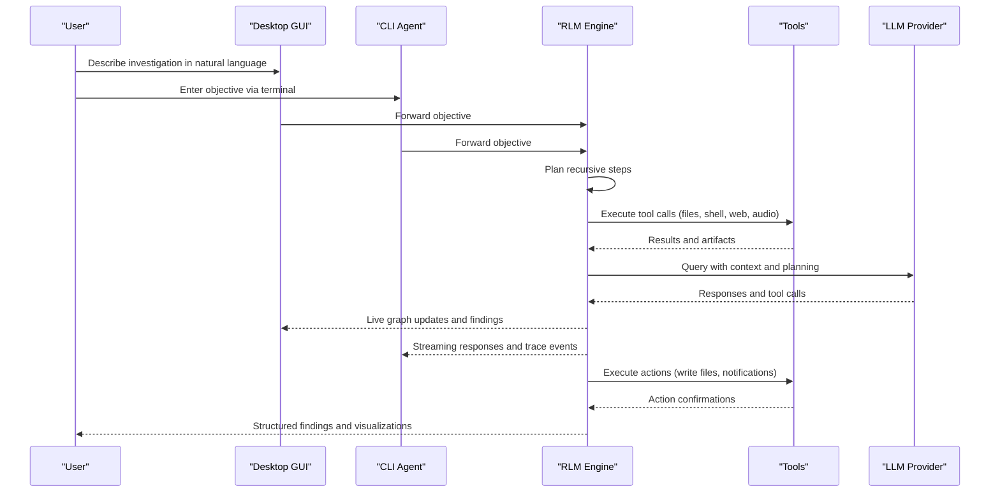
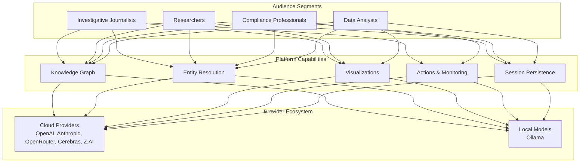

# Target Audience

<cite>
**Referenced Files in This Document**
- [README.md](file://README.md)
- [VISION.md](file://VISION.md)
- [DEMO.md](file://DEMO.md)
- [agent/__main__.py](file://agent/__main__.py)
- [agent/tui.py](file://agent/tui.py)
- [openplanter-desktop/crates/op-core/src/prompts.rs](file://openplanter-desktop/crates/op-core/src/prompts.rs)
- [openplanter-desktop/crates/op-core/src/engine/mod.rs](file://openplanter-desktop/crates/op-core/src/engine/mod.rs)
- [openplanter-desktop/crates/op-core/src/engine/investigation_state.rs](file://openplanter-desktop/crates/op-core/src/engine/investigation_state.rs)
- [openplanter-desktop/crates/op-tauri/src/commands/agent.rs](file://openplanter-desktop/crates/op-tauri/src/commands/agent.rs)
- [openplanter-desktop/frontend/src/commands/zaiPlan.ts](file://openplanter-desktop/frontend/src/commands/zaiPlan.ts)
- [openplanter-desktop/frontend/src/commands/webSearch.ts](file://openplanter-desktop/frontend/src/commands/webSearch.ts)
- [jon-maples-oppo/jon_maples_key_findings.json](file://jon-maples-oppo/jon_maples_key_findings.json)
- [central-fl-ice-workspace/METRICS_ANALYSIS_SUMMARY_2026-02-27.md](file://central-fl-ice-workspace/METRICS_ANALYSIS_SUMMARY_2026-02-27.md)
- [central-fl-ice-workspace/ICE_METRICS_DECODE_DEEP_DIVE_2026-02-27.md](file://central-fl-ice-workspace/ICE_METRICS_DECODE_DEEP_DIVE_2026-02-27.md)
</cite>

## Table of Contents
1. [Introduction](#introduction)
2. [Project Structure](#project-structure)
3. [Core Components](#core-components)
4. [Architecture Overview](#architecture-overview)
5. [Detailed Component Analysis](#detailed-component-analysis)
6. [Dependency Analysis](#dependency-analysis)
7. [Performance Considerations](#performance-considerations)
8. [Troubleshooting Guide](#troubleshooting-guide)
9. [Conclusion](#conclusion)
10. [Appendices](#appendices)

## Introduction
OpenPlanter serves a broad audience of analysts and investigators who need to understand complex domains by connecting heterogeneous data sources, resolving entities across them, and discovering hidden relationships. The platform targets users who analyze large, messy datasets and require a conversational agent that builds a structured knowledge graph, performs entity resolution, and generates actionable insights through visualization and AI grounding.

Primary user groups include:
- Investigative journalists investigating financial crime, political corruption, or corporate misconduct
- Researchers conducting academic or scientific studies requiring integration of diverse datasets
- Compliance professionals performing due diligence and monitoring
- Data analysts working with complex, multi-source datasets needing entity resolution and graph discovery

Skill level requirements span from beginners comfortable with command-line interfaces to experienced developers familiar with AI/ML concepts. The platform offers both a desktop GUI and a CLI agent, allowing users to choose the interface that best fits their workflow.

## Project Structure
OpenPlanter comprises:
- A desktop application (Tauri 2) with a three-pane interface: sidebar, chat pane, and knowledge graph
- A Python CLI agent with a terminal UI and slash commands
- A Rust core engine implementing the recursive language model engine, planning, and execution
- A comprehensive set of tools for data ingestion, shell execution, web search, audio transcription, and planning/delegation
- Persistent sessions, embeddings retrieval, and Chrome DevTools MCP integration

**Diagram sources**
- [README.md:19-31](file://README.md#L19-L31)
- [README.md:229-246](file://README.md#L229-L246)
- [README.md:55-82](file://README.md#L55-L82)
- [openplanter-desktop/crates/op-core/src/prompts.rs:123-175](file://openplanter-desktop/crates/op-core/src/prompts.rs#L123-L175)

**Section sources**
- [README.md:19-51](file://README.md#L19-L51)
- [README.md:229-246](file://README.md#L229-L246)
- [README.md:55-82](file://README.md#L55-L82)

## Core Components
- Desktop GUI: Three-pane layout with session management, provider/model settings, live knowledge graph, and wiki integration
- CLI Agent: Terminal-based interface with slash commands for model switching, reasoning effort, embeddings, and Chrome MCP
- Core Engine: Recursive language model engine with planning, execution, and acceptance criteria
- Tools: 20+ tools for ingestion, shell execution, web search, audio transcription, and planning/delegation
- Providers: Support for multiple LLM providers and local models

Key capabilities:
- Live knowledge graph with real-time entity and relationship visualization
- Session persistence and checkpointed wiki synthesis
- Multi-provider support and configurable embeddings retrieval
- Chrome DevTools MCP integration for browser automation

**Section sources**
- [README.md:25-31](file://README.md#L25-L31)
- [README.md:229-246](file://README.md#L229-L246)
- [README.md:247-291](file://README.md#L247-L291)
- [agent/tui.py:20-30](file://agent/tui.py#L20-L30)

## Architecture Overview
OpenPlanter’s architecture centers on a recursive language model agent that:
- Builds a structured knowledge graph from heterogeneous data sources
- Resolves entities across datasets with confidence scoring
- Performs graph traversal, anomaly detection, and pattern matching
- Generates interactive visualizations on demand
- Executes actions grounded in the ontology with audit trails

**Diagram sources**
- [README.md:25-31](file://README.md#L25-L31)
- [README.md:229-246](file://README.md#L229-L246)
- [openplanter-desktop/crates/op-core/src/prompts.rs:123-175](file://openplanter-desktop/crates/op-core/src/prompts.rs#L123-L175)

## Detailed Component Analysis

### Target User Groups and Use Cases
OpenPlanter targets four primary user groups, each with distinct needs and workflows:

1) Investigative Journalists
- Need to connect entities across leaked documents, public records, and proprietary databases
- Require graph analysis, entity resolution, and document ingestion
- Use cases: Financial crime investigations, political corruption, corporate misconduct
- Example: Cross-referencing shell companies with campaign finance donations and property deeds

2) Researchers (Academic/Scientific)
- Study complex systems requiring integration of diverse datasets
- Need entity resolution, link analysis, and visualization tools
- Use cases: Epidemiology, climate studies, social network analysis, supply chain research
- Example: Integrating hospital records, genomic data, and mobility data to model disease transmission

3) Compliance Professionals
- Conduct due diligence and monitor complex entity networks
- Require risk assessment, anomaly detection, and persistent monitoring
- Use cases: Fraud detection, sanctions screening, regulatory compliance
- Example: Identifying structuring patterns in financial transactions across multiple entities

4) Data Analysts
- Work with complex, multi-source datasets requiring entity resolution and graph discovery
- Need visualization and AI grounding for exploratory analysis
- Use cases: Business intelligence, competitive analysis, operational insights
- Example: Cross-linking vendor payments with lobbying disclosures to flag overlaps

**Section sources**
- [VISION.md:470-511](file://VISION.md#L470-L511)
- [DEMO.md:9-60](file://DEMO.md#L9-L60)
- [DEMO.md:62-120](file://DEMO.md#L62-L120)
- [DEMO.md:185-242](file://DEMO.md#L185-L242)

### Skill Level Requirements and Learning Curve
OpenPlanter accommodates users across a spectrum of technical expertise:

- Beginners comfortable with command-line interfaces:
  - Can start with the CLI agent and slash commands
  - Learn essential commands: /model, /reasoning, /embeddings, /chrome, /status
  - Progress to session persistence and basic tool usage
  - Desktop GUI provides guided visualization and knowledge graph exploration

- Intermediate users with scripting experience:
  - Leverage shell execution tools for data pipelines
  - Combine CLI and desktop workflows for iterative analysis
  - Utilize acceptance criteria for quality assurance

- Experienced developers and AI/ML practitioners:
  - Customize provider configurations and model selection
  - Extend tool definitions and integrate custom connectors
  - Deploy persistent agents and monitoring workflows
  - Utilize advanced reasoning effort settings and recursive planning

Learning progression:
1) Basic CLI usage and slash commands
2) Understanding session persistence and workspace management
3) Exploring knowledge graph visualizations
4) Advanced provider configuration and tool customization
5) Recursive planning and acceptance criteria
6) Persistent agent deployment and monitoring

**Section sources**
- [agent/tui.py:114-124](file://agent/tui.py#L114-L124)
- [agent/__main__.py:41-225](file://agent/__main__.py#L41-L225)
- [README.md:55-82](file://README.md#L55-L82)

### Use Case Scenarios by Audience

#### Investigative Journalism
Scenario: "Follow the Money"
- Data sources: Offshore registry CSV, FEC campaign finance database, scanned property deeds
- Process: Entity resolution across sources, graph construction, timeline analysis
- Outcome: Identification of shell companies linked to politicians through disclosed financial interests

#### Humanitarian Operations
Scenario: "What's Happening on the Ground?"
- Data sources: Beneficiary registration database, supply depot inventories, GPS coordinates, satellite imagery, situation reports
- Process: Unified operational picture, geospatial analysis, coverage gap identification
- Outcome: Supply redistribution recommendations and field team deployment alerts

#### Corporate Due Diligence
Scenario: "Who Is This Person Really?"
- Data sources: Internal databases, public records, corporate registries
- Process: Entity network construction, risk scoring, persistent monitoring
- Outcome: Enhanced due diligence recommendations and ongoing alerting

#### Government Oversight
Scenario: "ICE Detention Statistics Analysis"
- Data sources: Government datasets, FOIA responses, technical documentation
- Process: Metrics decoding, hypothesis generation, cross-referencing with large facilities
- Outcome: Data dictionary requests and methodological clarification for accurate analysis

**Section sources**
- [DEMO.md:9-60](file://DEMO.md#L9-L60)
- [DEMO.md:62-120](file://DEMO.md#L62-L120)
- [DEMO.md:185-242](file://DEMO.md#L185-L242)
- [central-fl-ice-workspace/METRICS_ANALYSIS_SUMMARY_2026-02-27.md:89-141](file://central-fl-ice-workspace/METRICS_ANALYSIS_SUMMARY_2026-02-27.md#L89-L141)
- [central-fl-ice-workspace/ICE_METRICS_DECODE_DEEP_DIVE_2026-02-27.md:295-331](file://central-fl-ice-workspace/ICE_METRICS_DECODE_DEEP_DIVE_2026-02-27.md#L295-L331)

### Desktop GUI vs CLI Agent Decision Matrix

#### Choose Desktop GUI when:
- You need immediate visual feedback through the live knowledge graph
- Working with complex datasets where interactive exploration is crucial
- Collaborating with team members who prefer visual interfaces
- Performing initial discovery and hypothesis generation
- Need provenance-aware wiki synthesis and session persistence
- Want guided navigation through the investigation workflow

#### Choose CLI Agent when:
- Working in headless environments or CI/CD pipelines
- Need programmatic access to OpenPlanter capabilities
- Preferring keyboard-driven workflows and scripting
- Operating in constrained environments without GUI support
- Integrating OpenPlanter into existing data processing pipelines
- Requires reproducible, scriptable analysis workflows

Interface comparison:
- Desktop GUI: Rich visualizations, real-time graph updates, session persistence, wiki integration
- CLI Agent: Slash commands for configuration, streaming responses, headless operation, reproducibility

**Section sources**
- [README.md:25-31](file://README.md#L25-L31)
- [README.md:55-82](file://README.md#L55-L82)
- [agent/tui.py:505-567](file://agent/tui.py#L505-L567)

### Prerequisites and Recommended Background

Essential prerequisites:
- Basic understanding of AI/LLM concepts:
  - Prompt engineering fundamentals
  - Understanding of model capabilities and limitations
  - Knowledge of provider selection and cost considerations
- Familiarity with command-line interfaces:
  - File system navigation and basic shell commands
  - Environment variable management
  - Package installation and dependency management
- Knowledge of data analysis workflows:
  - Data ingestion and preprocessing
  - Entity resolution concepts
  - Cross-dataset linking strategies
  - Evidence-based analysis methodologies

Recommended background for advanced users:
- Programming/scripting experience (Python, shell scripting)
- Understanding of graph theory and network analysis
- Familiarity with data formats (CSV, JSON, XML, Parquet)
- Knowledge of privacy and security considerations for sensitive data
- Understanding of audit trails and compliance requirements

**Section sources**
- [openplanter-desktop/crates/op-core/src/prompts.rs:123-175](file://openplanter-desktop/crates/op-core/src/prompts.rs#L123-L175)
- [agent/tui.py:20-30](file://agent/tui.py#L20-L30)

## Dependency Analysis
OpenPlanter’s target audience benefits from its modular architecture and provider-agnostic design:

**Diagram sources**
- [README.md:92-121](file://README.md#L92-L121)
- [README.md:229-246](file://README.md#L229-L246)

**Section sources**
- [README.md:92-121](file://README.md#L92-L121)
- [README.md:229-246](file://README.md#L229-L246)

## Performance Considerations
- Provider selection impacts latency and cost; configure appropriate models for your use case
- Embeddings retrieval enhances grounding but requires API keys and storage
- Chrome MCP integration improves web automation but requires Node.js and Chrome setup
- Session persistence enables efficient continuation but consumes disk space
- Recursive planning scales with investigation complexity; tune depth and step limits accordingly

## Troubleshooting Guide
Common setup issues and resolutions:
- API key configuration: Use interactive prompts or environment variables
- Workspace path errors: Ensure proper directory structure and permissions
- Model availability: Verify provider connectivity and quota limits
- Chrome MCP setup: Confirm Node.js installation and Chrome remote debugging
- Embeddings provider: Configure Voyage or Mistral keys for retrieval enhancement

**Section sources**
- [agent/__main__.py:281-416](file://agent/__main__.py#L281-L416)
- [README.md:363-373](file://README.md#L363-L373)

## Conclusion
OpenPlanter provides a unified platform for complex data analysis across diverse user groups. Its conversational agent-first approach, combined with robust entity resolution and visualization capabilities, enables users to transform fragmented data into actionable insights. The platform’s dual interface design accommodates both visual exploration and programmatic workflows, while its provider-agnostic architecture supports various deployment scenarios from individual analysts to enterprise compliance teams.

The target audience spans from investigative journalists seeking to uncover hidden connections to researchers analyzing complex systems, with clear pathways for skill development and advanced customization for experienced practitioners.

## Appendices

### Quick Reference: Essential Commands
- Desktop GUI: Use sidebar for session management and provider settings
- CLI Agent: /model, /reasoning, /embeddings, /chrome, /status, /help
- Provider configuration: OPENAI_API_KEY, ANTHROPIC_API_KEY, etc.
- Workspace management: OPENPLANTER_WORKSPACE environment variable

### Example Integration Patterns
- Journalistic investigations: Combine web search, document OCR, and entity resolution
- Academic research: Integrate multiple dataset formats with visualization dashboards
- Compliance monitoring: Deploy persistent agents with alerting and action workflows
- Operational analysis: Use geospatial tools and timeline visualizations

**Section sources**
- [agent/tui.py:114-124](file://agent/tui.py#L114-L124)
- [README.md:363-373](file://README.md#L363-L373)