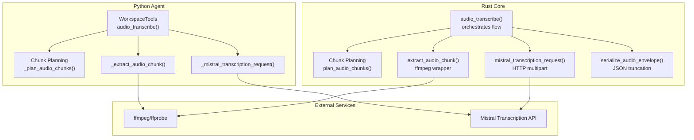
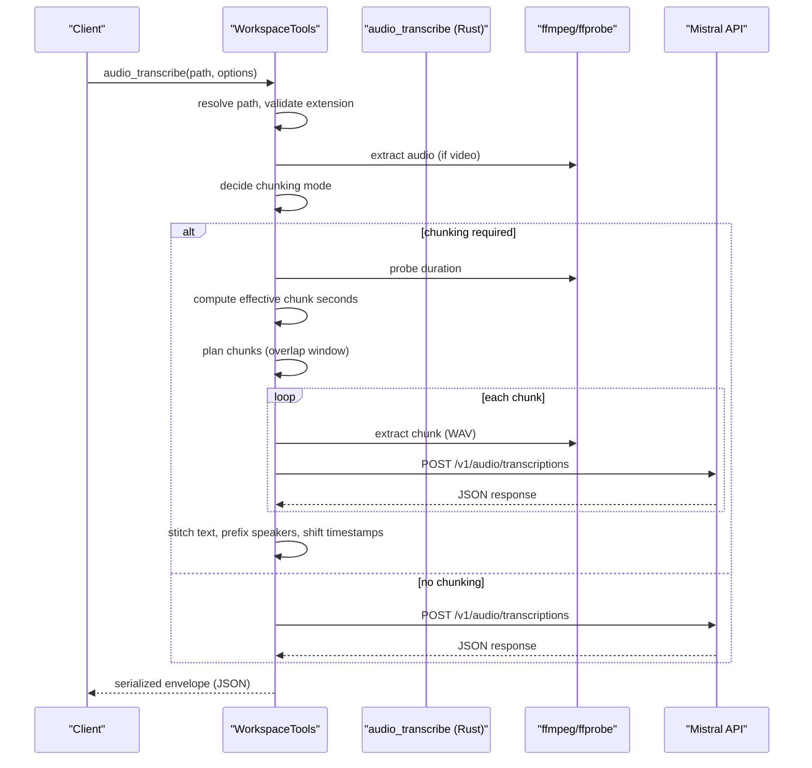
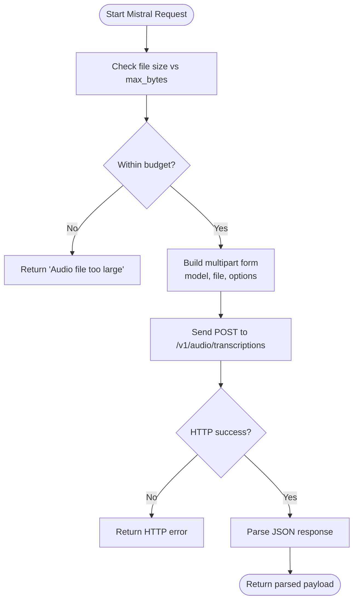
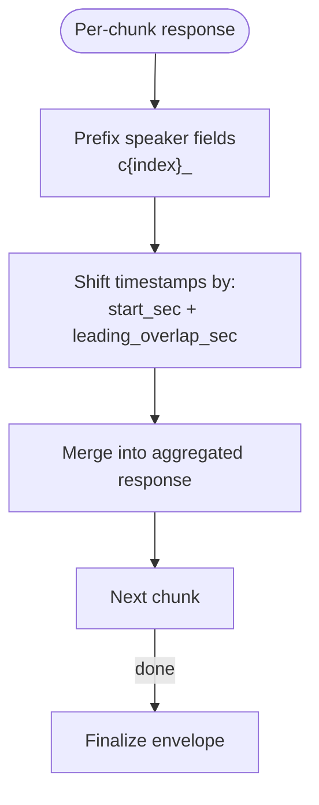
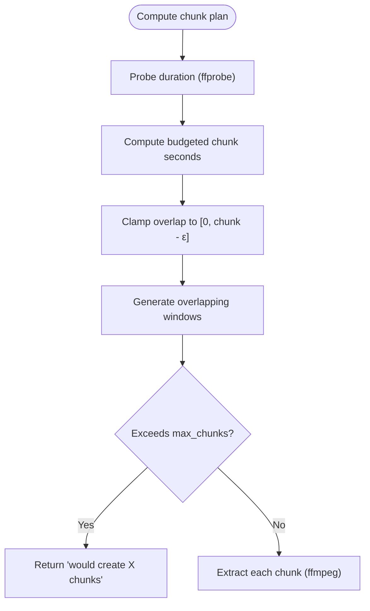
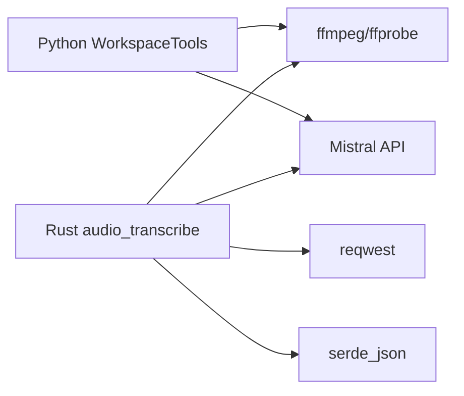

# Audio Processing Pipeline

<cite>
**Referenced Files in This Document**
- [tools.py](file://agent/tools.py)
- [audio.rs](file://openplanter-desktop/crates/op-core/src/tools/audio.rs)
- [defs.rs](file://openplanter-desktop/crates/op-core/src/tools/defs.rs)
- [test_audio_transcribe.py](file://tests/test_audio_transcribe.py)
</cite>

## Table of Contents
1. [Introduction](#introduction)
2. [Project Structure](#project-structure)
3. [Core Components](#core-components)
4. [Architecture Overview](#architecture-overview)
5. [Detailed Component Analysis](#detailed-component-analysis)
6. [Dependency Analysis](#dependency-analysis)
7. [Performance Considerations](#performance-considerations)
8. [Troubleshooting Guide](#troubleshooting-guide)
9. [Conclusion](#conclusion)

## Introduction
This document describes the audio processing pipeline with a focus on speech-to-text and audio analysis capabilities powered by Mistral's transcription service. It covers speaker diarization, chunked processing, timestamp extraction, audio file handling, supported formats, size limitations, configuration options, and practical workflows for multi-speaker analysis and transcript post-processing. It also provides guidance on audio quality considerations, processing limitations, and troubleshooting common transcription issues.

## Project Structure
The audio processing pipeline spans both Python and Rust components:
- Python agent tools orchestrate file resolution, chunk planning, and orchestrate Mistral requests.
- Rust core tools implement robust audio extraction, chunking, and serialization logic, including speaker prefixing and timestamp shifting.
- Tool definitions describe the API surface and constraints for clients.

**Diagram sources**
- [tools.py:2250-2412](file://agent/tools.py#L2250-L2412)
- [audio.rs:798-1186](file://openplanter-desktop/crates/op-core/src/tools/audio.rs#L798-L1186)

**Section sources**
- [tools.py:121-161](file://agent/tools.py#L121-L161)
- [audio.rs:14-26](file://openplanter-desktop/crates/op-core/src/tools/audio.rs#L14-L26)

## Core Components
- Mistral transcription integration: Orchestrated via Python and Rust wrappers that send multipart/form-data requests to Mistral’s `/v1/audio/transcriptions` endpoint.
- Speaker diarization: Enabled via the `diarize` option; speaker identifiers are prefixed per chunk to maintain global uniqueness.
- Chunked processing: Automatic or forced segmentation with configurable overlap and maximum chunk counts.
- Timestamp extraction: Segment and word-level timestamps are preserved and adjusted to reflect global time offsets.
- Audio file handling: Supports audio and video inputs; video is extracted to mono 16 kHz WAV prior to upload.

Key configuration defaults and limits:
- Model: voxtral-mini-latest
- Max upload size: 100 MiB
- Default chunk max seconds: 900
- Default overlap: 2.0 seconds
- Max chunks: 48
- Target fill ratio: ~85%
- Bytes per second budget: 32,000

**Section sources**
- [tools.py:148-155](file://agent/tools.py#L148-L155)
- [audio.rs:14-26](file://openplanter-desktop/crates/op-core/src/tools/audio.rs#L14-L26)
- [audio.rs:375-382](file://openplanter-desktop/crates/op-core/src/tools/audio.rs#L375-L382)

## Architecture Overview
The pipeline follows a deterministic flow:
1. Resolve and validate input path and extension.
2. If video, extract audio to WAV using ffmpeg.
3. Decide chunking mode (auto/off/force) based on size and configuration.
4. If chunking is required:
   - Probe duration with ffprobe.
   - Compute effective chunk duration respecting max-bytes budget.
   - Plan overlapping windows.
   - Extract each chunk and send to Mistral.
   - Aggregate results, deduplicate overlaps, and adjust timestamps.
5. Serialize response with truncation safeguards.

**Diagram sources**
- [tools.py:2250-2412](file://agent/tools.py#L2250-L2412)
- [audio.rs:798-1186](file://openplanter-desktop/crates/op-core/src/tools/audio.rs#L798-L1186)

## Detailed Component Analysis

### Mistral Transcription Integration
- Endpoint construction: Ensures trailing slash normalization and appends `/audio/transcriptions`.
- Request building: Adds model, stream=false, file multipart, and optional diarize/language/temperature/timestamp_granularities/context_bias.
- Error handling: Propagates HTTP status, malformed JSON, and timeouts; validates file size against configured budget.

**Diagram sources**
- [audio.rs:706-795](file://openplanter-desktop/crates/op-core/src/tools/audio.rs#L706-L795)

**Section sources**
- [audio.rs:56-63](file://openplanter-desktop/crates/op-core/src/tools/audio.rs#L56-L63)
- [audio.rs:706-795](file://openplanter-desktop/crates/op-core/src/tools/audio.rs#L706-L795)

### Speaker Diarization and Timestamp Extraction
- Speaker prefixing: Each chunk’s speaker identifiers are prefixed with `c{index}_` to avoid collisions across chunks.
- Timestamp adjustment: Segment and word timestamps are shifted by chunk start time and adjusted for leading overlap.
- Aggregation: Segments, words, and diarization arrays are merged into a unified response envelope.

**Diagram sources**
- [audio.rs:458-561](file://openplanter-desktop/crates/op-core/src/tools/audio.rs#L458-L561)
- [audio.rs:1124-1141](file://openplanter-desktop/crates/op-core/src/tools/audio.rs#L1124-L1141)

**Section sources**
- [audio.rs:458-561](file://openplanter-desktop/crates/op-core/src/tools/audio.rs#L458-L561)
- [audio.rs:1124-1141](file://openplanter-desktop/crates/op-core/src/tools/audio.rs#L1124-L1141)

### Chunked Processing and Overlap Management
- Duration probing: Uses ffprobe to obtain media duration.
- Budget-aware chunk sizing: Computes effective chunk seconds to respect max-bytes budget and target fill ratio (~85%).
- Overlap enforcement: Clamps overlap to be within [0, chunk_duration - ε].
- Chunk plan generation: Produces overlapping windows up to a maximum number of chunks.

**Diagram sources**
- [audio.rs:1005-1028](file://openplanter-desktop/crates/op-core/src/tools/audio.rs#L1005-L1028)
- [audio.rs:375-382](file://openplanter-desktop/crates/op-core/src/tools/audio.rs#L375-L382)
- [audio.rs:384-429](file://openplanter-desktop/crates/op-core/src/tools/audio.rs#L384-L429)

**Section sources**
- [audio.rs:1005-1028](file://openplanter-desktop/crates/op-core/src/tools/audio.rs#L1005-L1028)
- [audio.rs:375-382](file://openplanter-desktop/crates/op-core/src/tools/audio.rs#L375-L382)
- [audio.rs:384-429](file://openplanter-desktop/crates/op-core/src/tools/audio.rs#L384-L429)

### Audio File Handling and Supported Formats
- Supported audio extensions: aac, flac, m4a, mp3, mpeg, mpga, oga, ogg, opus, wav.
- Supported video extensions: avi, m4v, mkv, mov, mp4, webm.
- Video preprocessing: Extracted to mono 16 kHz PCM WAV using ffmpeg.
- Media tool availability: ffmpeg and ffprobe must be installed and discoverable in PATH for long-form audio/video.

**Section sources**
- [audio.rs:14-17](file://openplanter-desktop/crates/op-core/src/tools/audio.rs#L14-L17)
- [audio.rs:91-97](file://openplanter-desktop/crates/op-core/src/tools/audio.rs#L91-L97)
- [audio.rs:315-340](file://openplanter-desktop/crates/op-core/src/tools/audio.rs#L315-L340)
- [audio.rs:218-231](file://openplanter-desktop/crates/op-core/src/tools/audio.rs#L218-L231)

### Transcription Configuration
Key options and constraints:
- Model selection: Override default model via `model`.
- Diarization: Enable speaker identification.
- Timestamp granularities: segment or word; cannot be combined with language hints.
- Context bias: Up to 100 phrases to bias transcription toward expected terms.
- Language: ISO language hint; incompatible with timestamp_granularities.
- Temperature: Decoding temperature for Mistral.
- Chunking modes: auto (size-based), off (no chunking), force (always chunk).
- Chunk parameters: chunk_max_seconds, chunk_overlap_seconds, max_chunks.
- Continue on chunk error: If true, continues despite individual chunk failures and returns partial output.

Constraints enforced:
- chunk_max_seconds must be between 30 and 1800 seconds.
- chunk_overlap_seconds must be between 0 and 15 seconds.
- max_chunks must be between 1 and 200.

**Section sources**
- [defs.rs:72-131](file://openplanter-desktop/crates/op-core/src/tools/defs.rs#L72-L131)
- [audio.rs:849-854](file://openplanter-desktop/crates/op-core/src/tools/audio.rs#L849-L854)
- [audio.rs:855-886](file://openplanter-desktop/crates/op-core/src/tools/audio.rs#L855-L886)

### Practical Workflows and Post-Processing

#### Multi-speaker analysis
- Enable diarization to receive speaker segments.
- Use chunk overlap to mitigate boundary artifacts.
- Rely on speaker prefixes (`c{index}_`) to disambiguate speakers across chunks.
- Timestamps are globally shifted to reflect real-world positions.

**Section sources**
- [audio.rs:1030-1044](file://openplanter-desktop/crates/op-core/src/tools/audio.rs#L1030-L1044)
- [audio.rs:1124-1141](file://openplanter-desktop/crates/op-core/src/tools/audio.rs#L1124-L1141)

#### Transcript post-processing
- Deduplication: Overlapping text between chunks is deduplicated using token normalization and sliding window comparison.
- Truncation: Envelope JSON is truncated to fit character limits; response fields may be omitted in prioritized order.
- Partial runs: When continue_on_chunk_error is true, warnings and partial flags indicate which chunks failed.

**Section sources**
- [audio.rs:167-194](file://openplanter-desktop/crates/op-core/src/tools/audio.rs#L167-L194)
- [audio.rs:602-704](file://openplanter-desktop/crates/op-core/src/tools/audio.rs#L602-L704)
- [audio.rs:1044-1045](file://openplanter-desktop/crates/op-core/src/tools/audio.rs#L1044-L1045)

#### Example scenarios
- Auto chunking for oversize files: The system detects oversized files and automatically chunks them.
- Force chunking: Even under-size files can be chunked by setting chunking=force.
- Video input: MP4 is extracted to WAV before transcription.

**Section sources**
- [test_audio_transcribe.py:91-163](file://tests/test_audio_transcribe.py#L91-L163)
- [test_audio_transcribe.py:225-270](file://tests/test_audio_transcribe.py#L225-L270)
- [test_audio_transcribe.py:292-316](file://tests/test_audio_transcribe.py#L292-L316)

## Dependency Analysis
- Python agent depends on:
  - ffmpeg/ffprobe for media extraction and probing.
  - Mistral API for transcription.
- Rust core depends on:
  - reqwest for HTTP multipart requests.
  - tokio for async orchestration.
  - serde_json for payload parsing and serialization.
- Shared constraints:
  - Environment PATH must include ffmpeg/ffprobe.
  - Mistral API key must be configured.

**Diagram sources**
- [audio.rs:6-12](file://openplanter-desktop/crates/op-core/src/tools/audio.rs#L6-L12)
- [audio.rs:218-231](file://openplanter-desktop/crates/op-core/src/tools/audio.rs#L218-L231)

**Section sources**
- [audio.rs:6-12](file://openplanter-desktop/crates/op-core/src/tools/audio.rs#L6-L12)
- [audio.rs:218-231](file://openplanter-desktop/crates/op-core/src/tools/audio.rs#L218-L231)

## Performance Considerations
- Chunk size budgeting: Effective chunk seconds are computed to respect the max-bytes budget and target fill ratio (~85%), balancing throughput and accuracy.
- Overlap trade-offs: Larger overlap improves boundary accuracy but increases total processing time and API calls.
- Max chunks cap: Limits total processing cost and memory footprint.
- Character limits: Envelope serialization truncates large responses to prevent exceeding observation limits.

[No sources needed since this section provides general guidance]

## Troubleshooting Guide
Common issues and resolutions:
- Unsupported audio format: Ensure file extension is among supported audio or video types; video is converted to WAV internally.
- Missing ffmpeg/ffprobe: Install and ensure binaries are in PATH for long-form audio/video processing.
- Oversized file: Reduce chunk size or enable auto chunking; verify max-bytes budget.
- Language + timestamp_granularities conflict: Remove one of the conflicting options.
- No chunks succeeded: Verify API connectivity and keys; check chunk overlap and duration constraints.
- Partial output: Enable continue_on_chunk_error to receive partial transcripts with warnings.

**Section sources**
- [audio.rs:839-848](file://openplanter-desktop/crates/op-core/src/tools/audio.rs#L839-L848)
- [audio.rs:218-231](file://openplanter-desktop/crates/op-core/src/tools/audio.rs#L218-L231)
- [audio.rs:849-854](file://openplanter-desktop/crates/op-core/src/tools/audio.rs#L849-L854)
- [audio.rs:1155-1159](file://openplanter-desktop/crates/op-core/src/tools/audio.rs#L1155-L1159)
- [test_audio_transcribe.py:272-290](file://tests/test_audio_transcribe.py#L272-L290)

## Conclusion
The audio processing pipeline integrates Mistral transcription with robust chunking, speaker diarization, and timestamp handling. It supports both audio and video inputs, enforces strict constraints for reliability, and provides mechanisms for partial runs and response truncation. By tuning chunk parameters and leveraging speaker prefixes and timestamp adjustments, users can achieve accurate multi-speaker transcripts for large audio files.