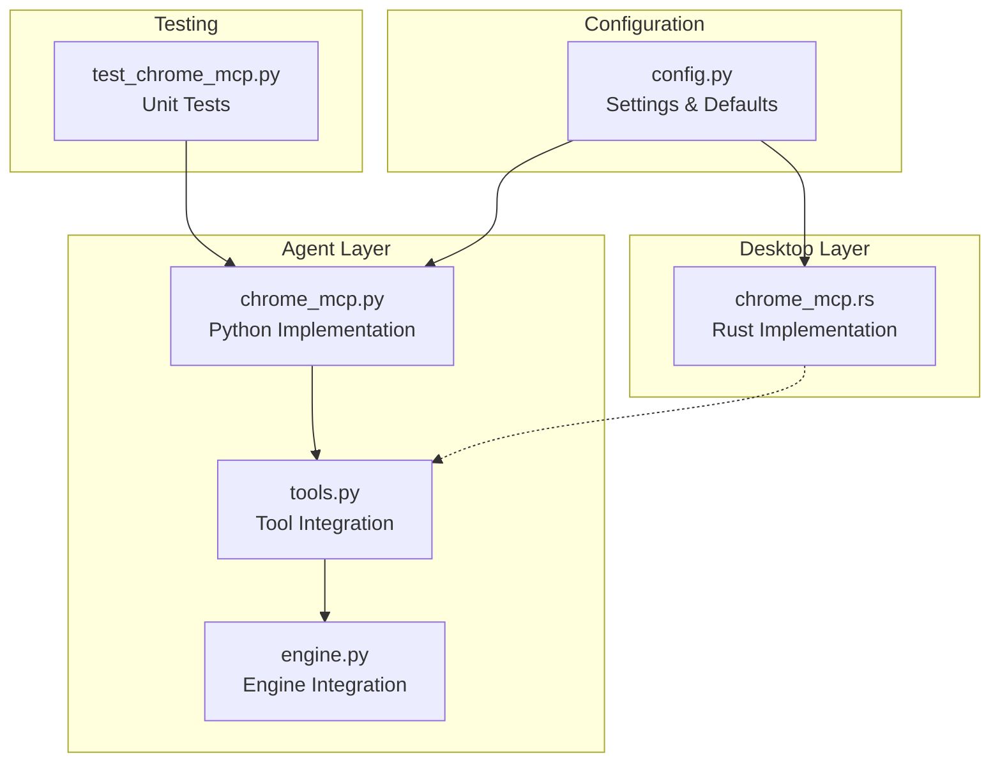
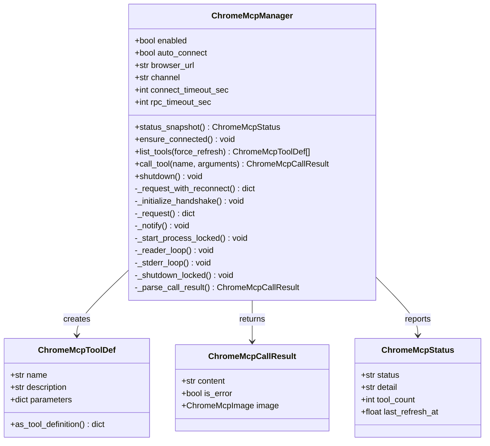
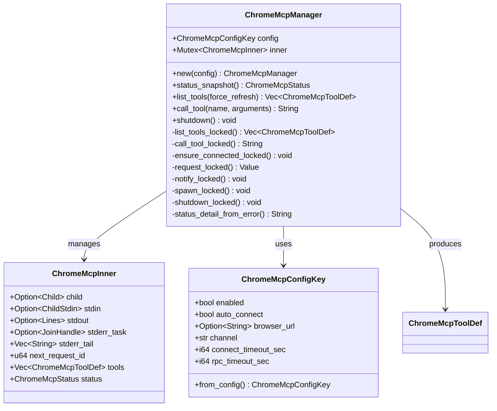
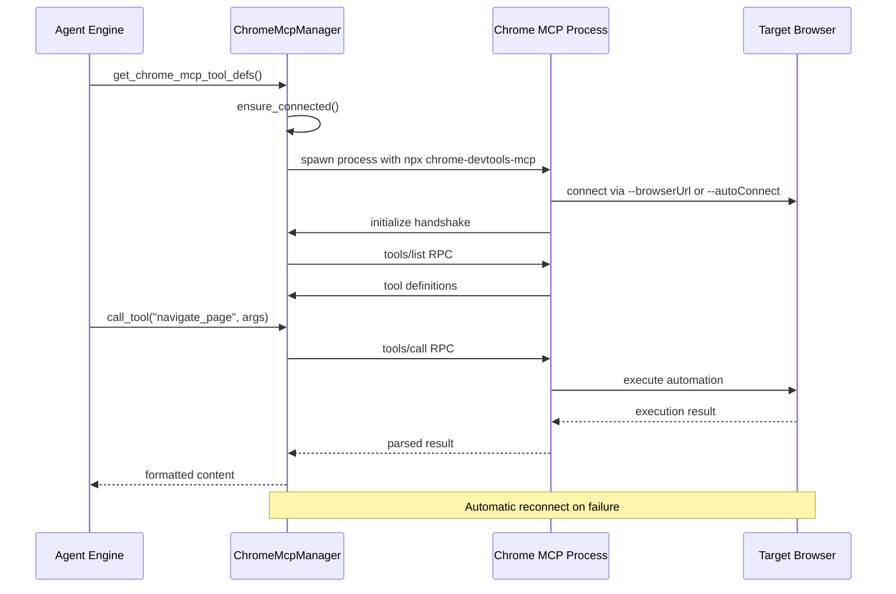
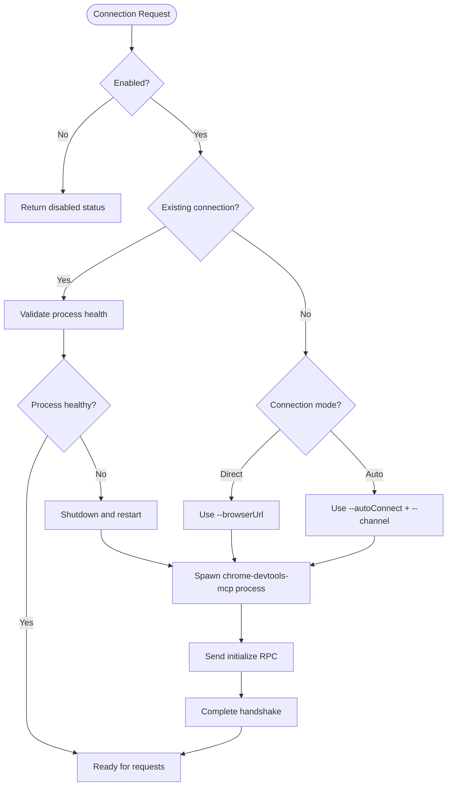
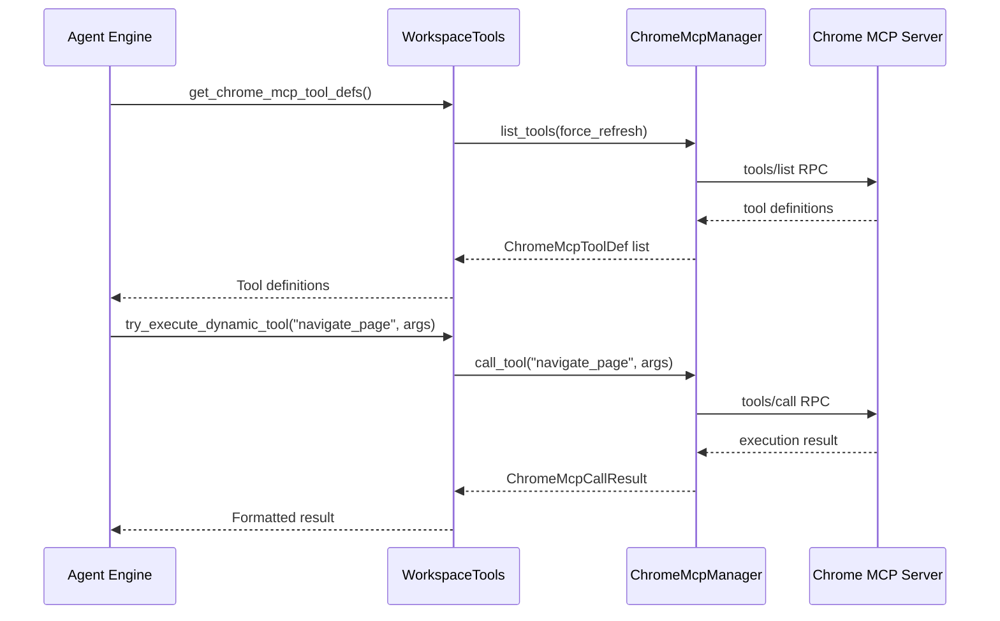
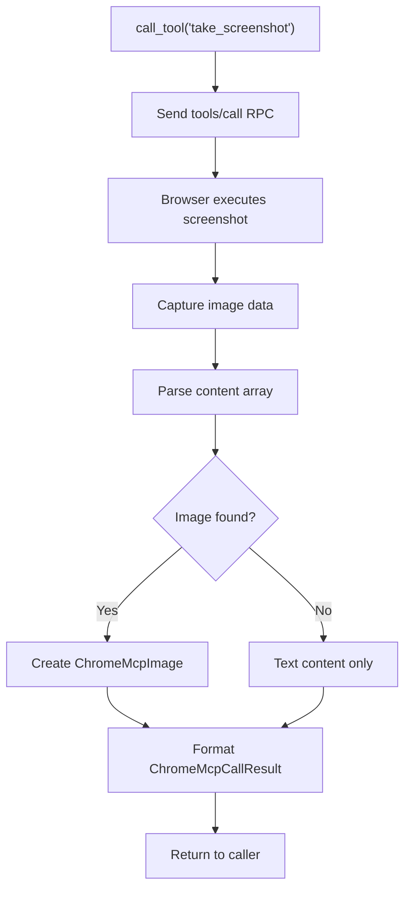
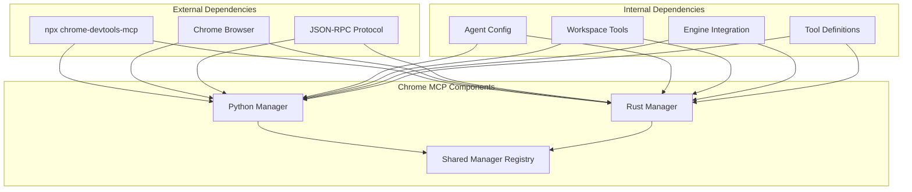
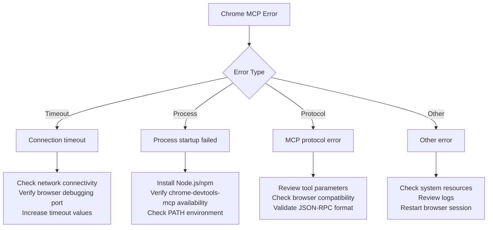

# Chrome MCP Automation

<cite>
**Referenced Files in This Document**
- [chrome_mcp.py](file://agent/chrome_mcp.py)
- [chrome_mcp.rs](file://openplanter-desktop/crates/op-core/src/tools/chrome_mcp.rs)
- [config.py](file://agent/config.py)
- [tools.py](file://agent/tools.py)
- [engine.py](file://agent/engine.py)
- [test_chrome_mcp.py](file://tests/test_chrome_mcp.py)
</cite>

## Table of Contents
1. [Introduction](#introduction)
2. [Project Structure](#project-structure)
3. [Core Components](#core-components)
4. [Architecture Overview](#architecture-overview)
5. [Detailed Component Analysis](#detailed-component-analysis)
6. [Dependency Analysis](#dependency-analysis)
7. [Performance Considerations](#performance-considerations)
8. [Troubleshooting Guide](#troubleshooting-guide)
9. [Security Considerations](#security-considerations)
10. [Practical Examples](#practical-examples)
11. [Extending Browser Automation](#extending-browser-automation)
12. [Conclusion](#conclusion)

## Introduction

Chrome MCP (Message Computation Protocol) automation enables the OpenPlanter agent to interact with web browsers through the Chrome DevTools protocol. This integration provides powerful browser automation capabilities including dynamic tool execution, page interaction, and screenshot functionality. The system supports both synchronous Python implementation and asynchronous Rust implementation, offering flexibility for different deployment scenarios.

The Chrome MCP integration transforms browser automation from a static process into a dynamic tool ecosystem that can be discovered, invoked, and managed programmatically. This enables sophisticated web scraping, form filling, content extraction, and visual analysis workflows that were previously difficult to implement reliably.

## Project Structure

The Chrome MCP automation functionality is distributed across multiple components within the OpenPlanter project:



**Diagram sources**
- [chrome_mcp.py:113-573](file://agent/chrome_mcp.py#L113-L573)
- [chrome_mcp.rs:109-501](file://openplanter-desktop/crates/op-core/src/tools/chrome_mcp.rs#L109-L501)
- [tools.py:121-416](file://agent/tools.py#L121-L416)
- [config.py:26-494](file://agent/config.py#L26-L494)

**Section sources**
- [chrome_mcp.py:1-573](file://agent/chrome_mcp.py#L1-L573)
- [chrome_mcp.rs:1-595](file://openplanter-desktop/crates/op-core/src/tools/chrome_mcp.rs#L1-L595)
- [tools.py:121-416](file://agent/tools.py#L121-L416)
- [config.py:26-494](file://agent/config.py#L26-L494)

## Core Components

### ChromeMcpManager (Python)

The core Chrome MCP implementation consists of a robust manager class that handles connection lifecycle, tool discovery, and RPC communication:



**Diagram sources**
- [chrome_mcp.py:25-521](file://agent/chrome_mcp.py#L25-L521)

### ChromeMcpManager (Rust)

The Rust implementation provides asynchronous capabilities with Tokio-based concurrency:



**Diagram sources**
- [chrome_mcp.rs:109-501](file://openplanter-desktop/crates/op-core/src/tools/chrome_mcp.rs#L109-L501)

**Section sources**
- [chrome_mcp.py:113-521](file://agent/chrome_mcp.py#L113-L521)
- [chrome_mcp.rs:109-501](file://openplanter-desktop/crates/op-core/src/tools/chrome_mcp.rs#L109-L501)

## Architecture Overview

The Chrome MCP architecture implements a client-server model with JSON-RPC over stdio pipes:



**Diagram sources**
- [chrome_mcp.py:158-303](file://agent/chrome_mcp.py#L158-L303)
- [chrome_mcp.rs:271-316](file://openplanter-desktop/crates/op-core/src/tools/chrome_mcp.rs#L271-L316)

The architecture supports two connection modes:
- **Direct Connection**: Uses `--browserUrl` to connect to a specific browser instance
- **Auto Connect**: Uses `--autoConnect` with channel selection for automatic browser discovery

**Section sources**
- [chrome_mcp.py:357-394](file://agent/chrome_mcp.py#L357-L394)
- [chrome_mcp.rs:398-446](file://openplanter-desktop/crates/op-core/src/tools/chrome_mcp.rs#L398-L446)

## Detailed Component Analysis

### Connection Management

Connection management implements robust lifecycle handling with automatic reconnection:



**Diagram sources**
- [chrome_mcp.py:158-183](file://agent/chrome_mcp.py#L158-L183)
- [chrome_mcp.rs:271-316](file://openplanter-desktop/crates/op-core/src/tools/chrome_mcp.rs#L271-L316)

### Tool Discovery and Dynamic Execution

The system implements dynamic tool discovery through the MCP protocol:



**Diagram sources**
- [tools.py:383-416](file://agent/tools.py#L383-L416)
- [chrome_mcp.py:202-267](file://agent/chrome_mcp.py#L202-L267)

### Screenshot and Image Handling

The system supports advanced image processing from browser automation:



**Diagram sources**
- [chrome_mcp.py:469-521](file://agent/chrome_mcp.py#L469-L521)
- [chrome_mcp.rs:527-594](file://openplanter-desktop/crates/op-core/src/tools/chrome_mcp.rs#L527-L594)

**Section sources**
- [chrome_mcp.py:202-521](file://agent/chrome_mcp.py#L202-L521)
- [chrome_mcp.rs:174-594](file://openplanter-desktop/crates/op-core/src/tools/chrome_mcp.rs#L174-L594)
- [tools.py:383-416](file://agent/tools.py#L383-L416)

## Dependency Analysis

The Chrome MCP system has minimal external dependencies and integrates cleanly with the broader OpenPlanter architecture:



**Diagram sources**
- [chrome_mcp.py:357-573](file://agent/chrome_mcp.py#L357-L573)
- [chrome_mcp.rs:109-501](file://openplanter-desktop/crates/op-core/src/tools/chrome_mcp.rs#L109-L501)
- [config.py:202-207](file://agent/config.py#L202-L207)

**Section sources**
- [chrome_mcp.py:357-573](file://agent/chrome_mcp.py#L357-L573)
- [chrome_mcp.rs:109-501](file://openplanter-desktop/crates/op-core/src/tools/chrome_mcp.rs#L109-L501)
- [config.py:202-207](file://agent/config.py#L202-L207)

## Performance Considerations

### Connection Pooling and Reuse

The system implements shared manager instances to optimize resource usage:

- **Process Reuse**: Chrome MCP processes are reused across multiple tool invocations
- **Connection Persistence**: Connections remain established between tool calls when possible
- **Automatic Cleanup**: Processes are terminated when the application exits

### Timeout Management

The implementation provides configurable timeout handling:

- **Connection Timeout**: Separate timeout for establishing browser connections
- **RPC Timeout**: Separate timeout for individual tool execution
- **Automatic Retry**: Single automatic retry on connection failures

### Memory Management

- **Output Limiting**: Shell command output is truncated to prevent memory issues
- **Background Job Cleanup**: Proper cleanup of background processes
- **Resource Monitoring**: Thread-safe access to shared resources

**Section sources**
- [chrome_mcp.py:523-573](file://agent/chrome_mcp.py#L523-L573)
- [chrome_mcp.rs:109-121](file://openplanter-desktop/crates/op-core/src/tools/chrome_mcp.rs#L109-L121)

## Troubleshooting Guide

### Common Connection Issues

**Symptoms**: "Chrome DevTools MCP is disabled" or "Chrome DevTools MCP is enabled but cannot attach"

**Causes and Solutions**:
- **Missing browser URL**: Configure `chrome_mcp_browser_url` or enable `chrome_mcp_auto_connect`
- **Remote debugging disabled**: Enable Chrome remote debugging at `chrome://inspect/#remote-debugging`
- **Process not found**: Install Node.js/npm so `npx` is available locally
- **Timeout errors**: Increase `chrome_mcp_connect_timeout_sec` and `chrome_mcp_rpc_timeout_sec`

### Error Classification

The system provides detailed error classification:



**Diagram sources**
- [chrome_mcp.py:82-110](file://agent/chrome_mcp.py#L82-L110)
- [chrome_mcp.rs:460-500](file://openplanter-desktop/crates/op-core/src/tools/chrome_mcp.rs#L460-L500)

### Debugging Automation Failures

**Debugging Steps**:
1. **Enable verbose logging**: Monitor stderr output from the Chrome MCP process
2. **Test browser connectivity**: Verify Chrome remote debugging is working manually
3. **Validate tool parameters**: Ensure tool definitions match expected schemas
4. **Check network configuration**: Verify proxy settings if applicable

**Section sources**
- [chrome_mcp.py:82-110](file://agent/chrome_mcp.py#L82-L110)
- [chrome_mcp.rs:460-500](file://openplanter-desktop/crates/op-core/src/tools/chrome_mcp.rs#L460-L500)

## Security Considerations

### Browser Security Context

The Chrome MCP integration operates within the browser's security model:
- **Same-origin policies**: Respected by default
- **User gesture requirements**: Many browser actions require explicit user interaction
- **Cross-site restrictions**: Cross-origin limitations apply to automation
- **Popup blocking**: Browser popup blockers may interfere with automation

### Proxy Configuration

The system inherits proxy settings from the environment:
- **HTTP/HTTPS proxies**: Automatically detected from standard environment variables
- **SOCKS proxies**: Supported through standard proxy configuration
- **Authentication**: Proxy authentication supported where applicable

### Secure Automation Practices

**Best Practices**:
- **Input validation**: Always validate tool parameters before execution
- **Output sanitization**: Sanitize browser output to prevent injection attacks
- **Resource limits**: Implement timeouts and resource limits for automation tasks
- **Error isolation**: Isolate browser automation errors from main application flow

**Section sources**
- [chrome_mcp.py:357-372](file://agent/chrome_mcp.py#L357-L372)
- [chrome_mcp.rs:400-412](file://openplanter-desktop/crates/op-core/src/tools/chrome_mcp.rs#L400-L412)

## Practical Examples

### Basic Browser Navigation Workflow

```python
# Example workflow for navigating to a webpage
from agent.tools import WorkspaceTools
from agent.chrome_mcp import ChromeMcpCallResult

# Initialize tools with Chrome MCP enabled
tools = WorkspaceTools(
    root="/path/to/workspace",
    chrome_mcp_enabled=True,
    chrome_mcp_auto_connect=True
)

# Get available tools
tool_defs = tools.get_chrome_mcp_tool_defs()
print("Available Chrome MCP tools:", [tool["name"] for tool in tool_defs])

# Navigate to a URL
result: ChromeMcpCallResult = tools.try_execute_dynamic_tool(
    "navigate_page",
    {"url": "https://example.com"}
)

print("Navigation result:", result.content)
```

### Screenshot Automation

```python
# Example workflow for taking screenshots
result = tools.try_execute_dynamic_tool(
    "take_screenshot",
    {}
)

if result.image:
    print(f"Captured {result.image.media_type} image")
    # Process the base64 encoded image data
    image_data = result.image.base64_data
else:
    print("No image captured:", result.content)
```

### Form Interaction Pattern

```python
# Example workflow for form automation
form_tools = ["fill_field", "click_button", "submit_form"]

for tool_name in form_tools:
    if tool_name in known_tool_names:
        result = tools.try_execute_dynamic_tool(
            tool_name,
            {"selector": "#username", "value": "john_doe"}
        )
        print(f"{tool_name} result: {result.content}")
```

**Section sources**
- [test_chrome_mcp.py:107-160](file://tests/test_chrome_mcp.py#L107-L160)
- [tools.py:383-416](file://agent/tools.py#L383-L416)

## Extending Browser Automation

### Adding Custom Tools

To extend the Chrome MCP system with custom tools:

1. **Define Tool Schema**: Create a tool definition with proper JSON schema validation
2. **Implement Tool Handler**: Add tool logic in the Chrome MCP server implementation
3. **Register Tool**: Ensure the tool appears in the `tools/list` response
4. **Test Integration**: Verify tool works through the standard tool execution interface

### Custom Tool Definition Pattern

```python
# Example custom tool definition structure
custom_tool_def = {
    "name": "custom_browser_action",
    "description": "Performs custom browser automation action",
    "parameters": {
        "type": "object",
        "properties": {
            "target": {"type": "string", "description": "Target element selector"},
            "action": {"type": "string", "enum": ["click", "type", "scroll"]},
            "value": {"type": "string", "description": "Value for type actions"}
        },
        "required": ["target", "action"],
        "additionalProperties": False
    }
}
```

### Performance Optimization Strategies

**Optimization Techniques**:
- **Batch operations**: Combine multiple browser actions into single tool calls
- **Caching**: Cache frequently accessed page elements
- **Parallel execution**: Use multiple browser tabs for concurrent operations
- **Resource sharing**: Share browser sessions between related operations

**Section sources**
- [chrome_mcp.py:202-256](file://agent/chrome_mcp.py#L202-L256)
- [chrome_mcp.rs:174-245](file://openplanter-desktop/crates/op-core/src/tools/chrome_mcp.rs#L174-L245)

## Configuration Options

### Environment Variables

The Chrome MCP system supports extensive configuration through environment variables:

| Variable | Description | Default |
|----------|-------------|---------|
| `OPENPLANTER_CHROME_MCP_ENABLED` | Enable/disable Chrome MCP | `false` |
| `OPENPLANTER_CHROME_MCP_AUTO_CONNECT` | Enable auto browser connection | `true` |
| `OPENPLANTER_CHROME_MCP_BROWSER_URL` | Direct browser connection URL | `None` |
| `OPENPLANTER_CHROME_MCP_CHANNEL` | Browser channel (`stable`, `beta`, `dev`, `canary`) | `stable` |
| `OPENPLANTER_CHROME_MCP_CONNECT_TIMEOUT_SEC` | Connection timeout in seconds | `15` |
| `OPENPLANTER_CHROME_MCP_RPC_TIMEOUT_SEC` | RPC call timeout in seconds | `45` |
| `OPENPLANTER_CHROME_MCP_COMMAND` | Command to launch MCP server | `npx` |
| `OPENPLANTER_CHROME_MCP_PACKAGE` | npm package name | `chrome-devtools-mcp@latest` |
| `OPENPLANTER_CHROME_MCP_EXTRA_ARGS` | Additional command line arguments | `""` |

### Programmatic Configuration

```python
# Example configuration setup
config = AgentConfig(
    workspace="/path/to/workspace",
    chrome_mcp_enabled=True,
    chrome_mcp_auto_connect=True,
    chrome_mcp_browser_url="ws://localhost:9222/devtools/browser/uuid",
    chrome_mcp_channel="stable",
    chrome_mcp_connect_timeout_sec=30,
    chrome_mcp_rpc_timeout_sec=60
)
```

**Section sources**
- [config.py:26-29](file://agent/config.py#L26-L29)
- [config.py:202-207](file://agent/config.py#L202-L207)
- [config.py:445-464](file://agent/config.py#L445-L464)

## Conclusion

The Chrome MCP automation system provides a robust foundation for browser automation within the OpenPlanter framework. Its dual implementation approach (Python and Rust) ensures flexibility across different deployment scenarios while maintaining consistent functionality.

Key strengths of the implementation include:

- **Dynamic Tool Discovery**: Tools are automatically discovered and integrated into the agent's tool ecosystem
- **Robust Error Handling**: Comprehensive error detection and recovery mechanisms
- **Flexible Connection Modes**: Support for both direct and auto-connected browser scenarios
- **Image Processing**: Native support for screenshot capture and image data handling
- **Performance Optimization**: Efficient connection management and resource utilization

The system successfully bridges the gap between traditional browser automation and modern AI agent workflows, enabling sophisticated web interactions that can be seamlessly integrated into larger research and analysis pipelines.

Future enhancements could include expanded browser action libraries, improved proxy support, and additional image processing capabilities to further enhance the automation workflow.