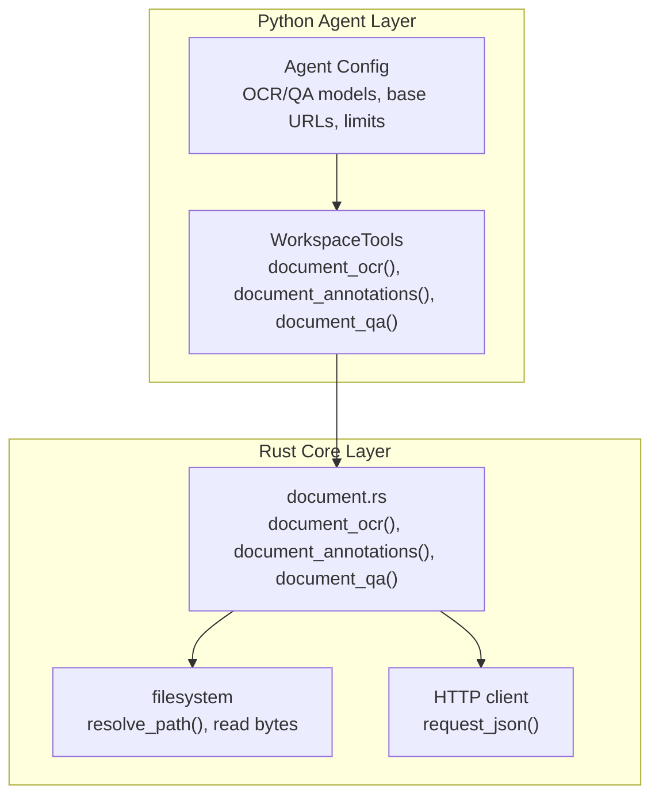
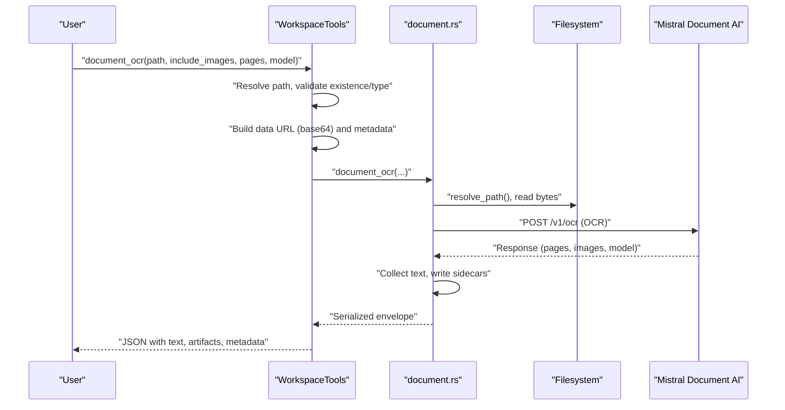
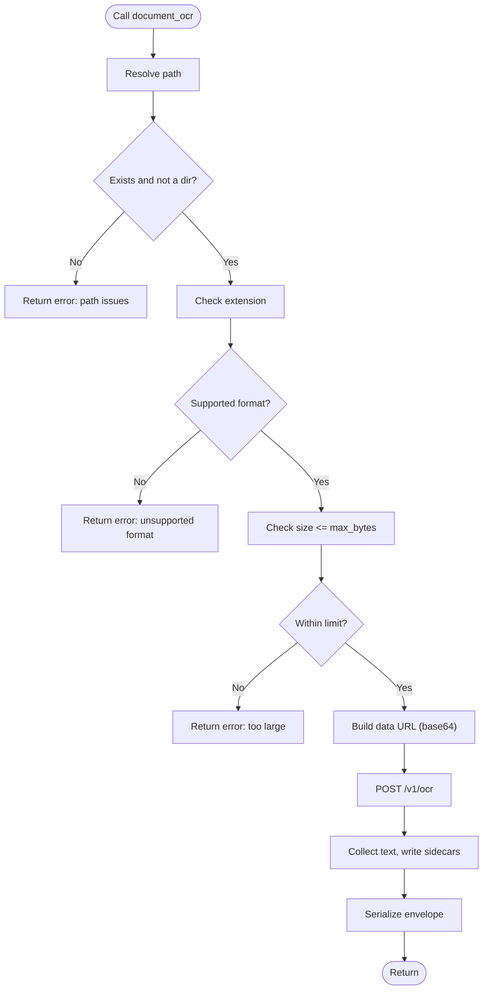
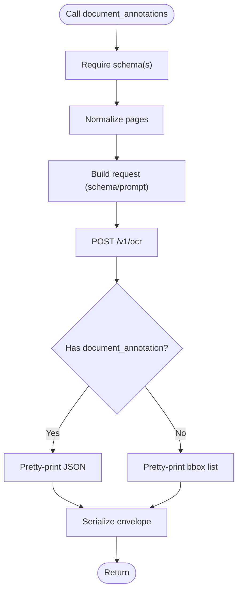
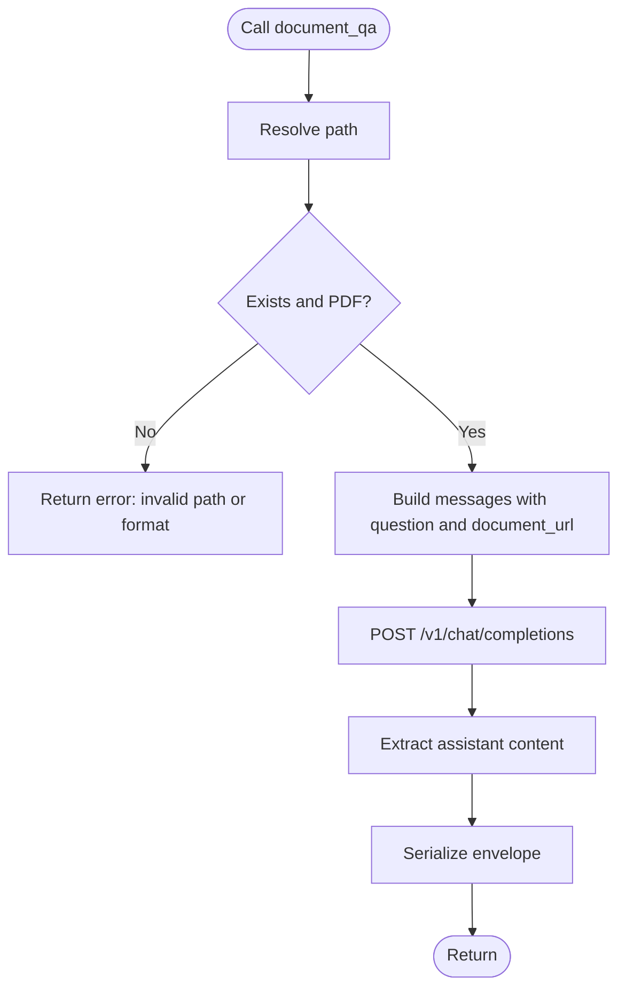
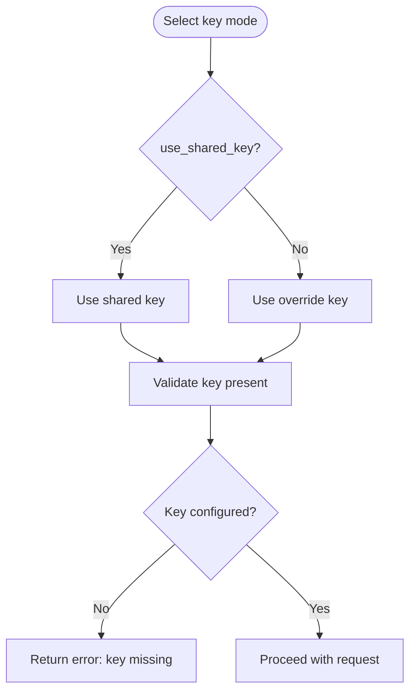
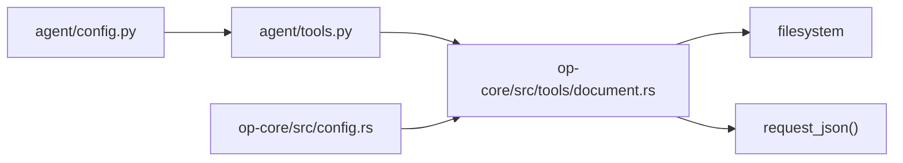

# Document Processing

<cite>
**Referenced Files in This Document**
- [tools.py](file://agent/tools.py)
- [document.rs](file://openplanter-desktop/crates/op-core/src/tools/document.rs)
- [config.py](file://agent/config.py)
- [config.rs](file://openplanter-desktop/crates/op-core/src/config.rs)
- [mistral.ts](file://openplanter-desktop/frontend/src/commands/mistral.ts)
- [test_document_ai.py](file://tests/test_document_ai.py)
</cite>

## Table of Contents
1. [Introduction](#introduction)
2. [Project Structure](#project-structure)
3. [Core Components](#core-components)
4. [Architecture Overview](#architecture-overview)
5. [Detailed Component Analysis](#detailed-component-analysis)
6. [Dependency Analysis](#dependency-analysis)
7. [Performance Considerations](#performance-considerations)
8. [Troubleshooting Guide](#troubleshooting-guide)
9. [Conclusion](#conclusion)

## Introduction
This document focuses on the document processing subsystem powered by Mistral’s Document AI. It covers OCR for PDFs and images, document annotation extraction, and question-answering over documents. It also explains supported formats, size limits, processing modes (shared vs override API keys), workflows for image-based OCR, PDF processing, and multi-page handling. Practical examples illustrate how to integrate these capabilities into investigation workflows, along with guidance on optimizing performance and managing API quotas.

## Project Structure
The document processing capability spans two layers:
- Python agent layer: orchestrates requests, validates inputs, builds payloads, and serializes outputs.
- Rust core layer: performs robust validation, constructs Mistral API requests, writes artifacts, and enforces limits.

**Diagram sources**
- [tools.py:1315-1386](file://agent/tools.py#L1315-L1386)
- [document.rs:773-901](file://openplanter-desktop/crates/op-core/src/tools/document.rs#L773-L901)
- [config.py:350-495](file://agent/config.py#L350-L495)
- [config.rs:558-611](file://openplanter-desktop/crates/op-core/src/config.rs#L558-L611)

**Section sources**
- [tools.py:1315-1386](file://agent/tools.py#L1315-L1386)
- [document.rs:773-901](file://openplanter-desktop/crates/op-core/src/tools/document.rs#L773-L901)
- [config.py:350-495](file://agent/config.py#L350-L495)
- [config.rs:558-611](file://openplanter-desktop/crates/op-core/src/config.rs#L558-L611)

## Core Components
- OCR tool: Converts PDFs and images to text and optionally extracts page images. Supports selective page processing and optional inclusion of base64-encoded images.
- Annotations tool: Extracts structured data from documents using JSON Schema-defined formats and optional bounding-box annotations.
- Q&A tool: Answers questions about a PDF using a chat-style interface with document context.

Key behaviors:
- Supported formats: PDF and common raster images (.avif, .jpg, .jpeg, .png, .webp).
- Size limits: Enforced per configuration for safety and performance.
- API key modes: Shared key or override key, selectable via configuration and UI.
- Artifact generation: Sidecar files (Markdown and JSON) are written for downstream analysis.

**Section sources**
- [tools.py:1315-1386](file://agent/tools.py#L1315-L1386)
- [tools.py:1388-1485](file://agent/tools.py#L1388-L1485)
- [tools.py:1487-1544](file://agent/tools.py#L1487-L1544)
- [document.rs:10-11](file://openplanter-desktop/crates/op-core/src/tools/document.rs#L10-L11)
- [document.rs:103-144](file://openplanter-desktop/crates/op-core/src/tools/document.rs#L103-L144)
- [config.py:390-411](file://agent/config.py#L390-L411)
- [config.rs:591-598](file://openplanter-desktop/crates/op-core/src/config.rs#L591-L598)

## Architecture Overview
End-to-end OCR and document AI flow from invocation to artifact creation.

**Diagram sources**
- [tools.py:1315-1386](file://agent/tools.py#L1315-L1386)
- [document.rs:773-901](file://openplanter-desktop/crates/op-core/src/tools/document.rs#L773-L901)

## Detailed Component Analysis

### OCR Tool (document_ocr)
- Purpose: OCR PDFs and images, optionally include page images, process selected pages.
- Inputs:
  - path: Local file path.
  - include_images: Boolean to include base64 image payloads.
  - pages: Optional list of zero-based page indices; duplicates are removed and negative values rejected.
  - model: Optional model override.
- Processing:
  - Validates extension against supported formats.
  - Enforces size limit.
  - Builds a data URL (base64) for the document.
  - Sends request to Mistral OCR endpoint.
  - Collects text and writes Markdown/JSON sidecars.
- Outputs:
  - Serialized envelope containing provider, operation, path, file metadata, model, options, artifacts, and extracted text.

**Diagram sources**
- [tools.py:1315-1386](file://agent/tools.py#L1315-L1386)
- [document.rs:773-901](file://openplanter-desktop/crates/op-core/src/tools/document.rs#L773-L901)

**Section sources**
- [tools.py:1315-1386](file://agent/tools.py#L1315-L1386)
- [document.rs:773-901](file://openplanter-desktop/crates/op-core/src/tools/document.rs#L773-L901)
- [test_document_ai.py:32-86](file://tests/test_document_ai.py#L32-L86)

### Annotations Tool (document_annotations)
- Purpose: Extract structured document data and/or bounding box annotations using JSON Schemas.
- Inputs:
  - document_schema or bbox_schema (at least one required).
  - instruction: Optional prompt guiding extraction.
  - include_images: Boolean to include base64 image payloads.
  - pages: Optional page selection.
  - model: Optional model override.
- Processing:
  - Validates presence of required schema(s).
  - Builds request body with optional prompt and response format.
  - Sends request to Mistral OCR endpoint.
  - Serializes either document annotation JSON or bbox annotations.
- Outputs:
  - Envelope with extracted structured data and artifacts.

**Diagram sources**
- [tools.py:1388-1485](file://agent/tools.py#L1388-L1485)
- [document.rs:904-1062](file://openplanter-desktop/crates/op-core/src/tools/document.rs#L904-L1062)

**Section sources**
- [tools.py:1388-1485](file://agent/tools.py#L1388-L1485)
- [document.rs:904-1062](file://openplanter-desktop/crates/op-core/src/tools/document.rs#L904-L1062)
- [test_document_ai.py:138-178](file://tests/test_document_ai.py#L138-L178)

### Q&A Tool (document_qa)
- Purpose: Answer questions about a PDF using a chat-style request with document context.
- Inputs:
  - path: Local PDF file.
  - question: Non-empty question text.
  - model: Optional model override.
- Processing:
  - Validates PDF extension.
  - Builds request body with question and document_url.
  - Sends request to Mistral chat completions endpoint.
  - Extracts assistant message content.
- Outputs:
  - Envelope with question, answer, and metadata.

**Diagram sources**
- [tools.py:1487-1544](file://agent/tools.py#L1487-L1544)
- [document.rs:1065-1158](file://openplanter-desktop/crates/op-core/src/tools/document.rs#L1065-L1158)

**Section sources**
- [tools.py:1487-1544](file://agent/tools.py#L1487-L1544)
- [document.rs:1065-1158](file://openplanter-desktop/crates/op-core/src/tools/document.rs#L1065-L1158)
- [test_document_ai.py:240-275](file://tests/test_document_ai.py#L240-L275)

### API Key Modes: Shared vs Override
- Shared key mode: Uses a shared Mistral key for Document AI.
- Override key mode: Uses a dedicated Document AI key.
- Selection is controlled by configuration and UI commands.

**Diagram sources**
- [document.rs:39-61](file://openplanter-desktop/crates/op-core/src/tools/document.rs#L39-L61)
- [mistral.ts:40-82](file://openplanter-desktop/frontend/src/commands/mistral.ts#L40-L82)

**Section sources**
- [document.rs:39-61](file://openplanter-desktop/crates/op-core/src/tools/document.rs#L39-L61)
- [mistral.ts:40-82](file://openplanter-desktop/frontend/src/commands/mistral.ts#L40-L82)
- [test_document_ai.py:247-275](file://tests/test_document_ai.py#L247-L275)

## Dependency Analysis
- Python agent depends on:
  - WorkspaceTools for path resolution, data URL construction, and serialization.
  - Environment configuration for base URLs, models, and limits.
- Rust core depends on:
  - Filesystem utilities for path resolution and reading bytes.
  - HTTP client for Mistral API requests.
  - Configuration for base URLs, timeouts, and limits.

**Diagram sources**
- [config.py:350-495](file://agent/config.py#L350-L495)
- [config.rs:558-611](file://openplanter-desktop/crates/op-core/src/config.rs#L558-L611)
- [tools.py:1315-1386](file://agent/tools.py#L1315-L1386)
- [document.rs:773-901](file://openplanter-desktop/crates/op-core/src/tools/document.rs#L773-L901)

**Section sources**
- [config.py:350-495](file://agent/config.py#L350-L495)
- [config.rs:558-611](file://openplanter-desktop/crates/op-core/src/config.rs#L558-L611)
- [tools.py:1315-1386](file://agent/tools.py#L1315-L1386)
- [document.rs:773-901](file://openplanter-desktop/crates/op-core/src/tools/document.rs#L773-L901)

## Performance Considerations
- Prefer page selection for large documents to reduce processing time and cost.
- Limit included images when not needed to minimize payload size and storage overhead.
- Tune max_bytes and request timeout to balance throughput and reliability.
- Use override keys for dedicated quotas when shared quotas are constrained.

[No sources needed since this section provides general guidance]

## Troubleshooting Guide
Common issues and resolutions:
- Unsupported format: Ensure the file has a supported extension (PDF or raster images).
- File too large: Reduce document size or split into smaller pages.
- Missing API key: Configure either shared or override key depending on mode.
- Invalid path or directory: Verify the path points to an existing file.
- Q&A only supports PDF: Ensure the input is a PDF file.

Operational checks:
- Verify key mode and configuration via UI command.
- Inspect sidecar artifacts for debugging.
- Review serialized envelopes for truncated content and truncation metadata.

**Section sources**
- [document.rs:103-144](file://openplanter-desktop/crates/op-core/src/tools/document.rs#L103-L144)
- [document.rs:39-61](file://openplanter-desktop/crates/op-core/src/tools/document.rs#L39-L61)
- [test_document_ai.py:240-280](file://tests/test_document_ai.py#L240-L280)
- [mistral.ts:48-78](file://openplanter-desktop/frontend/src/commands/mistral.ts#L48-L78)

## Conclusion
The document processing subsystem integrates Mistral Document AI to deliver OCR, structured annotations, and Q&A over PDFs and images. It enforces strict format and size constraints, supports flexible API key modes, and produces durable artifacts for investigation workflows. By selecting pages, controlling image inclusion, and tuning configuration, teams can optimize performance and manage quotas effectively.