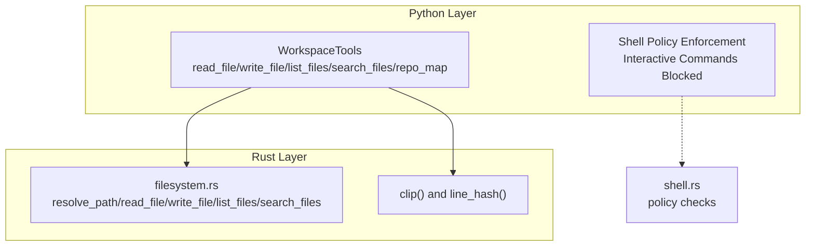
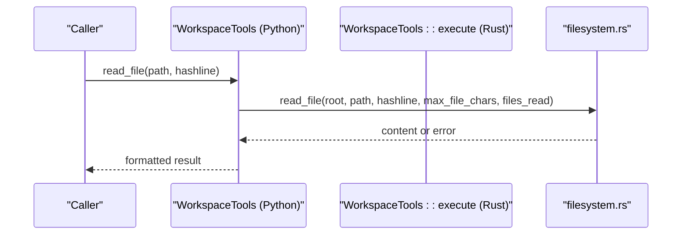
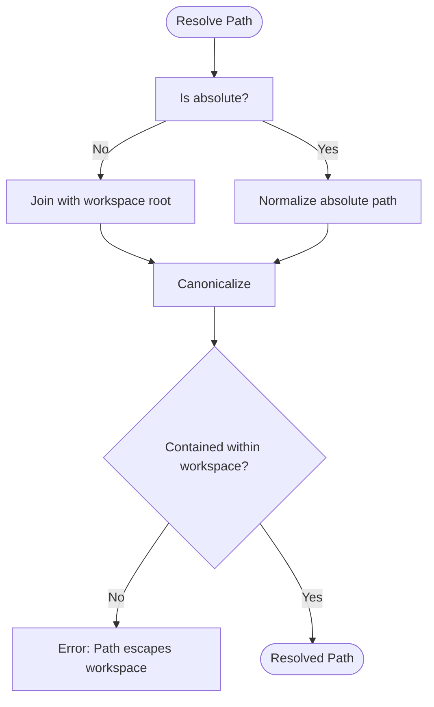
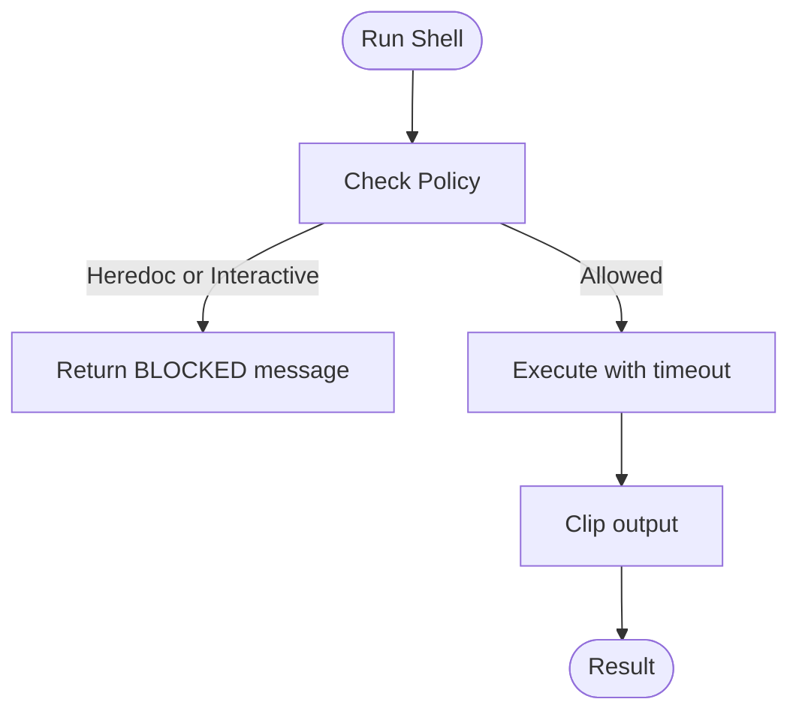
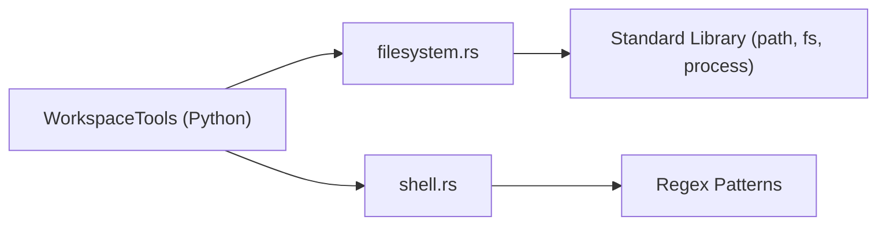

# File Operations

<cite>
**Referenced Files in This Document**
- [filesystem.rs](file://openplanter-desktop/crates/op-core/src/tools/filesystem.rs)
- [mod.rs](file://openplanter-desktop/crates/op-core/src/tools/mod.rs)
- [tools.py](file://agent/tools.py)
- [workspace_resolution.py](file://agent/workspace_resolution.py)
- [test_tools.py](file://tests/test_tools.py)
- [test_tools_complex.py](file://tests/test_tools_complex.py)
- [shell.rs](file://openplanter-desktop/crates/op-core/src/tools/shell.rs)
</cite>

## Table of Contents
1. [Introduction](#introduction)
2. [Project Structure](#project-structure)
3. [Core Components](#core-components)
4. [Architecture Overview](#architecture-overview)
5. [Detailed Component Analysis](#detailed-component-analysis)
6. [Dependency Analysis](#dependency-analysis)
7. [Performance Considerations](#performance-considerations)
8. [Troubleshooting Guide](#troubleshooting-guide)
9. [Conclusion](#conclusion)

## Introduction
This document focuses on workspace file management capabilities across the Python and Rust layers of the system. It covers the core file operations—read_file, write_file, list_files, search_files—and the repository mapping functionality (repo_map). It explains path resolution and security constraints that prevent path traversal, outlines file size and listing limits, and documents the repository symbol extraction pipeline. Practical examples illustrate reading with hashline numbering, directory traversal with glob patterns, and repository symbol extraction. Security policies around interactive commands and heredoc restrictions are detailed, along with troubleshooting guidance and performance optimization tips for large repositories.

## Project Structure
The file operations span two primary layers:
- Python layer: Provides user-facing WorkspaceTools with file operations, shell policy enforcement, and repository mapping.
- Rust layer: Implements robust path resolution, clipping, and filesystem primitives used by the dispatcher.

**Diagram sources**
- [tools.py:120-319](file://agent/tools.py#L120-L319)
- [filesystem.rs:16-121](file://openplanter-desktop/crates/op-core/src/tools/filesystem.rs#L16-L121)
- [shell.rs:12-43](file://openplanter-desktop/crates/op-core/src/tools/shell.rs#L12-L43)

**Section sources**
- [tools.py:120-319](file://agent/tools.py#L120-L319)
- [filesystem.rs:16-121](file://openplanter-desktop/crates/op-core/src/tools/filesystem.rs#L16-L121)
- [shell.rs:12-43](file://openplanter-desktop/crates/op-core/src/tools/shell.rs#L12-L43)

## Core Components
- read_file: Reads a single file, enforces workspace bounds, supports hashline numbering, and clips output to configured limits.
- write_file: Writes content to a file, ensures safe creation under workspace, and prevents unauthorized overwrites without prior read.
- list_files: Enumerates files with optional glob filtering, using ripgrep when available or a safe filesystem walk.
- search_files: Searches file contents with optional glob filtering, using ripgrep or a safe fallback walk.
- repo_map: Extracts symbols and metadata from source files, supporting Python AST and generic symbol detection.

Key constraints and limits:
- Path traversal prevention via strict canonicalization and containment checks.
- File size clipping for reads and observations.
- Limits on files listed and search hits.
- Shell policy blocks interactive commands and heredocs.

**Section sources**
- [tools.py:418-506](file://agent/tools.py#L418-L506)
- [tools.py:577-637](file://agent/tools.py#L577-L637)
- [filesystem.rs:77-121](file://openplanter-desktop/crates/op-core/src/tools/filesystem.rs#L77-L121)
- [filesystem.rs:123-154](file://openplanter-desktop/crates/op-core/src/tools/filesystem.rs#L123-L154)
- [filesystem.rs:234-307](file://openplanter-desktop/crates/op-core/src/tools/filesystem.rs#L234-L307)
- [filesystem.rs:309-387](file://openplanter-desktop/crates/op-core/src/tools/filesystem.rs#L309-L387)

## Architecture Overview
The Python WorkspaceTools acts as a dispatcher, routing tool calls to the Rust filesystem module and applying runtime policies. The Rust filesystem module enforces path safety, performs clipping, and executes efficient scans using ripgrep when present.

**Diagram sources**
- [mod.rs:286-301](file://openplanter-desktop/crates/op-core/src/tools/mod.rs#L286-L301)
- [filesystem.rs:77-121](file://openplanter-desktop/crates/op-core/src/tools/filesystem.rs#L77-L121)

**Section sources**
- [mod.rs:286-301](file://openplanter-desktop/crates/op-core/src/tools/mod.rs#L286-L301)
- [filesystem.rs:77-121](file://openplanter-desktop/crates/op-core/src/tools/filesystem.rs#L77-L121)

## Detailed Component Analysis

### Path Resolution and Security Constraints
- Canonicalization and containment: Paths are resolved against the workspace root and must remain within the root to prevent traversal.
- Absolute vs relative: Relative paths are joined to the workspace root; absolute paths are normalized and validated.
- Escape detection: Attempts to escape the workspace trigger explicit errors.
- Write safety: New files require parent directories to be creatable; existing files require prior read before overwrite.

**Diagram sources**
- [filesystem.rs:25-75](file://openplanter-desktop/crates/op-core/src/tools/filesystem.rs#L25-L75)
- [tools.py:191-201](file://agent/tools.py#L191-L201)

**Section sources**
- [filesystem.rs:25-75](file://openplanter-desktop/crates/op-core/src/tools/filesystem.rs#L25-L75)
- [tools.py:191-201](file://agent/tools.py#L191-L201)

### read_file
- Validates existence and type, reads UTF-8 with replacement for decoding errors.
- Clips content to configured max length and optionally prefixes each line with a hash derived from the line’s whitespace-normalized content.
- Returns a header indicating the relative path plus numbered lines.

Practical example:
- Reading a file with hashline numbering produces lines in the form N:XX|content, enabling precise editing anchors.

**Section sources**
- [filesystem.rs:77-121](file://openplanter-desktop/crates/op-core/src/tools/filesystem.rs#L77-L121)
- [tools.py:639-661](file://agent/tools.py#L639-L661)
- [test_tools.py:319-333](file://tests/test_tools.py#L319-L333)

### write_file
- Resolves path and enforces write scope and claims.
- Creates parent directories if needed; writes content atomically.
- Prevents overwriting existing files unless they were previously read.

Practical example:
- Writing nested directories automatically creates intermediate folders.

**Section sources**
- [filesystem.rs:123-154](file://openplanter-desktop/crates/op-core/src/tools/filesystem.rs#L123-L154)
- [test_tools_complex.py:210-219](file://tests/test_tools_complex.py#L210-L219)

### list_files
- Uses ripgrep when available to enumerate files, excluding .git directories and optionally filtered by glob.
- Falls back to a safe filesystem walk with a cap on entries to avoid excessive scanning.

Practical example:
- Listing with a glob pattern limits results to matching files.

**Section sources**
- [filesystem.rs:234-307](file://openplanter-desktop/crates/op-core/src/tools/filesystem.rs#L234-L307)
- [tools.py:418-456](file://agent/tools.py#L418-L456)

### search_files
- Uses ripgrep with line numbers and hidden-file support when available.
- Falls back to walking the workspace and scanning text with case-insensitive matching.

Practical example:
- Searching for a term yields lines with file path, line number, and matched content.

**Section sources**
- [filesystem.rs:309-387](file://openplanter-desktop/crates/op-core/src/tools/filesystem.rs#L309-L387)
- [tools.py:458-506](file://agent/tools.py#L458-L506)

### Repository Mapping (repo_map)
- Gathers candidate files using the same enumeration logic as list_files, optionally filtered by glob.
- Detects language by file extension and extracts symbols:
  - Python: AST-based extraction of classes and functions.
  - Other languages: Regex-based detection of functions, classes, and function declarations.
- Outputs a JSON object containing root, per-file metadata (language, line count, symbols), and total file count.

Practical example:
- Running repo_map on Python files extracts top-level classes and methods, enabling navigation and context building.

**Section sources**
- [tools.py:508-539](file://agent/tools.py#L508-L539)
- [tools.py:541-561](file://agent/tools.py#L541-L561)
- [tools.py:563-575](file://agent/tools.py#L563-L575)
- [tools.py:577-637](file://agent/tools.py#L577-L637)
- [test_tools.py:287-307](file://tests/test_tools.py#L287-L307)

### Security Policies: Interactive Commands and Heredocs
- Interactive commands: Programs like vim, nano, less, more, top, htop, man are blocked.
- Heredoc syntax: Commands containing heredoc markers are blocked.
- Shell output is clipped to a configurable maximum length.

**Diagram sources**
- [tools.py:203-214](file://agent/tools.py#L203-L214)
- [shell.rs:27-43](file://openplanter-desktop/crates/op-core/src/tools/shell.rs#L27-L43)
- [tools.py:253-286](file://agent/tools.py#L253-L286)

**Section sources**
- [tools.py:203-214](file://agent/tools.py#L203-L214)
- [shell.rs:27-43](file://openplanter-desktop/crates/op-core/src/tools/shell.rs#L27-L43)
- [test_tools_complex.py:26-31](file://tests/test_tools_complex.py#L26-L31)

## Dependency Analysis
- Python WorkspaceTools depends on:
  - filesystem.rs for path resolution and file operations.
  - shell.rs for policy enforcement and shell execution.
- Path resolution is centralized in filesystem.rs with strict containment checks.
- repo_map composes list_files logic and symbol extraction helpers.

**Diagram sources**
- [mod.rs:286-352](file://openplanter-desktop/crates/op-core/src/tools/mod.rs#L286-L352)
- [filesystem.rs:25-75](file://openplanter-desktop/crates/op-core/src/tools/filesystem.rs#L25-L75)
- [shell.rs:12-43](file://openplanter-desktop/crates/op-core/src/tools/shell.rs#L12-L43)

**Section sources**
- [mod.rs:286-352](file://openplanter-desktop/crates/op-core/src/tools/mod.rs#L286-L352)
- [filesystem.rs:25-75](file://openplanter-desktop/crates/op-core/src/tools/filesystem.rs#L25-L75)
- [shell.rs:12-43](file://openplanter-desktop/crates/op-core/src/tools/shell.rs#L12-L43)

## Performance Considerations
- Prefer ripgrep for list_files and search_files when available; it is significantly faster than pure Python walks.
- Limit glob patterns to reduce the number of files scanned.
- Use repo_map with a reasonable max_files (default 200, clamped to 500) to avoid scanning very large repositories.
- Tune max_files_listed and max_search_hits to balance completeness and responsiveness.
- For large files, rely on clipping to avoid memory pressure; consider streaming or chunked processing if needed.

[No sources needed since this section provides general guidance]

## Troubleshooting Guide
Common errors and resolutions:
- Path escapes workspace: Ensure paths are relative to the workspace root or absolute paths inside the root.
  - Example: [test_tools_complex.py:106-112](file://tests/test_tools_complex.py#L106-L112)
- File not found: Verify the path exists and is not a directory.
  - Example: [test_tools.py:52-56](file://tests/test_tools.py#L52-L56)
- Path is a directory: Pass a file path to read_file.
  - Example: [test_tools.py:59-66](file://tests/test_tools.py#L59-L66)
- Write blocked due to lack of prior read: Call read_file on an existing file before writing.
  - Example: [filesystem.rs:133-138](file://openplanter-desktop/crates/op-core/src/tools/filesystem.rs#L133-L138)
- Empty or truncated output:
  - Clipping occurs when content exceeds max_file_chars or max_observation_chars.
  - Example: [test_tools_complex.py:42-49](file://tests/test_tools_complex.py#L42-L49)
- Search returns “no matches”: Ensure the query is non-empty and consider adjusting glob filters.
  - Example: [test_tools.py:88-94](file://tests/test_tools.py#L88-L94)
- Shell blocked: Remove interactive commands or heredoc syntax; use write_file or apply_patch for multi-line content.
  - Example: [test_tools_complex.py:26-31](file://tests/test_tools_complex.py#L26-L31)

**Section sources**
- [test_tools_complex.py:42-49](file://tests/test_tools_complex.py#L42-L49)
- [test_tools.py:52-56](file://tests/test_tools.py#L52-L56)
- [test_tools.py:59-66](file://tests/test_tools.py#L59-L66)
- [filesystem.rs:133-138](file://openplanter-desktop/crates/op-core/src/tools/filesystem.rs#L133-L138)
- [test_tools.py:88-94](file://tests/test_tools.py#L88-L94)
- [test_tools_complex.py:26-31](file://tests/test_tools_complex.py#L26-L31)

## Conclusion
The file operations subsystem provides safe, efficient, and policy-enforced workspace management. Path resolution and containment checks prevent traversal attacks, while clipping and limits protect performance and memory. The repository mapping capability enables intelligent symbol extraction across supported languages. By leveraging glob patterns, respecting limits, and adhering to security policies, users can efficiently explore, search, and modify files in large repositories.