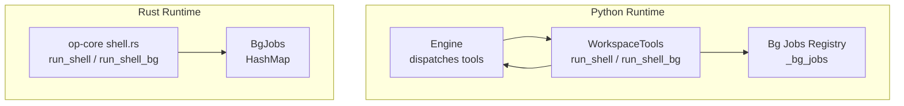
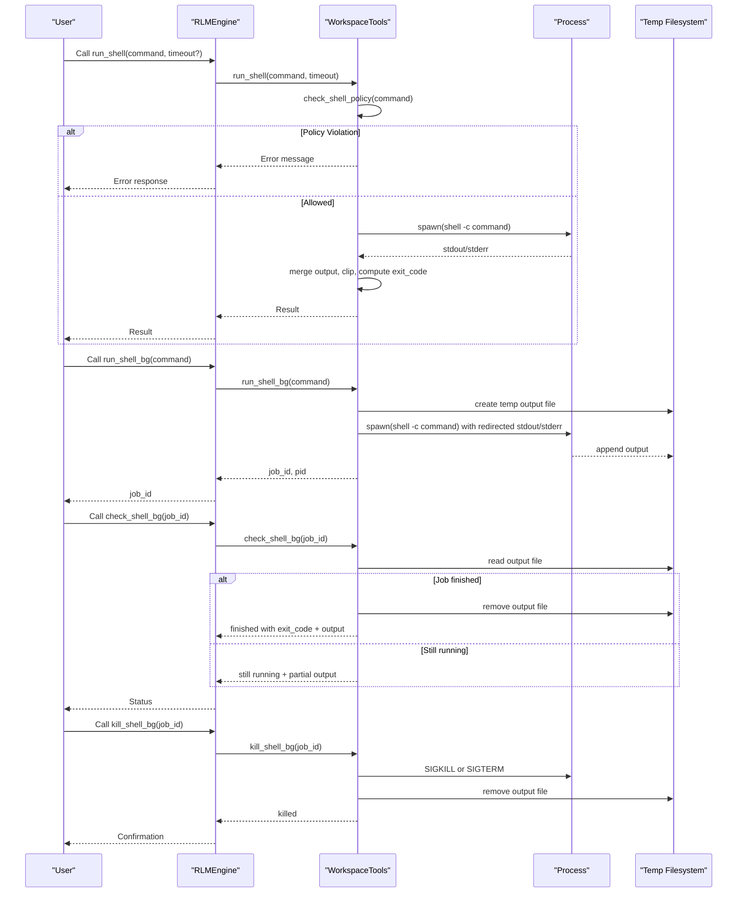
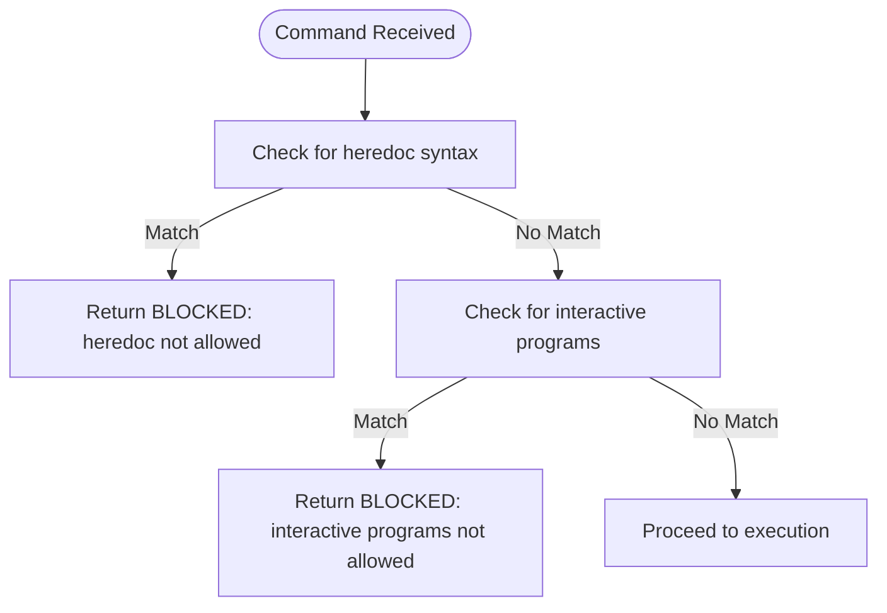
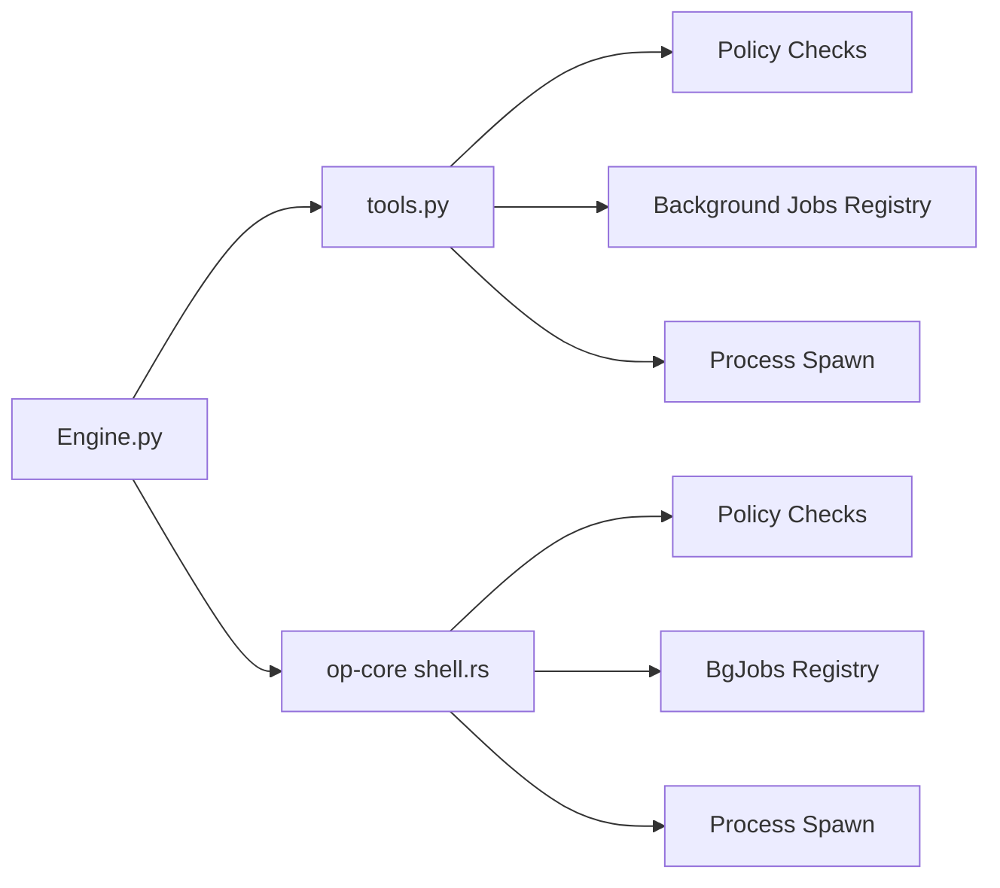

# Shell Execution

<cite>
**Referenced Files in This Document**
- [shell.rs](file://openplanter-desktop/crates/op-core/src/tools/shell.rs)
- [tools.py](file://agent/tools.py)
- [tool_defs.py](file://agent/tool_defs.py)
- [engine.py](file://agent/engine.py)
- [config.py](file://agent/config.py)
- [prompts.py](file://agent/prompts.py)
- [test_bg_and_timeout.py](file://tests/test_bg_and_timeout.py)
- [README.md](file://README.md)
</cite>

## Table of Contents
1. [Introduction](#introduction)
2. [Project Structure](#project-structure)
3. [Core Components](#core-components)
4. [Architecture Overview](#architecture-overview)
5. [Detailed Component Analysis](#detailed-component-analysis)
6. [Dependency Analysis](#dependency-analysis)
7. [Performance Considerations](#performance-considerations)
8. [Troubleshooting Guide](#troubleshooting-guide)
9. [Conclusion](#conclusion)

## Introduction
This document provides a comprehensive guide to shell execution within the workspace, focusing on the run_shell, run_shell_bg, and background job management functions. It explains security policies (interactive program blocking, heredoc restrictions), timeout configurations, synchronous/asynchronous execution, process group management, and resource limits. Practical examples, monitoring, error handling, and debugging guidance are included to help you select appropriate timeouts and manage long-running processes safely.

## Project Structure
The shell execution capability spans two runtimes:
- Python runtime (CLI agent): synchronous and asynchronous shell execution with policy enforcement and background job tracking.
- Rust runtime (desktop op-core): a native implementation of the same shell toolset with policy enforcement and background job management.

**Diagram sources**
- [engine.py:1979-2003](file://agent/engine.py#L1979-L2003)
- [tools.py:253-352](file://agent/tools.py#L253-L352)
- [shell.rs:45-77](file://openplanter-desktop/crates/op-core/src/tools/shell.rs#L45-L77)

**Section sources**
- [README.md:234-235](file://README.md#L234-L235)
- [tool_defs.py:419-482](file://agent/tool_defs.py#L419-L482)

## Core Components
- run_shell: Executes a shell command synchronously with timeout protection and output clipping.
- run_shell_bg: Starts a shell command in the background, writing output to a temporary file and returning a job ID.
- check_shell_bg: Checks the status and partial output of a background job; cleans up on completion.
- kill_shell_bg: Terminates a background job and removes its output file.
- Policy enforcement: Blocks heredoc syntax and interactive terminal programs.
- Resource limits: Per-command timeout (min 1s, max 600s), output truncation, and process group termination.

**Section sources**
- [tools.py:253-352](file://agent/tools.py#L253-L352)
- [shell.rs:79-225](file://openplanter-desktop/crates/op-core/src/tools/shell.rs#L79-L225)
- [tool_defs.py:419-482](file://agent/tool_defs.py#L419-L482)

## Architecture Overview
The shell execution flow integrates with the agent’s tool dispatch system. The engine validates tool calls and forwards them to the appropriate runtime implementation.

**Diagram sources**
- [engine.py:1979-2003](file://agent/engine.py#L1979-L2003)
- [tools.py:253-352](file://agent/tools.py#L253-L352)
- [shell.rs:79-225](file://openplanter-desktop/crates/op-core/src/tools/shell.rs#L79-L225)

## Detailed Component Analysis

### Security Policies
- Heredoc restriction: Commands containing heredoc syntax are blocked to prevent hanging or unintended multi-line input.
- Interactive program blocking: Commands invoking interactive terminal programs (vim, nano, less, more, top, htop, man) are blocked to avoid deadlocks in non-interactive environments.

Policy enforcement is implemented consistently in both runtimes using regular expressions.

**Diagram sources**
- [tools.py:203-214](file://agent/tools.py#L203-L214)
- [shell.rs:27-43](file://openplanter-desktop/crates/op-core/src/tools/shell.rs#L27-L43)

**Section sources**
- [prompts.py:70-72](file://agent/prompts.py#L70-L72)
- [prompts.py:84-87](file://agent/prompts.py#L84-L87)
- [tools.py:203-214](file://agent/tools.py#L203-L214)
- [shell.rs:27-43](file://openplanter-desktop/crates/op-core/src/tools/shell.rs#L27-L43)

### Synchronous Execution (run_shell)
- Spawns a shell process with the provided command.
- Waits with a configurable timeout (min 1s, max 600s).
- Captures stdout and stderr, merges them, and clips output to a configured maximum length.
- Returns exit code and merged output.

Key behaviors:
- Effective timeout clamping ensures reasonable bounds.
- Output is truncated with a clear omission notice.
- On timeout, the process is terminated and a timeout message is returned.

**Section sources**
- [tools.py:253-286](file://agent/tools.py#L253-L286)
- [shell.rs:79-135](file://openplanter-desktop/crates/op-core/src/tools/shell.rs#L79-L135)

### Asynchronous Execution (run_shell_bg)
- Creates a temporary output file for capturing output.
- Spawns the shell process with stdout/stderr redirected to the file.
- Tracks the job in an internal registry with a monotonically increasing job ID.
- Returns job_id and pid for later monitoring.

Output capture:
- Output is appended to a temporary file while the process runs.
- Partial output can be read even if the job is still running.

**Section sources**
- [tools.py:288-312](file://agent/tools.py#L288-L312)
- [shell.rs:137-185](file://openplanter-desktop/crates/op-core/src/tools/shell.rs#L137-L185)

### Background Job Monitoring (check_shell_bg)
- Reads the current output from the job’s output file.
- Checks process status via try_wait.
- If the process has exited, removes the output file and returns final status and output.
- If still running, returns a running status with partial output.

Cleanup:
- Automatic cleanup occurs when a job finishes and its output file is removed.

**Section sources**
- [tools.py:314-334](file://agent/tools.py#L314-L334)
- [shell.rs:187-212](file://openplanter-desktop/crates/op-core/src/tools/shell.rs#L187-L212)

### Background Job Termination (kill_shell_bg)
- Locates the job by ID and terminates the process.
- Attempts graceful termination first, then force kill if needed.
- Removes the output file and deletes the job from the registry.

**Section sources**
- [tools.py:336-352](file://agent/tools.py#L336-L352)
- [shell.rs:214-225](file://openplanter-desktop/crates/op-core/src/tools/shell.rs#L214-L225)

### Process Group Management
- Both runtimes spawn processes in a new session/group to isolate child processes.
- On timeout or termination, the process group is signaled to ensure all children are terminated.

**Section sources**
- [tools.py:259-278](file://agent/tools.py#L259-L278)
- [tools.py:341-351](file://agent/tools.py#L341-L351)

### Resource Limits
- Per-command timeout: Clamped between 1 and 600 seconds.
- Output size: Clipped to a maximum number of characters.
- Background jobs: Managed in-memory with automatic cleanup on drop.

**Section sources**
- [tools.py:257](file://agent/tools.py#L257)
- [shell.rs:89](file://openplanter-desktop/crates/op-core/src/tools/shell.rs#L89)
- [config.py:214-219](file://agent/config.py#L214-L219)

### Practical Examples

- Safe synchronous execution:
  - Use run_shell for short, deterministic commands.
  - Provide a timeout appropriate to the expected runtime.
  - Example: run_shell("ls -la", timeout=10)

- Long-running background execution:
  - Use run_shell_bg to start a process and receive a job_id.
  - Periodically check status with check_shell_bg.
  - Kill long-running jobs with kill_shell_bg if needed.
  - Example: run_shell_bg("sleep 3600")

- Output verification:
  - For commands that may produce empty output, verify with a secondary command (e.g., wc -c) as advised in system prompts.

- Policy-compliant alternatives:
  - Replace heredoc with write_file + execute.
  - Replace interactive editors with non-interactive equivalents (e.g., sed, awk, python3 -c).

**Section sources**
- [test_bg_and_timeout.py:18-51](file://tests/test_bg_and_timeout.py#L18-L51)
- [test_bg_and_timeout.py:54-112](file://tests/test_bg_and_timeout.py#L54-L112)
- [prompts.py:55-56](file://agent/prompts.py#L55-L56)
- [prompts.py:70-72](file://agent/prompts.py#L70-L72)
- [prompts.py:84-87](file://agent/prompts.py#L84-L87)

### Error Handling
- Policy violations return immediate error messages indicating the blocked pattern.
- Process start failures return a descriptive error.
- Timeout triggers a controlled termination and a timeout message.
- Missing background jobs return an error indicating the job does not exist.
- Cleanup routines ensure resources are reclaimed on exit or explicit kill.

**Section sources**
- [tools.py:203-214](file://agent/tools.py#L203-L214)
- [tools.py:269-279](file://agent/tools.py#L269-L279)
- [tools.py:316-318](file://agent/tools.py#L316-L318)
- [tools.py:338-340](file://agent/tools.py#L338-L340)
- [shell.rs:86-88](file://openplanter-desktop/crates/op-core/src/tools/shell.rs#L86-L88)
- [shell.rs:109-115](file://openplanter-desktop/crates/op-core/src/tools/shell.rs#L109-L115)
- [shell.rs:189-191](file://openplanter-desktop/crates/op-core/src/tools/shell.rs#L189-L191)
- [shell.rs:215-218](file://openplanter-desktop/crates/op-core/src/tools/shell.rs#L215-L218)

## Dependency Analysis
- Engine dispatch: The engine routes run_shell, run_shell_bg, check_shell_bg, and kill_shell_bg calls to the WorkspaceTools implementation.
- Policy enforcement: Both Python and Rust implementations share the same regex-based policy checks.
- Background job state: Python maintains an in-memory registry; Rust maintains a HashMap-based registry.

**Diagram sources**
- [engine.py:1979-2003](file://agent/engine.py#L1979-L2003)
- [tools.py:203-214](file://agent/tools.py#L203-L214)
- [shell.rs:27-43](file://openplanter-desktop/crates/op-core/src/tools/shell.rs#L27-L43)

**Section sources**
- [engine.py:1979-2003](file://agent/engine.py#L1979-L2003)
- [tools.py:203-214](file://agent/tools.py#L203-L214)
- [shell.rs:27-43](file://openplanter-desktop/crates/op-core/src/tools/shell.rs#L27-L43)

## Performance Considerations
- Timeout bounds: Choose timeouts conservatively to avoid long hangs; the system caps at 600s.
- Output clipping: Large outputs are truncated; consider splitting work into smaller commands or writing to files for later inspection.
- Background I/O: Redirecting output to temporary files avoids blocking the main thread; monitor disk usage for long-running jobs.
- Process groups: New sessions ensure child processes are isolated; however, excessive background jobs can consume resources.

[No sources needed since this section provides general guidance]

## Troubleshooting Guide
- Command appears to hang:
  - Check if the command uses heredoc or interactive programs; both are blocked.
  - Use run_shell_bg and check_shell_bg to monitor progress.
- Timeout exceeded:
  - Adjust timeout or split the command into smaller steps.
  - Verify the process was terminated by checking the timeout message.
- Background job not found:
  - Ensure the job_id is correct and the job has not already finished.
  - Use cleanup_bg_jobs to terminate lingering jobs.
- Debugging failed commands:
  - Reproduce with run_shell to capture full output and exit code.
  - Use system prompts guidance to verify outputs and cross-check with wc -c.

**Section sources**
- [test_bg_and_timeout.py:25-37](file://tests/test_bg_and_timeout.py#L25-L37)
- [test_bg_and_timeout.py:83-87](file://tests/test_bg_and_timeout.py#L83-L87)
- [tools.py:354-373](file://agent/tools.py#L354-L373)
- [prompts.py:55-56](file://agent/prompts.py#L55-L56)

## Conclusion
The shell execution subsystem provides robust, secure, and controllable command execution within the workspace. By enforcing policy constraints, bounding resource usage, and offering both synchronous and asynchronous execution modes, it enables safe automation of analysis scripts and data pipelines. Use run_shell for short tasks, run_shell_bg for long-running workloads, and rely on check_shell_bg and kill_shell_bg for monitoring and termination. Configure timeouts appropriately and follow the policy guidelines to avoid common pitfalls.