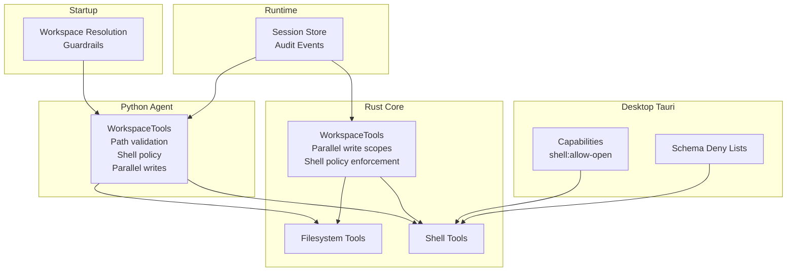
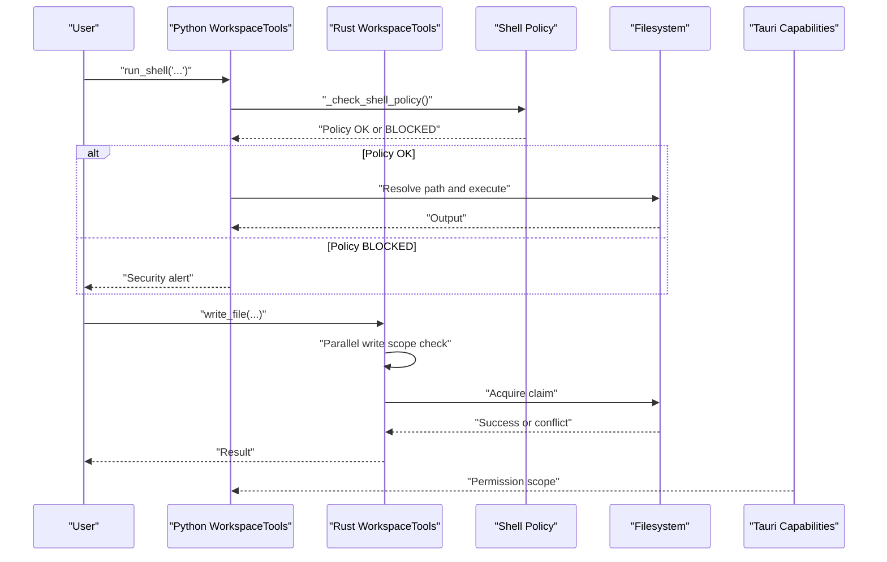
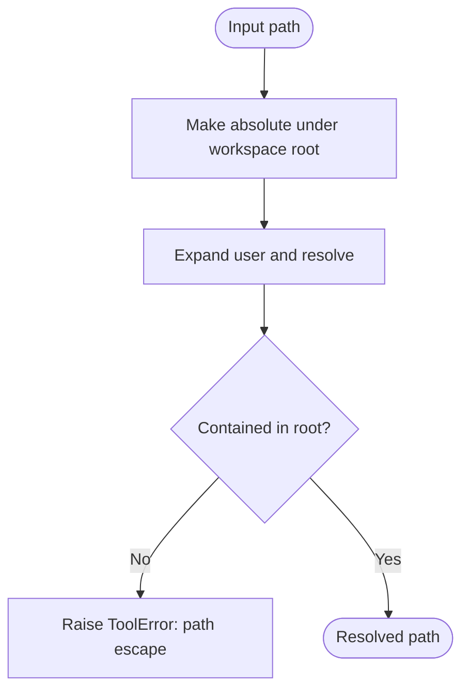
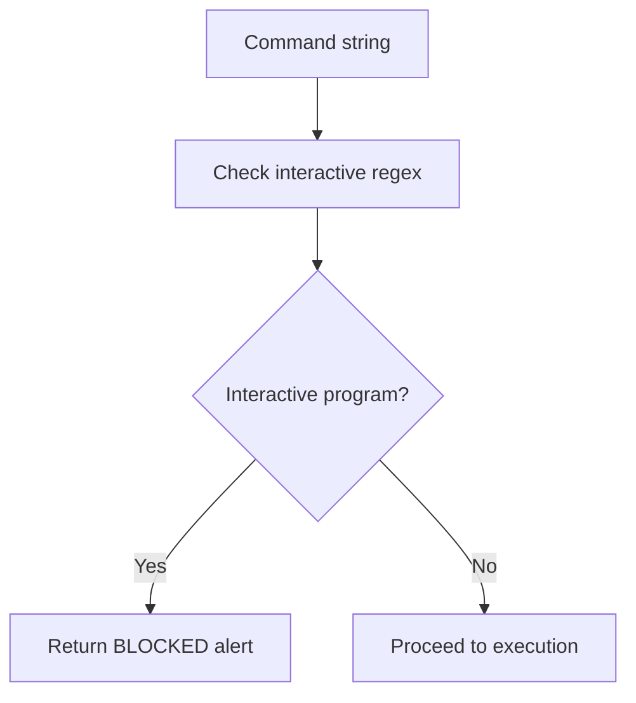
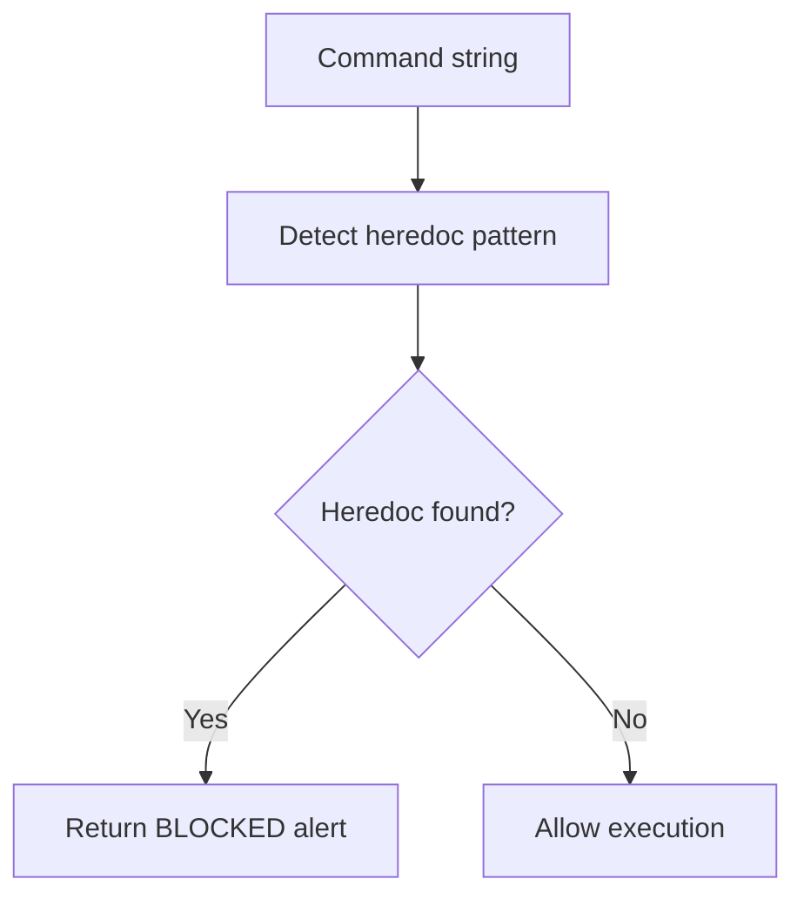
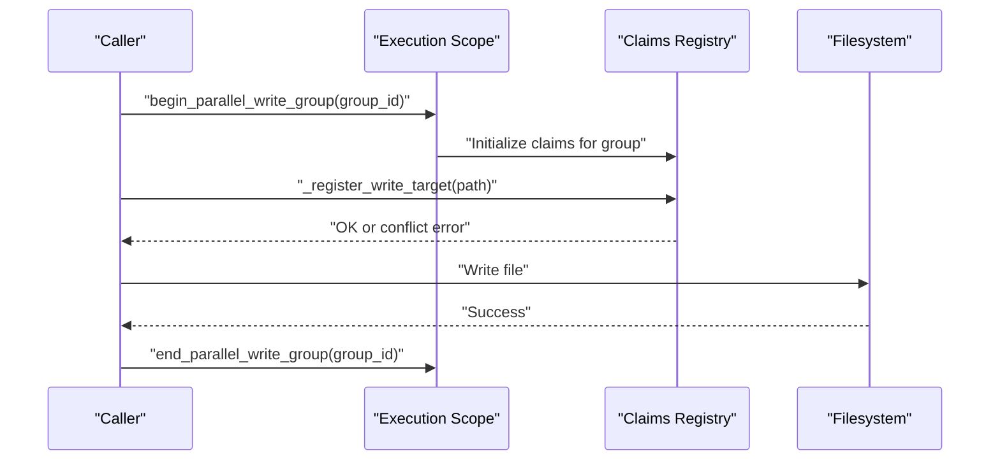
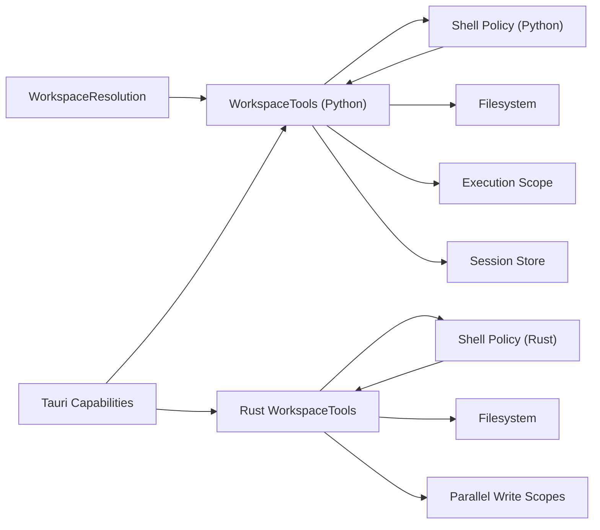

# Tool Security Policies

<cite>
**Referenced Files in This Document**
- [tools.py](file://agent/tools.py)
- [shell.rs](file://openplanter-desktop/crates/op-core/src/tools/shell.rs)
- [mod.rs](file://openplanter-desktop/crates/op-core/src/tools/mod.rs)
- [default.json](file://openplanter-desktop/crates/op-tauri/capabilities/default.json)
- [desktop-schema.json](file://openplanter-desktop/crates/op-tauri/gen/schemas/desktop-schema.json)
- [macOS-schema.json](file://openplanter-desktop/crates/op-tauri/gen/schemas/macOS-schema.json)
- [workspace_resolution.py](file://agent/workspace_resolution.py)
- [runtime.py](file://agent/runtime.py)
- [test_engine.py](file://tests/test_engine.py)
- [test_tools.py](file://tests/test_tools.py)
- [session-trace-v2-spec.md](file://docs/session-trace-v2-spec.md)
</cite>

## Table of Contents
1. [Introduction](#introduction)
2. [Project Structure](#project-structure)
3. [Core Components](#core-components)
4. [Architecture Overview](#architecture-overview)
5. [Detailed Component Analysis](#detailed-component-analysis)
6. [Dependency Analysis](#dependency-analysis)
7. [Performance Considerations](#performance-considerations)
8. [Troubleshooting Guide](#troubleshooting-guide)
9. [Conclusion](#conclusion)
10. [Appendices](#appendices)

## Introduction
This document specifies the tool security policies for runtime safety and policy enforcement in the investigation workflow. It covers path resolution validation, interactive command blocking, heredoc restrictions, parallel write coordination, execution scope management, and conflict detection. It also documents sandboxing approaches, privilege management, audit logging, and practical guidance for configuring and troubleshooting security policies.

## Project Structure
Security-critical components are distributed across the Python agent runtime and the Rust core:
- Python agent: WorkspaceTools enforces path safety, shell policy checks, and parallel write coordination.
- Rust core: Provides parallel write scopes, shell policy enforcement, and tool execution orchestration.
- Desktop Tauri: Enforces capability-based permissions for shell operations.
- Startup workspace guardrails: Prevents unsafe workspace selection.
- Runtime session store: Provides durable audit trails and provenance for security investigations.

**Diagram sources**
- [tools.py:121-287](file://agent/tools.py#L121-L287)
- [shell.rs:1-49](file://openplanter-desktop/crates/op-core/src/tools/shell.rs#L1-L49)
- [mod.rs:56-163](file://openplanter-desktop/crates/op-core/src/tools/mod.rs#L56-L163)
- [default.json:1-11](file://openplanter-desktop/crates/op-tauri/capabilities/default.json#L1-L11)
- [desktop-schema.json:2401-2422](file://openplanter-desktop/crates/op-tauri/gen/schemas/desktop-schema.json#L2401-L2422)
- [workspace_resolution.py:31-136](file://agent/workspace_resolution.py#L31-L136)
- [runtime.py:446-511](file://agent/runtime.py#L446-L511)

**Section sources**
- [tools.py:121-287](file://agent/tools.py#L121-L287)
- [shell.rs:1-49](file://openplanter-desktop/crates/op-core/src/tools/shell.rs#L1-L49)
- [mod.rs:56-163](file://openplanter-desktop/crates/op-core/src/tools/mod.rs#L56-L163)
- [default.json:1-11](file://openplanter-desktop/crates/op-tauri/capabilities/default.json#L1-L11)
- [desktop-schema.json:2401-2422](file://openplanter-desktop/crates/op-tauri/gen/schemas/desktop-schema.json#L2401-L2422)
- [workspace_resolution.py:31-136](file://agent/workspace_resolution.py#L31-L136)
- [runtime.py:446-511](file://agent/runtime.py#L446-L511)

## Core Components
- Path resolution validation: Ensures all file operations remain within the workspace root and prevents path traversal escapes.
- Interactive command blocking: Prohibits interactive terminal programs that could hang or require user input.
- Heredoc restrictions: Blocks heredoc syntax in shell commands to prevent multi-line content injection.
- Parallel write coordination: Manages concurrent writes with ownership scoping and conflict detection.
- Execution scope management: Associates write operations with owners and groups to detect contention.
- Sandbox boundaries: Startup guardrails, capability-based permissions, and session audit trails.
- Privilege management: Controlled shell access via capabilities and explicit allowlists.
- Audit logging: Structured event streams with provenance for security investigations.

**Section sources**
- [tools.py:191-223](file://agent/tools.py#L191-L223)
- [shell.rs:27-43](file://openplanter-desktop/crates/op-core/src/tools/shell.rs#L27-L43)
- [mod.rs:49-95](file://openplanter-desktop/crates/op-core/src/tools/mod.rs#L49-L95)
- [workspace_resolution.py:124-136](file://agent/workspace_resolution.py#L124-L136)
- [runtime.py:446-511](file://agent/runtime.py#L446-L511)

## Architecture Overview
The security architecture combines runtime policy enforcement in Python and Rust, startup guardrails, and desktop capabilities.

**Diagram sources**
- [tools.py:253-287](file://agent/tools.py#L253-L287)
- [shell.rs:27-43](file://openplanter-desktop/crates/op-core/src/tools/shell.rs#L27-L43)
- [mod.rs:251-278](file://openplanter-desktop/crates/op-core/src/tools/mod.rs#L251-L278)
- [default.json:6-9](file://openplanter-desktop/crates/op-tauri/capabilities/default.json#L6-L9)

## Detailed Component Analysis

### Path Resolution Validation
- Purpose: Prevent path traversal and ensure all operations stay within the workspace root.
- Mechanism:
  - Normalize candidate paths to absolute form under the workspace root.
  - Resolve symlinks and confirm containment within the root.
  - Raise errors for escape attempts.
- Safety impact: Blocks attempts to read/write files outside the workspace.

**Diagram sources**
- [tools.py:191-201](file://agent/tools.py#L191-L201)

**Section sources**
- [tools.py:191-201](file://agent/tools.py#L191-L201)

### Interactive Command Blocking
- Purpose: Block interactive terminal programs that require user input or could hang.
- Mechanism:
  - Regex-based detection of interactive commands.
  - Immediate policy rejection with a security alert.
- Safety impact: Prevents unattended or hostile interactive sessions.

**Diagram sources**
- [tools.py:203-214](file://agent/tools.py#L203-L214)
- [shell.rs:27-43](file://openplanter-desktop/crates/op-core/src/tools/shell.rs#L27-L43)

**Section sources**
- [tools.py:203-214](file://agent/tools.py#L203-L214)
- [shell.rs:27-43](file://openplanter-desktop/crates/op-core/src/tools/shell.rs#L27-L43)

### Heredoc Restrictions
- Purpose: Prevent multi-line content injection via heredoc syntax.
- Mechanism:
  - Regex detection of heredoc patterns.
  - Policy rejection with guidance to use write_file/apply_patch.
- Safety impact: Mitigates unintended or malicious multi-line input.

**Diagram sources**
- [tools.py:203-214](file://agent/tools.py#L203-L214)
- [shell.rs:27-43](file://openplanter-desktop/crates/op-core/src/tools/shell.rs#L27-L43)

**Section sources**
- [tools.py:203-214](file://agent/tools.py#L203-L214)
- [shell.rs:27-43](file://openplanter-desktop/crates/op-core/src/tools/shell.rs#L27-L43)

### Parallel Write Coordination
- Purpose: Coordinate concurrent writes to avoid conflicts and maintain consistency.
- Mechanism:
  - Execution scope associates a group_id and owner_id with operations.
  - Claims map target paths to owners; conflicts detected if another owner claims the same path.
  - Rust parallel write scopes enforce claims across tool instances.
- Safety impact: Prevents race conditions and inconsistent writes.

**Diagram sources**
- [tools.py:224-251](file://agent/tools.py#L224-L251)
- [mod.rs:49-95](file://openplanter-desktop/crates/op-core/src/tools/mod.rs#L49-L95)
- [mod.rs:251-278](file://openplanter-desktop/crates/op-core/src/tools/mod.rs#L251-L278)

**Section sources**
- [tools.py:224-251](file://agent/tools.py#L224-L251)
- [mod.rs:49-95](file://openplanter-desktop/crates/op-core/src/tools/mod.rs#L49-L95)
- [mod.rs:251-278](file://openplanter-desktop/crates/op-core/src/tools/mod.rs#L251-L278)

### Execution Scope Management
- Purpose: Associate ownership and grouping for parallel write operations.
- Mechanism:
  - Thread-local storage holds group_id and owner_id during scoped operations.
  - Claims are registered per resolved path within the scope.
- Safety impact: Enables conflict detection and deterministic ownership.

**Section sources**
- [tools.py:224-235](file://agent/tools.py#L224-L235)

### Sandbox Boundaries and Startup Guardrails
- Purpose: Prevent unsafe workspace initialization and repository root usage.
- Mechanism:
  - Startup resolves workspace from CLI/env/dotenv/CWD with normalization.
  - Guardrails reject repository root as workspace unless explicitly redirected to a subdirectory.
- Safety impact: Ensures the agent operates within a controlled, non-root workspace.

**Section sources**
- [workspace_resolution.py:31-136](file://agent/workspace_resolution.py#L31-L136)

### Privilege Management via Desktop Capabilities
- Purpose: Limit shell capabilities to a minimal, auditable set.
- Mechanism:
  - Default capability allows only "shell:allow-open".
  - Schema defines deny lists for spawn, stdin_write, kill, and open.
  - Desktop builds enforce these permissions at runtime.
- Safety impact: Reduces attack surface by restricting shell operations.

**Section sources**
- [default.json:6-9](file://openplanter-desktop/crates/op-tauri/capabilities/default.json#L6-L9)
- [desktop-schema.json:2401-2422](file://openplanter-desktop/crates/op-tauri/gen/schemas/desktop-schema.json#L2401-L2422)
- [macOS-schema.json:2401-2422](file://openplanter-desktop/crates/op-tauri/gen/schemas/macOS-schema.json#L2401-L2422)

### Audit Logging and Provenance
- Purpose: Provide immutable audit trails and evidence references for security investigations.
- Mechanism:
  - Session store appends structured events with provenance metadata.
  - Events include record locator, parent/cause references, and evidence references.
  - Trace spec defines durability rules and required fields.
- Safety impact: Enables forensic analysis and compliance auditing.

**Section sources**
- [runtime.py:446-511](file://agent/runtime.py#L446-L511)
- [session-trace-v2-spec.md:559-620](file://docs/session-trace-v2-spec.md#L559-L620)
- [session-trace-v2-spec.md:1054-1100](file://docs/session-trace-v2-spec.md#L1054-L1100)

## Dependency Analysis
Security policy enforcement spans multiple layers with clear separation of concerns.

**Diagram sources**
- [workspace_resolution.py:31-136](file://agent/workspace_resolution.py#L31-L136)
- [tools.py:121-287](file://agent/tools.py#L121-L287)
- [shell.rs:1-49](file://openplanter-desktop/crates/op-core/src/tools/shell.rs#L1-L49)
- [mod.rs:56-163](file://openplanter-desktop/crates/op-core/src/tools/mod.rs#L56-L163)
- [default.json:1-11](file://openplanter-desktop/crates/op-tauri/capabilities/default.json#L1-L11)

**Section sources**
- [workspace_resolution.py:31-136](file://agent/workspace_resolution.py#L31-L136)
- [tools.py:121-287](file://agent/tools.py#L121-L287)
- [shell.rs:1-49](file://openplanter-desktop/crates/op-core/src/tools/shell.rs#L1-L49)
- [mod.rs:56-163](file://openplanter-desktop/crates/op-core/src/tools/mod.rs#L56-L163)
- [default.json:1-11](file://openplanter-desktop/crates/op-tauri/capabilities/default.json#L1-L11)

## Performance Considerations
- Regex-based policy checks are O(n) in command length and run infrequently compared to I/O operations.
- Parallel write claims use hash maps for O(1) average-time lookups; contention increases lock wait time.
- Background shell jobs are managed with minimal overhead; ensure timeouts and cleanup to avoid resource leaks.
- Startup workspace resolution normalizes paths once per session; avoid repeated redundant checks.

## Troubleshooting Guide
Common policy violations and safe operation patterns:

- Path escape attempts
  - Symptom: ToolError indicating path escapes workspace.
  - Safe pattern: Use relative paths within the workspace root.
  - Section sources
    - [tools.py:191-201](file://agent/tools.py#L191-L201)
    - [test_tools.py:34-40](file://tests/test_tools.py#L34-L40)

- Interactive command blocked
  - Symptom: Immediate BLOCKED alert for interactive programs.
  - Safe pattern: Use non-interactive alternatives or batch commands.
  - Section sources
    - [tools.py:203-214](file://agent/tools.py#L203-L214)
    - [shell.rs:27-43](file://openplanter-desktop/crates/op-core/src/tools/shell.rs#L27-L43)

- Heredoc syntax blocked
  - Symptom: BLOCKED alert instructing to use write_file/apply_patch.
  - Safe pattern: Split multi-line content into separate write operations.
  - Section sources
    - [tools.py:203-214](file://agent/tools.py#L203-L214)
    - [shell.rs:27-43](file://openplanter-desktop/crates/op-core/src/tools/shell.rs#L27-L43)

- Parallel write conflict
  - Symptom: ToolError stating target is claimed by another owner.
  - Safe pattern: Use distinct group_id/owner_id pairs or serialize writes.
  - Section sources
    - [tools.py:236-251](file://agent/tools.py#L236-L251)
    - [mod.rs:251-278](file://openplanter-desktop/crates/op-core/src/tools/mod.rs#L251-L278)
    - [test_engine.py:631-642](file://tests/test_engine.py#L631-L642)

- Repeated shell commands blocked by runtime policy
  - Symptom: Observations indicate policy block during repeated invocations.
  - Safe pattern: Consolidate commands or use idempotent operations.
  - Section sources
    - [test_engine.py:257-276](file://tests/test_engine.py#L257-L276)

- Unsafe workspace selection
  - Symptom: WorkspaceResolutionError when attempting repository root.
  - Safe pattern: Set OPENPLANTER_WORKSPACE to a subdirectory or use .env/workspace redirection.
  - Section sources
    - [workspace_resolution.py:124-136](file://agent/workspace_resolution.py#L124-L136)

## Conclusion
The security architecture integrates path validation, shell policy enforcement, parallel write coordination, and capability-based permissions to create a robust runtime safety model. Combined with comprehensive audit logging and provenance, it supports secure investigation workflows and enables effective incident response and compliance auditing.

## Appendices

### Practical Examples
- Policy violation examples
  - Path escape: Attempting to write outside workspace raises ToolError.
  - Interactive command: Using vim/nano triggers immediate BLOCKED alert.
  - Heredoc: Multi-line input via << EOF is rejected.
  - Parallel conflict: Two tasks claiming the same path result in a conflict error.
- Safe operation patterns
  - Use relative paths within the workspace.
  - Prefer non-interactive commands and batch operations.
  - Split multi-line content into discrete write operations.
  - Assign unique group_id/owner_id for concurrent writes.

### Security Considerations by Tool Category
- Filesystem tools: Enforce path containment; avoid destructive operations without explicit overrides.
- Shell tools: Restrict to non-interactive commands; leverage capability allowlists.
- Web tools: Validate URLs and sanitize outputs; limit provider-specific risks.
- Document tools: Control OCR/transcription limits and output sizes.

### Privilege Management Checklist
- Confirm Tauri capabilities align with intended operations.
- Review deny-list entries for spawn, stdin_write, kill, and open.
- Limit shell access to trusted commands and arguments.
- Use scoped environments and timeouts for external processes.

### Audit Logging Best Practices
- Enable structured event streams with provenance metadata.
- Include record locators, parent/cause references, and evidence references.
- Comply with durability rules for partial and resumed turns.
- Maintain immutable logs for compliance and forensics.