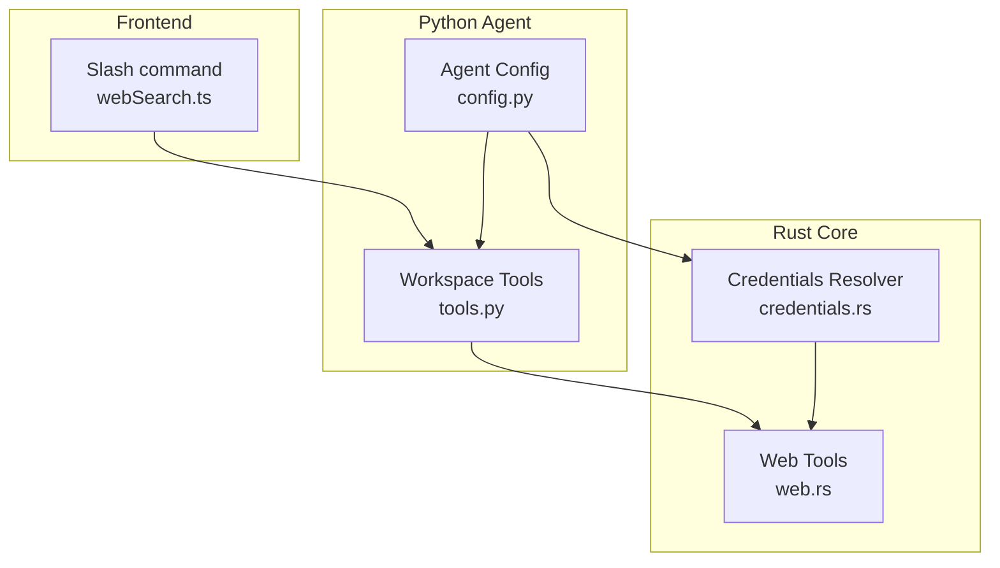
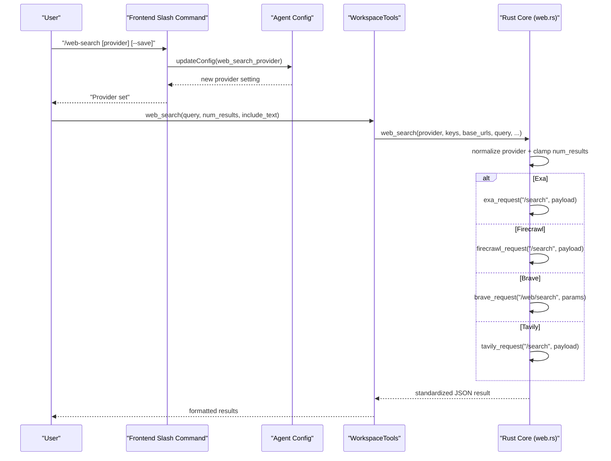
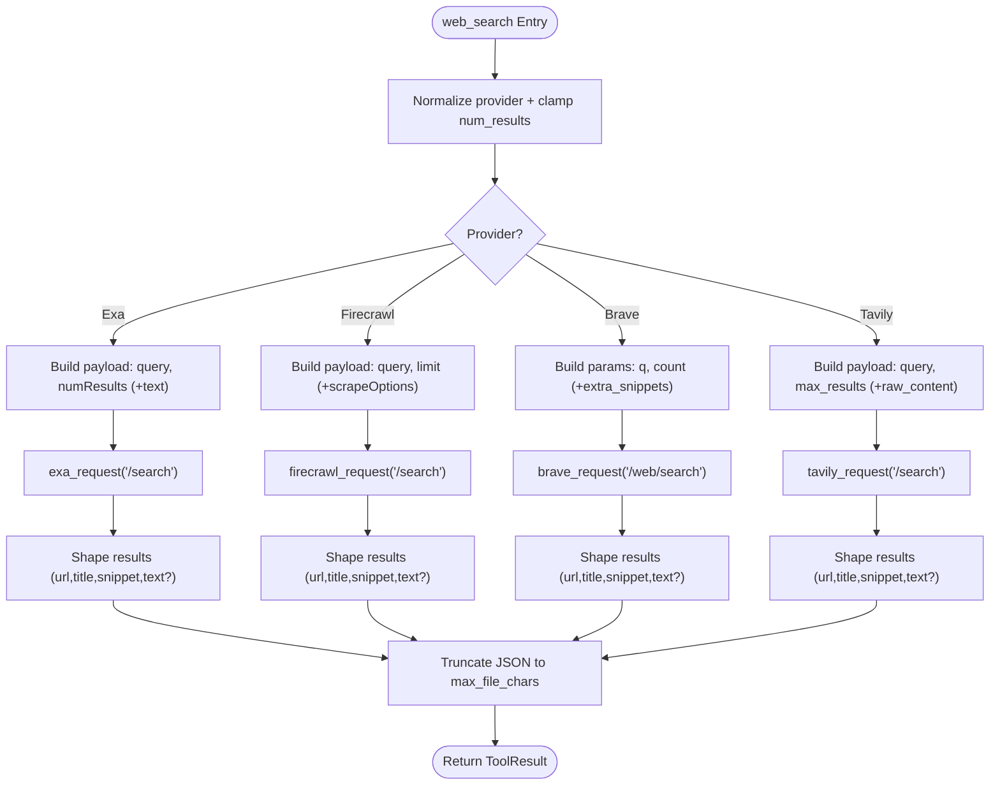
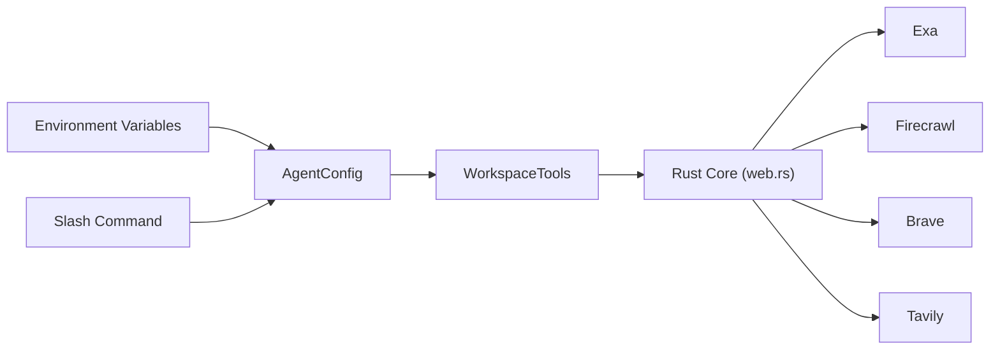

# Web Search Integration

<cite>
**Referenced Files in This Document**
- [web.rs](file://openplanter-desktop/crates/op-core/src/tools/web.rs)
- [tools.py](file://agent/tools.py)
- [config.py](file://agent/config.py)
- [webSearch.ts](file://openplanter-desktop/frontend/src/commands/webSearch.ts)
- [README.md](file://README.md)
- [credentials.rs](file://openplanter-desktop/crates/op-core/src/credentials.rs)
- [credentials.py](file://agent/credentials.py)
- [test_tools.py](file://tests/test_tools.py)
</cite>

## Table of Contents
1. [Introduction](#introduction)
2. [Project Structure](#project-structure)
3. [Core Components](#core-components)
4. [Architecture Overview](#architecture-overview)
5. [Detailed Component Analysis](#detailed-component-analysis)
6. [Dependency Analysis](#dependency-analysis)
7. [Performance Considerations](#performance-considerations)
8. [Troubleshooting Guide](#troubleshooting-guide)
9. [Conclusion](#conclusion)

## Introduction
This document explains the web search integration that powers external information gathering across multiple providers. It covers configuration, API key management, rate-limiting considerations, query construction, result processing, and content extraction from web pages. Practical examples demonstrate search operations, result filtering, and integration with investigation workflows. Provider-specific features, limitations, and fallback mechanisms are documented alongside guidance for optimizing queries, handling provider failures, and managing API costs.

## Project Structure
The web search capability spans both the Rust core and the Python agent:
- Rust core implements provider-specific HTTP clients, standardized result shaping, and content extraction utilities.
- Python agent exposes a unified interface for workspace tools, including web search and URL fetching.
- Frontend provides a slash command to configure the active provider.
- Configuration and credentials are resolved from environment variables and persisted settings.

**Diagram sources**
- [webSearch.ts:1-59](file://openplanter-desktop/frontend/src/commands/webSearch.ts#L1-L59)
- [config.py:320-323](file://agent/config.py#L320-L323)
- [tools.py:121-162](file://agent/tools.py#L121-L162)
- [web.rs:269-552](file://openplanter-desktop/crates/op-core/src/tools/web.rs#L269-L552)
- [credentials.rs:202-210](file://openplanter-desktop/crates/op-core/src/credentials.rs#L202-L210)

**Section sources**
- [README.md:229-238](file://README.md#L229-L238)
- [webSearch.ts:6-32](file://openplanter-desktop/frontend/src/commands/webSearch.ts#L6-L32)
- [config.py:320-323](file://agent/config.py#L320-L323)
- [tools.py:121-162](file://agent/tools.py#L121-L162)
- [web.rs:269-552](file://openplanter-desktop/crates/op-core/src/tools/web.rs#L269-L552)

## Core Components
- Provider-agnostic web search and URL fetch functions in the Rust core:
  - web_search: orchestrates provider selection, payload construction, request dispatch, and standardized result shaping.
  - fetch_url: retrieves and extracts readable content from one or more URLs.
  - Provider-specific HTTP helpers: exa_request, firecrawl_request, brave_request, tavily_request.
  - Content extraction utilities: HTML parsing, text normalization, truncation.
- Python workspace tools:
  - WorkspaceTools.web_search and fetch_url delegate to the Rust core via the agent runtime.
  - Configuration fields for provider selection and base URLs.
- Frontend slash command:
  - /web-search sets the active provider and persists settings when requested.

Key behaviors:
- Provider normalization ensures lowercase and supported values.
- Results are truncated to prevent oversized outputs.
- Provider-specific payloads and parameters are constructed per provider contract.
- Missing API keys produce explicit errors indicating which key is missing.

**Section sources**
- [web.rs:269-552](file://openplanter-desktop/crates/op-core/src/tools/web.rs#L269-L552)
- [web.rs:554-728](file://openplanter-desktop/crates/op-core/src/tools/web.rs#L554-L728)
- [tools.py:121-162](file://agent/tools.py#L121-L162)
- [webSearch.ts:6-32](file://openplanter-desktop/frontend/src/commands/webSearch.ts#L6-L32)

## Architecture Overview
The web search pipeline routes user intent through the frontend, configuration, and Python tools into the Rust core, which performs provider-specific HTTP requests and normalizes outputs.

**Diagram sources**
- [webSearch.ts:8-57](file://openplanter-desktop/frontend/src/commands/webSearch.ts#L8-L57)
- [config.py:320-323](file://agent/config.py#L320-L323)
- [tools.py:121-162](file://agent/tools.py#L121-L162)
- [web.rs:269-552](file://openplanter-desktop/crates/op-core/src/tools/web.rs#L269-L552)

## Detailed Component Analysis

### Rust Core: Web Tools
- Provider selection and normalization:
  - The provider argument is normalized to lowercase and validated against supported values.
  - num_results is clamped to a safe upper bound.
- Payload construction:
  - Exa: POST /search with query and numResults; optional include_text adds text extraction.
  - Firecrawl: POST /search with query and limit; optional scrapeOptions for markdown extraction.
  - Brave: GET /web/search with q and count; optional extra_snippets for richer text.
  - Tavily: POST /search with query and max_results; optional include_raw_content for markdown.
- Request dispatch:
  - Each provider uses a dedicated HTTP helper that validates API keys, sets headers, applies timeouts, and parses JSON responses.
- Result shaping:
  - Standardized fields: query, provider, results/pages, total.
  - Results include url, title, snippet, and optionally text (truncated).
- URL fetching:
  - fetch_url supports the same providers, retrieving readable content from URLs.
  - Brave fetch_url performs direct HTML fetch and extraction when no API key is present.

**Diagram sources**
- [web.rs:269-552](file://openplanter-desktop/crates/op-core/src/tools/web.rs#L269-L552)

**Section sources**
- [web.rs:269-552](file://openplanter-desktop/crates/op-core/src/tools/web.rs#L269-L552)
- [web.rs:554-728](file://openplanter-desktop/crates/op-core/src/tools/web.rs#L554-L728)

### Python Agent: Workspace Tools
- Configuration:
  - AgentConfig defines default base URLs and environment variable resolution for each provider’s API key and base URL.
  - web_search_provider defaults to "exa" and is validated to supported values.
- Tool invocation:
  - WorkspaceTools.web_search and fetch_url construct provider-specific payloads and forward to the Rust core.
  - fetch_url normalizes input URLs, limits to 10, and delegates to provider-specific logic.

Practical usage patterns:
- Set provider via slash command (/web-search) or environment variables.
- Control result verbosity with include_text to retrieve full text bodies.
- Limit results with num_results to reduce cost and latency.

**Section sources**
- [config.py:163-179](file://agent/config.py#L163-L179)
- [config.py:353-356](file://agent/config.py#L353-L356)
- [config.py:320-323](file://agent/config.py#L320-L323)
- [tools.py:121-162](file://agent/tools.py#L121-L162)
- [tools.py:2966-3014](file://agent/tools.py#L2966-L3014)

### Frontend: Slash Command
- Validates provider against supported list and updates the active provider.
- Optionally saves settings to persist across sessions.

**Section sources**
- [webSearch.ts:6-32](file://openplanter-desktop/frontend/src/commands/webSearch.ts#L6-L32)

### Provider-Specific Behavior and Limitations
- Exa:
  - Requires EXA_API_KEY; returns highlighted snippets and optional full text.
  - Base URL configurable via OPENPLANTER_EXA_BASE_URL.
- Firecrawl:
  - Requires FIRECRAWL_API_KEY; supports markdown extraction via scrapeOptions.
  - Base URL configurable via OPENPLANTER_FIRECRAWL_BASE_URL.
- Brave:
  - Requires BRAVE_API_KEY; uses GET /web/search with extra_snippets for richer text.
  - Without API key, fetch_url performs direct HTML fetch and extraction.
  - Base URL configurable via OPENPLANTER_BRAVE_BASE_URL.
- Tavily:
  - Requires TAVILY_API_KEY; supports raw_content extraction.
  - Base URL configurable via OPENPLANTER_TAVILY_BASE_URL.

**Section sources**
- [web.rs:61-94](file://openplanter-desktop/crates/op-core/src/tools/web.rs#L61-L94)
- [web.rs:96-128](file://openplanter-desktop/crates/op-core/src/tools/web.rs#L96-L128)
- [web.rs:130-162](file://openplanter-desktop/crates/op-core/src/tools/web.rs#L130-L162)
- [web.rs:164-196](file://openplanter-desktop/crates/op-core/src/tools/web.rs#L164-L196)
- [config.py:375-379](file://agent/config.py#L375-L379)
- [config.py:353-356](file://agent/config.py#L353-L356)

### Rate Limiting and Error Handling
- Missing API keys:
  - Each provider helper returns a specific error indicating which key is missing.
- HTTP errors:
  - Provider helpers propagate HTTP errors and non-JSON responses as errors.
- Frontend slash command:
  - Provides feedback when invalid provider is requested and lists valid providers.

**Section sources**
- [web.rs:68-71](file://openplanter-desktop/crates/op-core/src/tools/web.rs#L68-L71)
- [web.rs:103-106](file://openplanter-desktop/crates/op-core/src/tools/web.rs#L103-L106)
- [web.rs:137-140](file://openplanter-desktop/crates/op-core/src/tools/web.rs#L137-L140)
- [web.rs:171-174](file://openplanter-desktop/crates/op-core/src/tools/web.rs#L171-L174)
- [webSearch.ts:25-32](file://openplanter-desktop/frontend/src/commands/webSearch.ts#L25-L32)
- [test_tools.py:259-285](file://tests/test_tools.py#L259-L285)

## Dependency Analysis
- Provider selection and configuration:
  - Frontend slash command updates AgentConfig.web_search_provider.
  - AgentConfig resolves OPENPLANTER_*_API_KEY and *_BASE_URL environment variables.
- Runtime delegation:
  - WorkspaceTools forwards calls to Rust core web.rs functions.
- Credentials:
  - Rust credentials resolver and Python credentials module both expose provider keys for configuration and prompting.

**Diagram sources**
- [config.py:320-323](file://agent/config.py#L320-L323)
- [config.py:375-379](file://agent/config.py#L375-L379)
- [webSearch.ts:8-57](file://openplanter-desktop/frontend/src/commands/webSearch.ts#L8-L57)
- [tools.py:121-162](file://agent/tools.py#L121-L162)
- [web.rs:269-552](file://openplanter-desktop/crates/op-core/src/tools/web.rs#L269-L552)

**Section sources**
- [config.py:320-323](file://agent/config.py#L320-L323)
- [config.py:375-379](file://agent/config.py#L375-L379)
- [credentials.rs:202-210](file://openplanter-desktop/crates/op-core/src/credentials.rs#L202-L210)
- [credentials.py:29-51](file://agent/credentials.py#L29-L51)

## Performance Considerations
- Result limits:
  - num_results is clamped to a maximum to control cost and latency.
- Text truncation:
  - Results and fetched pages are truncated to configured character limits to avoid oversized outputs.
- Provider-specific optimizations:
  - Brave can include extra_snippets for richer context when include_text is enabled.
  - Tavily supports raw_content extraction for markdown bodies.
- Cost management:
  - Prefer smaller num_results and include_text only when necessary.
  - Use provider-specific base URL overrides judiciously to align with regional endpoints.

[No sources needed since this section provides general guidance]

## Troubleshooting Guide
Common issues and resolutions:
- Missing API key:
  - Symptom: Error mentioning the missing provider key.
  - Resolution: Set the appropriate OPENPLANTER_*_API_KEY environment variable or configure via the interactive key prompt.
- Invalid provider:
  - Symptom: Error listing valid providers.
  - Resolution: Use /web-search with a supported provider or set OPENPLANTER_WEB_SEARCH_PROVIDER.
- HTTP errors:
  - Symptom: Generic "Web search failed" messages.
  - Resolution: Verify provider base URL, network connectivity, and API key validity.
- Unexpected empty results:
  - Symptom: total: 0.
  - Resolution: Adjust query phrasing, increase num_results, or switch provider.

**Section sources**
- [web.rs:68-71](file://openplanter-desktop/crates/op-core/src/tools/web.rs#L68-L71)
- [web.rs:103-106](file://openplanter-desktop/crates/op-core/src/tools/web.rs#L103-L106)
- [web.rs:137-140](file://openplanter-desktop/crates/op-core/src/tools/web.rs#L137-L140)
- [web.rs:171-174](file://openplanter-desktop/crates/op-core/src/tools/web.rs#L171-L174)
- [webSearch.ts:25-32](file://openplanter-desktop/frontend/src/commands/webSearch.ts#L25-L32)
- [test_tools.py:259-285](file://tests/test_tools.py#L259-L285)

## Conclusion
The web search integration provides a robust, provider-agnostic mechanism for external information gathering. By centralizing provider logic in the Rust core and exposing a simple interface in the Python agent, it supports multiple providers with consistent result formats. Proper configuration of API keys and base URLs, careful tuning of query parameters, and awareness of provider-specific features enable efficient and cost-conscious investigations.