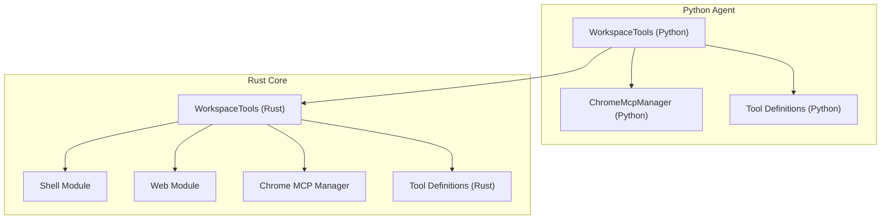
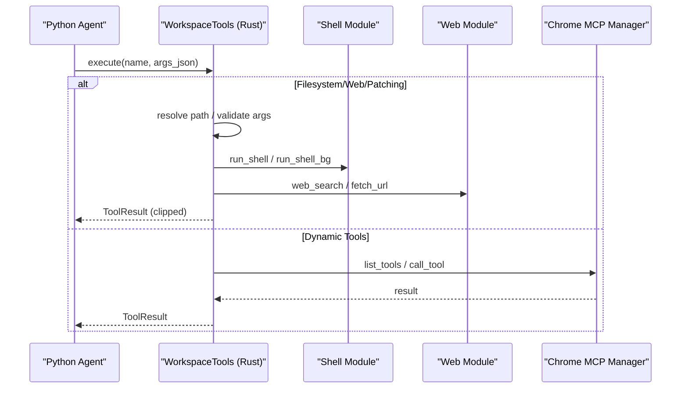
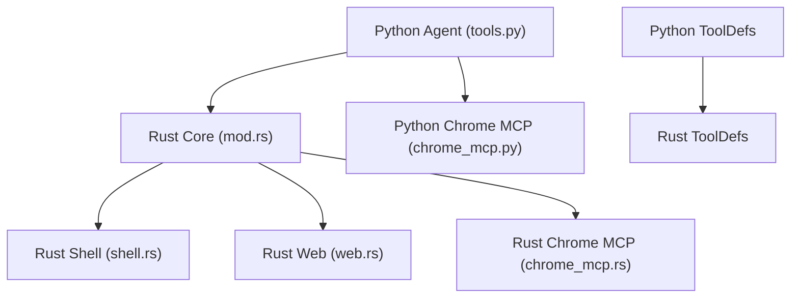

# Workspace Tools System

<cite>
**Referenced Files in This Document**
- [tools.py](file://agent/tools.py)
- [tool_defs.py](file://agent/tool_defs.py)
- [mod.rs](file://openplanter-desktop/crates/op-core/src/tools/mod.rs)
- [defs.rs](file://openplanter-desktop/crates/op-core/src/tools/defs.rs)
- [shell.rs](file://openplanter-desktop/crates/op-core/src/tools/shell.rs)
- [web.rs](file://openplanter-desktop/crates/op-core/src/tools/web.rs)
- [chrome_mcp.rs](file://openplanter-desktop/crates/op-core/src/tools/chrome_mcp.rs)
- [chrome_mcp.py](file://agent/chrome_mcp.py)
</cite>

## Table of Contents
1. [Introduction](#introduction)
2. [Project Structure](#project-structure)
3. [Core Components](#core-components)
4. [Architecture Overview](#architecture-overview)
5. [Detailed Component Analysis](#detailed-component-analysis)
6. [Dependency Analysis](#dependency-analysis)
7. [Performance Considerations](#performance-considerations)
8. [Troubleshooting Guide](#troubleshooting-guide)
9. [Conclusion](#conclusion)

## Introduction
This document describes the workspace tools system that powers investigations in the OpenPlanter project. It covers the tool architecture including dataset ingestion, file operations, shell execution, web search, and Chrome MCP integration. The system provides 20+ workspace operations designed for secure, reproducible, and auditable investigation workflows. It documents each tool's capabilities, safety constraints, usage patterns, and integration between the Python agent and the Rust core. Practical guidance is included for tool selection, parameter configuration, result interpretation, security considerations for shell execution, and web search integration with multiple providers. Finally, troubleshooting and performance optimization advice is provided.

## Project Structure
The workspace tools system spans two primary implementations:
- Python agent implementation under the `agent/` directory, providing tool orchestration, safety policies, and dynamic Chrome MCP integration.
- Rust core implementation under `openplanter-desktop/crates/op-core/src/tools/`, providing robust, asynchronous tool execution with strong safety guarantees and provider integrations.

**Diagram sources**
- [tools.py:121-417](file://agent/tools.py#L121-L417)
- [chrome_mcp.py:113-573](file://agent/chrome_mcp.py#L113-L573)
- [mod.rs:56-728](file://openplanter-desktop/crates/op-core/src/tools/mod.rs#L56-L728)
- [shell.rs:79-225](file://openplanter-desktop/crates/op-core/src/tools/shell.rs#L79-L225)
- [web.rs:269-728](file://openplanter-desktop/crates/op-core/src/tools/web.rs#L269-L728)
- [chrome_mcp.rs:109-501](file://openplanter-desktop/crates/op-core/src/tools/chrome_mcp.rs#L109-L501)
- [defs.rs:15-796](file://openplanter-desktop/crates/op-core/src/tools/defs.rs#L15-L796)

**Section sources**
- [tools.py:121-417](file://agent/tools.py#L121-L417)
- [mod.rs:56-728](file://openplanter-desktop/crates/op-core/src/tools/mod.rs#L56-L728)

## Core Components
The workspace tools system centers around a unified dispatcher that routes tool calls to specialized modules while enforcing safety and policy constraints. The Python agent maintains runtime policies, path resolution, and dynamic tool discovery, while the Rust core executes tools asynchronously with strict timeouts and resource limits.

Key components:
- WorkspaceTools (Python): Orchestrates tool execution, enforces safety policies, manages background jobs, and integrates with Chrome MCP.
- WorkspaceTools (Rust): Central dispatcher implementing tool execution, background job lifecycle, and provider integrations.
- Shell Module (Rust): Executes commands with policy enforcement, timeouts, and output clipping.
- Web Module (Rust): Implements Exa, Firecrawl, Brave, and Tavily integrations for search and fetching.
- Chrome MCP Manager (Python/Rust): Manages Chrome DevTools MCP lifecycle, tool discovery, and RPC communication.
- Tool Definitions (Python/Rust): Provider-neutral schemas for OpenAI and Anthropic tool arrays.

**Section sources**
- [tools.py:121-417](file://agent/tools.py#L121-L417)
- [mod.rs:56-728](file://openplanter-desktop/crates/op-core/src/tools/mod.rs#L56-L728)
- [shell.rs:79-225](file://openplanter-desktop/crates/op-core/src/tools/shell.rs#L79-L225)
- [web.rs:269-728](file://openplanter-desktop/crates/op-core/src/tools/web.rs#L269-L728)
- [chrome_mcp.py:113-573](file://agent/chrome_mcp.py#L113-L573)
- [chrome_mcp.rs:109-501](file://openplanter-desktop/crates/op-core/src/tools/chrome_mcp.rs#L109-L501)
- [tool_defs.py:10-586](file://agent/tool_defs.py#L10-L586)
- [defs.rs:15-796](file://openplanter-desktop/crates/op-core/src/tools/defs.rs#L15-L796)

## Architecture Overview
The system architecture ensures separation of concerns between orchestration (Python) and execution (Rust), with shared safety policies and provider configurations.

**Diagram sources**
- [mod.rs:282-722](file://openplanter-desktop/crates/op-core/src/tools/mod.rs#L282-L722)
- [shell.rs:79-225](file://openplanter-desktop/crates/op-core/src/tools/shell.rs#L79-L225)
- [web.rs:269-728](file://openplanter-desktop/crates/op-core/src/tools/web.rs#L269-L728)
- [chrome_mcp.rs:148-269](file://openplanter-desktop/crates/op-core/src/tools/chrome_mcp.rs#L148-L269)

## Detailed Component Analysis

### Filesystem Tools
Capabilities:
- list_files: Enumerate files with optional glob filtering and limits.
- search_files: Search file contents with ripgrep fallback and match limits.
- repo_map: Generate lightweight source maps for code navigation.
- read_file: Read file contents with optional hashline numbering for verification.
- read_image: Read images with size and format validation.
- write_file/edit_file: Create or overwrite files and replace exact text spans.
- apply_patch/hashline_edit: Apply Codex-style patches and edit using hash-anchored lines.

Safety and constraints:
- Path resolution prevents escaping the workspace root.
- Write scope enforcement for curator mode restricts writes to wiki paths.
- Parallel write claims prevent race conditions across tasks.
- File size clipping protects memory and observation limits.

Usage patterns:
- Use read_file with hashline=true for subsequent hashline_edit operations.
- Use repo_map to discover symbols and file structure before editing.
- Use apply_patch for atomic, multi-file changes.

**Section sources**
- [tools.py:418-661](file://agent/tools.py#L418-L661)
- [mod.rs:282-352](file://openplanter-desktop/crates/op-core/src/tools/mod.rs#L282-L352)
- [defs.rs:15-451](file://openplanter-desktop/crates/op-core/src/tools/defs.rs#L15-L451)

### Shell Execution Tools
Capabilities:
- run_shell: Execute commands with timeouts and output clipping.
- run_shell_bg/check_shell_bg/kill_shell_bg: Manage background jobs with persistent output files.

Safety and constraints:
- Policy enforcement blocks heredoc syntax and interactive terminal programs.
- Process groups and controlled termination ensure cleanup.
- Timeouts clamp execution to prevent runaway processes.
- Output clipping prevents oversized observations.

Security considerations:
- Avoid shell injection by validating and sanitizing inputs.
- Prefer explicit commands and avoid eval/exec patterns.
- Use short timeouts for untrusted commands.
- Monitor background jobs and clean up on shutdown.

**Section sources**
- [tools.py:253-374](file://agent/tools.py#L253-L374)
- [shell.rs:27-225](file://openplanter-desktop/crates/op-core/src/tools/shell.rs#L27-L225)
- [chrome_mcp.py:158-303](file://agent/chrome_mcp.py#L158-L303)

### Web Search and Fetch Tools
Capabilities:
- web_search: Search the web using Exa, Firecrawl, Brave, or Tavily with configurable results and text inclusion.
- fetch_url: Fetch and return text content from one or more URLs with provider normalization.

Providers and configuration:
- Exa: Requires API key and base URL; supports search and content retrieval.
- Firecrawl: Requires API key and base URL; supports scraping and markdown extraction.
- Brave: Uses REST API with subscription token; supports direct fetch fallback.
- Tavily: Requires API key and base URL; supports search and content extraction.

Usage patterns:
- Choose provider based on availability and desired output format.
- Limit num_results and include_text to balance latency and verbosity.
- Use fetch_url for targeted content retrieval after discovery.

**Section sources**
- [web.rs:61-728](file://openplanter-desktop/crates/op-core/src/tools/web.rs#L61-L728)
- [tool_defs.py:65-102](file://agent/tool_defs.py#L65-L102)

### Chrome MCP Integration
Capabilities:
- Dynamic tool discovery and execution via Chrome DevTools MCP.
- Automatic connection or manual browser URL attachment.
- Structured result parsing with text, images, and URIs.

Safety and constraints:
- Environment variable overrides for command, package, and extra args.
- Status snapshots and detailed error reporting with stderr tail.
- Retry logic with graceful shutdown on failures.

Usage patterns:
- Enable auto-connect or set browser URL for remote debugging.
- Use list_tools to refresh tool definitions before calling.
- Parse call results for text content and optional images.

**Section sources**
- [chrome_mcp.py:113-573](file://agent/chrome_mcp.py#L113-L573)
- [chrome_mcp.rs:109-501](file://openplanter-desktop/crates/op-core/src/tools/chrome_mcp.rs#L109-L501)
- [mod.rs:691-711](file://openplanter-desktop/crates/op-core/src/tools/mod.rs#L691-L711)

### Audio and Document AI Tools
Capabilities:
- audio_transcribe: Offline transcription with diarization, timestamps, context bias, language hints, model overrides, and chunking.
- document_ocr: OCR on PDFs and images with structured metadata and sidecar artifacts.
- document_annotations: Structured extraction using document-level and bbox-level JSON schemas.
- document_qa: Question answering over local PDFs using Document AI.

Safety and constraints:
- File size limits and request timeouts protect resources.
- Shared or override keys for Mistral Document AI depending on configuration.
- Clipping of observations to prevent oversized outputs.

**Section sources**
- [mod.rs:420-562](file://openplanter-desktop/crates/op-core/src/tools/mod.rs#L420-L562)
- [defs.rs:72-225](file://openplanter-desktop/crates/op-core/src/tools/defs.rs#L72-L225)

### Tool Definitions and Provider Conversion
The system provides provider-neutral tool definitions that convert to OpenAI strict or Anthropic schemas. Dynamic tools from Chrome MCP are merged into the schema at runtime.

Key features:
- Strict parameter enforcement for OpenAI compatibility.
- Delegation tool support (subtask/execute) with acceptance criteria stripping for provider conversion.
- Curator tool subset for restricted environments.

**Section sources**
- [tool_defs.py:10-756](file://agent/tool_defs.py#L10-L756)
- [defs.rs:515-796](file://openplanter-desktop/crates/op-core/src/tools/defs.rs#L515-L796)

## Dependency Analysis
The Python agent depends on the Rust core for execution while maintaining policy enforcement and dynamic integration points. Chrome MCP bridges are shared across both implementations.

**Diagram sources**
- [tools.py:121-417](file://agent/tools.py#L121-L417)
- [mod.rs:56-728](file://openplanter-desktop/crates/op-core/src/tools/mod.rs#L56-L728)
- [chrome_mcp.py:113-573](file://agent/chrome_mcp.py#L113-L573)
- [shell.rs:79-225](file://openplanter-desktop/crates/op-core/src/tools/shell.rs#L79-L225)
- [web.rs:269-728](file://openplanter-desktop/crates/op-core/src/tools/web.rs#L269-L728)
- [chrome_mcp.rs:109-501](file://openplanter-desktop/crates/op-core/src/tools/chrome_mcp.rs#L109-L501)
- [tool_defs.py:10-756](file://agent/tool_defs.py#L10-L756)
- [defs.rs:15-796](file://openplanter-desktop/crates/op-core/src/tools/defs.rs#L15-L796)

**Section sources**
- [tools.py:121-417](file://agent/tools.py#L121-L417)
- [mod.rs:56-728](file://openplanter-desktop/crates/op-core/src/tools/mod.rs#L56-L728)

## Performance Considerations
- Constrain output sizes: Use max_shell_output_chars, max_file_chars, and max_observation_chars to cap memory usage and latency.
- Limit search scope: Use glob filters and max_files_listed/max_search_hits to reduce I/O overhead.
- Control timeouts: Set command_timeout_sec appropriately for shell operations; use provider timeouts for web requests.
- Batch operations: Prefer apply_patch for multi-file changes to minimize individual write operations.
- Background jobs: Use run_shell_bg for long-running tasks and monitor with check_shell_bg/kill_shell_bg.
- Provider selection: Choose providers based on latency and cost; cache results where appropriate.

[No sources needed since this section provides general guidance]

## Troubleshooting Guide
Common issues and resolutions:
- Shell execution blocked: Heredoc or interactive terminal programs are disallowed by policy. Replace with write_file/apply_patch or run non-interactively.
- Background job not found: Verify job_id from run_shell_bg; use check_shell_bg to poll status.
- Chrome MCP unavailable: Ensure Node.js/npm is installed, remote debugging is enabled, and browser URL is reachable. Check stderr tail for diagnostics.
- Web search failures: Confirm API keys and base URLs are configured; verify network connectivity and rate limits.
- Path escaping: Ensure paths are within the workspace root; absolute paths are resolved relative to root.

Operational tips:
- Inspect status snapshots for Chrome MCP readiness and tool counts.
- Use think tool to annotate reasoning steps for auditability.
- Employ subtask/execute delegation for complex problems requiring specialized agents.

**Section sources**
- [tools.py:203-214](file://agent/tools.py#L203-L214)
- [shell.rs:27-43](file://openplanter-desktop/crates/op-core/src/tools/shell.rs#L27-L43)
- [chrome_mcp.py:171-200](file://agent/chrome_mcp.py#L171-L200)
- [chrome_mcp.rs:460-500](file://openplanter-desktop/crates/op-core/src/tools/chrome_mcp.rs#L460-L500)
- [web.rs:61-94](file://openplanter-desktop/crates/op-core/src/tools/web.rs#L61-L94)

## Conclusion
The workspace tools system provides a robust, secure, and extensible foundation for investigations. By combining Python orchestration with Rust execution, it achieves strong safety guarantees, predictable performance, and flexible integrations. The 20+ workspace operations cover essential workflows: dataset ingestion, file operations, shell execution, web search, and Chrome MCP integration. Proper configuration, adherence to safety constraints, and thoughtful composition of tools enable efficient and auditable investigations.

[No sources needed since this section summarizes without analyzing specific files]