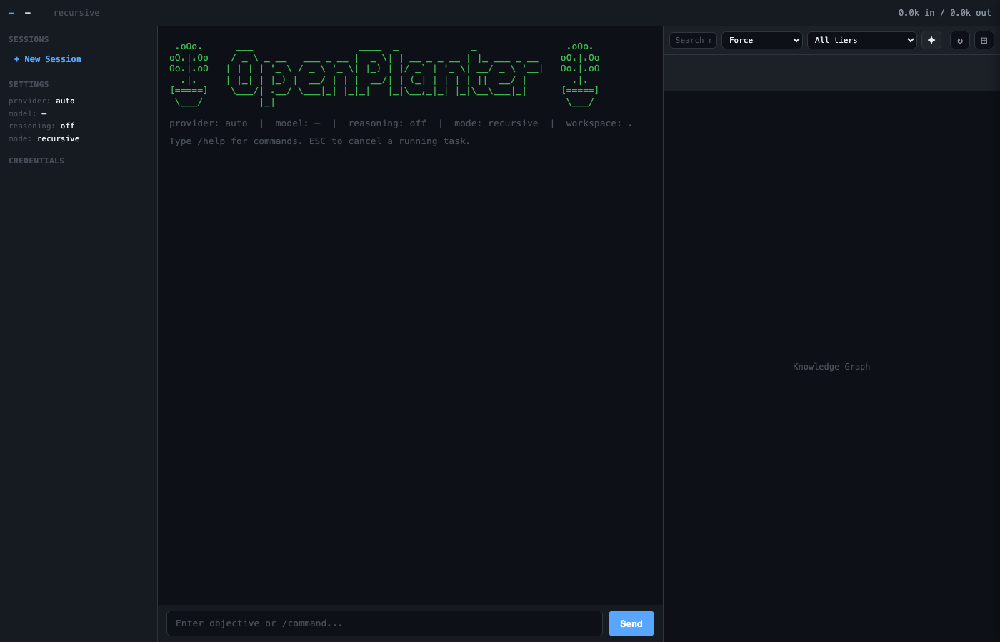

# OpenPlanter

A recursive-language-model investigation agent with a desktop GUI and terminal interface. OpenPlanter ingests heterogeneous datasets — corporate registries, campaign finance records, lobbying disclosures, government contracts, and more — resolves entities across them, and surfaces non-obvious connections through evidence-backed analysis. It operates autonomously with file I/O, shell execution, web search, and recursive sub-agent delegation.



## Download

Pre-built binaries are available on the [Releases page](https://github.com/ShinMegamiBoson/OpenPlanter/releases/latest):

- **macOS** — `.dmg`
- **Windows** — `.msi`
- **Linux** — `.AppImage`

## Desktop App

The desktop app (`openplanter-desktop/`) is a Tauri 2 application with a three-pane layout:

- **Sidebar** — Session management, provider/model settings, and API credential status
- **Chat pane** — Conversational interface showing the agent's objectives, reasoning steps, tool calls, and findings with syntax-highlighted code blocks
- **Knowledge graph** — Interactive Cytoscape.js visualization of entities and relationships discovered during investigation. Nodes are color-coded by category (corporate, campaign-finance, lobbying, contracts, sanctions, etc.). Click a source node to open a slide-out drawer with the full rendered wiki document.

### Features

- **Live knowledge graph** — Entities and connections render in real time as the agent works. Switch between force-directed, hierarchical, and circular layouts. Search and filter by category.
- **Wiki source drawer** — Click any source node to read the full markdown document in a slide-out panel. Internal wiki links navigate between documents and focus the corresponding graph node.
- **Session persistence** — Investigations are saved automatically. Resume previous sessions or start new ones from the sidebar.
- **Background wiki curator** — A lightweight agent runs in the background to keep wiki documents consistent and cross-linked.
- **Multi-provider support** — Switch between OpenAI, Anthropic, OpenRouter, Cerebras, and Ollama (local) from the sidebar.

### Building from Source

```bash
cd openplanter-desktop

# Install frontend dependencies
cd frontend && npm install && cd ..

# Install the Tauri Cargo subcommand
cargo install tauri-cli --version "^2"

# Run in development mode
cargo tauri dev

# Build distributable binary
cargo tauri build
```

Requires: Rust stable, Node.js 20+, the Tauri CLI, and platform-specific Tauri dependencies ([see Tauri prerequisites](https://v2.tauri.app/start/prerequisites/)).

## CLI Agent

The Python CLI agent can be used independently of the desktop app.

### Quickstart

```bash
# Install
pip install -e .

# Configure API keys (interactive prompt)
openplanter-agent --configure-keys

# Launch the TUI
openplanter-agent --workspace /path/to/your/project
```

Or run a single task headlessly:

```bash
openplanter-agent --task "Cross-reference vendor payments against lobbying disclosures and flag overlaps" --workspace ./data
```

### Docker

```bash
# Add your API keys to .env, then:
docker compose up
```

The container mounts `./workspace` as the agent's working directory.

## Supported Providers

| Provider | Default Model | Env Var |
|----------|---------------|---------|
| OpenAI | `azure-foundry/gpt-5.4` | `OPENAI_API_KEY` or `OPENAI_OAUTH_TOKEN` |
| Anthropic | `anthropic-foundry/claude-opus-4-6` | `ANTHROPIC_API_KEY` |
| OpenRouter | `anthropic/claude-sonnet-4-5` | `OPENROUTER_API_KEY` |
| Cerebras | `qwen-3-235b-a22b-instruct-2507` | `CEREBRAS_API_KEY` |
| Z.AI | `glm-5` | `ZAI_API_KEY` |
| Ollama | `llama3.2` | (none — local) |

OpenAI-compatible requests now default to the Azure Foundry proxy at
`https://foundry-proxy.cheetah-koi.ts.net/openai/v1`, and Anthropic requests
default to the Anthropic Foundry proxy at
`https://foundry-proxy.cheetah-koi.ts.net/anthropic/v1`.

For OpenAI-compatible access, you can authenticate with either a standard API key or a ChatGPT OAuth token (Plus/Pro/Teams): `OPENAI_OAUTH_TOKEN` (or `OPENPLANTER_OPENAI_OAUTH_TOKEN`).

### Local Models (Ollama)

[Ollama](https://ollama.com) runs models locally with no API key. Install Ollama, pull a model (`ollama pull llama3.2`), then:

```bash
openplanter-agent --provider ollama
openplanter-agent --provider ollama --model mistral
openplanter-agent --provider ollama --list-models
```

The base URL defaults to `http://localhost:11434/v1` and can be overridden with `OPENPLANTER_OLLAMA_BASE_URL` or `--base-url`. The first request may be slow while Ollama loads the model into memory; a 120-second first-byte timeout is used automatically.

### Z.AI Endpoint Plans

Z.AI has two distinct endpoint plans:

- PAYGO endpoint: `https://api.z.ai/api/paas/v4`
- Coding plan endpoint: `https://api.z.ai/api/coding/paas/v4`

Choose the plan explicitly:

```bash
export OPENPLANTER_ZAI_PLAN=paygo   # or coding
```

Or per run:

```bash
openplanter-agent --provider zai --model glm-5 --zai-plan coding
```

Advanced overrides:

```bash
export OPENPLANTER_ZAI_PAYGO_BASE_URL=https://api.z.ai/api/paas/v4
export OPENPLANTER_ZAI_CODING_BASE_URL=https://api.z.ai/api/coding/paas/v4
```

`OPENPLANTER_ZAI_BASE_URL` still overrides both plans when set.

### Z.AI Reliability Tuning

Z.AI rate limits (`HTTP 429`, code `1302`) are retried with capped backoff and jitter. For Z.AI streaming connection issues, OpenPlanter also retries up to `OPENPLANTER_ZAI_STREAM_MAX_RETRIES` times.

```bash
export OPENPLANTER_RATE_LIMIT_MAX_RETRIES=12
export OPENPLANTER_RATE_LIMIT_BACKOFF_BASE_SEC=1.0
export OPENPLANTER_RATE_LIMIT_BACKOFF_MAX_SEC=60.0
export OPENPLANTER_RATE_LIMIT_RETRY_AFTER_CAP_SEC=120.0
export OPENPLANTER_ZAI_STREAM_MAX_RETRIES=10
```

Additional service keys: `EXA_API_KEY`, `FIRECRAWL_API_KEY`, `BRAVE_API_KEY`, `TAVILY_API_KEY` (web search), `VOYAGE_API_KEY` (embeddings).

All keys can also be set with an `OPENPLANTER_` prefix (e.g. `OPENPLANTER_OPENAI_API_KEY`), via `.env` files in the workspace, or via CLI flags.
Provider base URLs can also be overridden with `OPENPLANTER_*_BASE_URL`, including `OPENPLANTER_TAVILY_BASE_URL`.

## Agent Tools

The agent has access to 19 tools, organized around its investigation workflow:

**Dataset ingestion & workspace** — `list_files`, `search_files`, `repo_map`, `read_file`, `write_file`, `edit_file`, `hashline_edit`, `apply_patch` — load, inspect, and transform source datasets; write structured findings.

**Shell execution** — `run_shell`, `run_shell_bg`, `check_shell_bg`, `kill_shell_bg` — run analysis scripts, data pipelines, and validation checks.

**Web** — `web_search` (Exa, Firecrawl, Brave, or Tavily), `fetch_url` — pull public records, verify entities, and retrieve supplementary data.

**Planning & delegation** — `think`, `subtask`, `execute`, `list_artifacts`, `read_artifact` — decompose investigations into focused sub-tasks, each with acceptance criteria and independent verification.

In **recursive mode** (the default), the agent spawns sub-agents via `subtask` and `execute` to parallelize entity resolution, cross-dataset linking, and evidence-chain construction across large investigations.

## CLI Reference

```
openplanter-agent [options]
```

### Workspace & Session

| Flag | Description |
|------|-------------|
| `--workspace DIR` | Workspace root (default: `.`) |
| `--session-id ID` | Use a specific session ID |
| `--resume` | Resume the latest (or specified) session |
| `--list-sessions` | List saved sessions and exit |

### Model Selection

| Flag | Description |
|------|-------------|
| `--provider NAME` | `auto`, `openai`, `anthropic`, `openrouter`, `cerebras`, `zai`, `ollama` |
| `--model NAME` | Model name or `newest` to auto-select |
| `--openai-oauth-token TOKEN` | ChatGPT Plus/Teams/Pro OAuth bearer token for OpenAI-compatible models |
| `--zai-plan PLAN` | Z.AI endpoint plan: `paygo` or `coding` |
| `--reasoning-effort LEVEL` | `low`, `medium`, `high`, or `none` |
| `--list-models` | Fetch available models from the provider API |

### Execution

| Flag | Description |
|------|-------------|
| `--task OBJECTIVE` | Run a single task and exit (headless) |
| `--recursive` | Enable recursive sub-agent delegation |
| `--acceptance-criteria` | Judge subtask results with a lightweight model |
| `--max-depth N` | Maximum recursion depth (default: 4) |
| `--max-steps N` | Maximum steps per call (default: 100) |
| `--timeout N` | Shell command timeout in seconds (default: 45) |

### UI

| Flag | Description |
|------|-------------|
| `--no-tui` | Plain REPL (no colors or spinner) |
| `--headless` | Non-interactive mode (for CI) |
| `--demo` | Censor entity names and workspace paths in output |

### Persistent Defaults

Use `--default-model`, `--default-reasoning-effort`, or per-provider variants like `--default-model-openai` to save workspace defaults to `.openplanter/settings.json`. View them with `--show-settings`.

## Configuration

Keys are resolved in this priority order (highest wins):

1. CLI flags (`--openai-api-key`, etc.)
2. Environment variables (`OPENAI_API_KEY` or `OPENPLANTER_OPENAI_API_KEY`)
3. `.env` file in the workspace
4. Workspace credential store (`.openplanter/credentials.json`)
5. User credential store (`~/.openplanter/credentials.json`)

All runtime settings can also be set via `OPENPLANTER_*` environment variables (e.g. `OPENPLANTER_MAX_DEPTH=8`).

## Project Structure

```
openplanter-desktop/         Tauri 2 desktop application
  crates/
    op-tauri/                 Tauri backend (Rust)
      src/commands/           IPC command handlers (agent, wiki, config)
    op-core/                  Shared core library
  frontend/                   TypeScript/Vite frontend
    src/components/           UI components (ChatPane, GraphPane, InputBar, Sidebar)
    src/graph/                Cytoscape.js graph rendering
    src/api/                  Tauri IPC wrappers
    e2e/                      Playwright E2E tests

agent/                        Python CLI agent
  __main__.py                 CLI entry point and REPL
  engine.py                   Recursive language model engine
  runtime.py                  Session persistence and lifecycle
  model.py                    Provider-agnostic LLM abstraction
  builder.py                  Engine/model factory
  tools.py                    Workspace tool implementations
  tool_defs.py                Tool JSON schemas
  prompts.py                  System prompt construction
  config.py                   Configuration dataclass
  credentials.py              Credential management
  tui.py                      Rich terminal UI
  demo.py                     Demo mode (output censoring)
  patching.py                 File patching utilities
  settings.py                 Persistent settings

tests/                        Unit and integration tests
```

## Development

### Desktop App

```bash
cd openplanter-desktop

# Development mode (hot-reload)
cargo tauri dev

# Frontend tests
cd frontend && npm test

# E2E tests (Playwright)
cd frontend && npm run test:e2e

# Backend tests
cargo test
```

### CLI Agent

```bash
# Install in editable mode with test dependencies
pip install -e ".[dev]"

# Optional: include Textual extras for UI-focused tests
pip install -e ".[dev,textual]"

# Run tests
python -m pytest tests/

# Skip live API tests
python -m pytest tests/ --ignore=tests/test_live_models.py --ignore=tests/test_integration_live.py
```

Requires Python 3.10+. Runtime dependencies: `rich`, `prompt_toolkit`, `pyfiglet`.

## License

MIT — see [LICENSE](LICENSE) for details.
