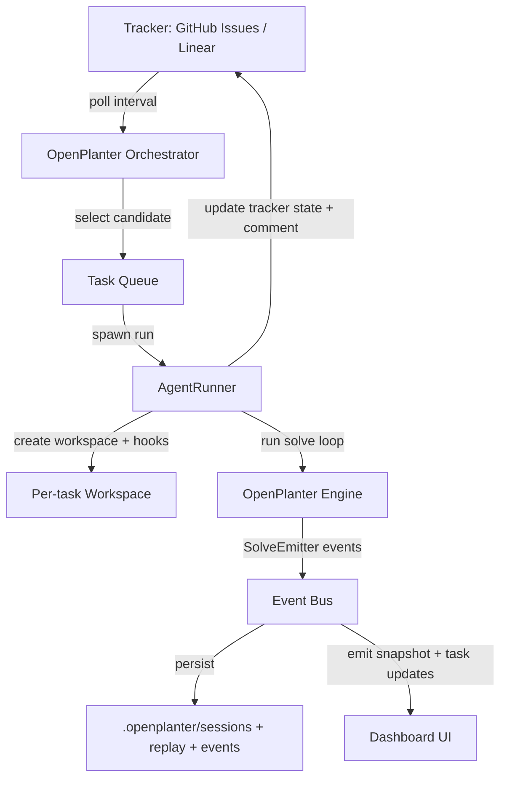
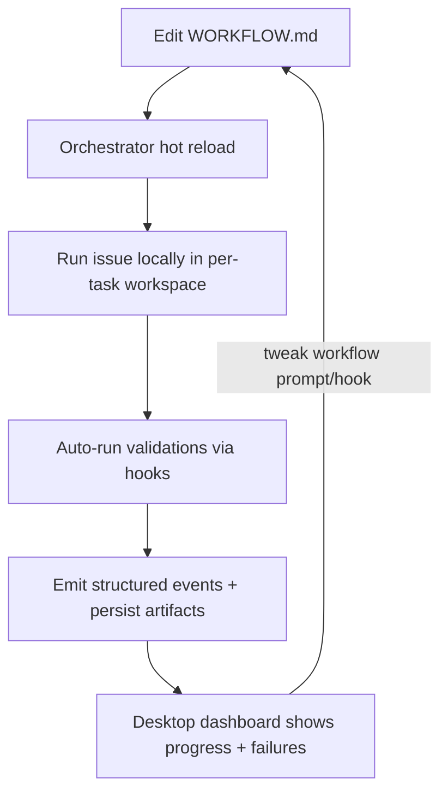

# Implementing Symphony-Inspired Orchestration in OpenPlanter

Implementation tracker: [harness-engineering-checklist.md](./harness-engineering-checklist.md)

## Information needs

To answer well, I must learn:

- How Symphony structures unattended “work orchestration” (polling loop, per-issue workspaces, tracker adapters, worker lifecycle, observability). fileciteturn79file0L1-L1 fileciteturn82file0L1-L1 fileciteturn85file0L1-L1  
- What OpenPlanter already exposes as “execution primitives” (solve entrypoints, session/workspace model, event streaming and persistence, tool schema system). fileciteturn98file0L1-L1 fileciteturn105file0L1-L1 fileciteturn104file0L1-L1 fileciteturn90file0L1-L1  
- How OpenPlanter desktop bridges engine telemetry to the UI (Tauri invoke routes, event channels, logging emitter, UX state store). fileciteturn94file0L1-L1 fileciteturn103file0L1-L1 fileciteturn104file0L1-L1 fileciteturn93file0L1-L1 fileciteturn101file0L1-L1  
- What CI/test harness already exists in OpenPlanter (to propose iteration-speed improvements without fighting the repo). fileciteturn95file0L1-L1 fileciteturn97file0L1-L1 fileciteturn92file0L1-L1  
- Which Symphony “components” are real code boundaries vs workflow/prompt conventions (WORKFLOW.md config + template, hooks, dynamic tracker tool). fileciteturn81file0L1-L1 fileciteturn84file0L1-L1 fileciteturn88file0L1-L1  

## Executive summary

OpenPlanter already contains many of the “per-run telemetry and governance primitives” you need to implement Symphony-style unattended orchestration: a structured event model for UI IPC and health telemetry fileciteturn105file0L1-L1, a bridge that emits events and persists replay and session artifacts fileciteturn104file0L1-L1, and a rich tool-spec system that supports strict schemas and dynamic tool injection fileciteturn90file0L1-L1. It also already has workspace guardrails (reject repo root, redirect to `workspace/`) in both Python CLI and desktop app startup paths. fileciteturn77file0L1-L1 fileciteturn102file0L1-L1

Symphony’s differentiators are not “agent intelligence” primitives, they are “work management” primitives:

- A polling orchestrator that continuously pulls tasks from a tracker and dispatches “issue runs” with concurrency control, retry/backoff, and stall detection. fileciteturn82file0L1-L1  
- A per-issue workspace lifecycle with hooks and remote execution support. fileciteturn85file0L1-L1  
- A clean tracker adapter boundary (read/write issue state, comment updates). fileciteturn84file0L1-L1  
- A “workflow spec” living in a single `WORKFLOW.md` that includes both configuration (YAML frontmatter) and the agent prompt template. fileciteturn81file0L1-L1  
- A lightweight dashboard view that summarizes orchestrator state and token throughput. fileciteturn89file0L1-L1  

The highest leverage path is to add an orchestration subsystem to OpenPlanter desktop (Rust `op-core` + Tauri + frontend), while optionally adding a parallel CLI entry point later. That yields:

- Developer productivity: faster iteration loops via hot-reloaded “workflow spec”, repeatable per-task workspaces, and local harness-style runs that align with CI. fileciteturn81file0L1-L1 fileciteturn95file0L1-L1  
- User-facing power: “issue-driven automation”, per-task workspaces, tracker adapters, notifications, remote worker support, and an orchestrator dashboard inside the existing OpenPlanter UI event model. fileciteturn104file0L1-L1 fileciteturn93file0L1-L1  

The podcast transcript content is unspecified, so this mapping is conservative and derived from Symphony’s concrete repo primitives and declared workflow concepts. fileciteturn79file0L1-L1

## Baseline comparison

### What Symphony provides, concretely

Symphony is explicitly positioned as “turn project work into isolated, autonomous implementation runs” and is demonstrated monitoring a tracker (Linear) and spawning agents that produce work artifacts and safely land PRs. fileciteturn79file0L1-L1

Its orchestration is built from clean separations:

- **Orchestrator loop**: a long-running process that periodically polls the tracker and dispatches work, managing concurrency, retries, and stalled runs. fileciteturn82file0L1-L1  
- **Agent runner**: per-issue execution context that creates a workspace, runs hooks, then runs “turns” until either the issue is no longer active or `max_turns` is reached, at which point the orchestrator retains control. fileciteturn83file0L1-L1  
- **Tracker boundary**: a module with callbacks for fetching candidates, updating state, and posting comments. fileciteturn84file0L1-L1  
- **Workspace lifecycle + SSH support**: deterministic per-issue directories under a configured root, validation that the workspace is within the root, and remote creation/removal via SSH. fileciteturn85file0L1-L1  
- **Workflow spec and prompt**: `WORKFLOW.md` blends YAML frontmatter (tracker, polling, workspace root, hooks, agent concurrency, codex settings) with a templated, highly prescriptive prompt. fileciteturn81file0L1-L1  
- **Observability**: a terminal dashboard that snapshots running agents, throughput, tokens, rate limits; it also publishes updates. fileciteturn89file0L1-L1  
- **Dynamic tools**: a dynamic tool boundary used by the Codex app-server client to let the model call “tracker operations” like `linear_graphql`. fileciteturn87file0L1-L1 fileciteturn88file0L1-L1  

### What OpenPlanter provides, concretely

OpenPlanter already has the “agent runtime UX contract” needed for orchestration:

- **Unified, serializable event model** (trace, delta, step, loop-health, complete/error, wiki updates), which is precisely what an orchestrator dashboard needs to render multi-run state. fileciteturn105file0L1-L1  
- **A Tauri bridge that emits those events and persists replay/events artifacts**, including step summaries and patch artifacts. This is already close to Symphony’s “proof of work” concept, just aimed at a single session. fileciteturn104file0L1-L1  
- **A frontend event subscription model** (listen channels like `agent:step`, `agent:trace`) and a centralized app store that already supports queued objectives. fileciteturn103file0L1-L1 fileciteturn93file0L1-L1  
- **Tool schema single-source-of-truth** with dynamic injection support (merging `dynamic_defs` into base tool definitions). This is the most direct insertion point for Symphony-like “tracker tools” and “dynamic tools”. fileciteturn90file0L1-L1  
- **Workspace guardrails** consistent with Symphony’s “workspace must be inside root” posture, preventing repo-root writes by redirecting or rejecting. fileciteturn77file0L1-L1 fileciteturn102file0L1-L1  
- **Multiple entrypoints**: Python CLI (`openplanter-agent = agent.__main__:main`) and the desktop app (Tauri invoke handler). fileciteturn97file0L1-L1 fileciteturn98file0L1-L1 fileciteturn101file0L1-L1  

The missing pieces are almost entirely “orchestration and tracker integration”, not “agent runtime”.

## Mapping Symphony concepts into OpenPlanter with concrete change proposals

The transcript is unspecified, so “podcast ideas” are treated as the Symphony component list you provided. Any domain-specific nuance beyond these is unspecified.

### Comparative table

| Idea | Dev-side changes | User-side features | Files/Locations | Effort estimate |
|---|---|---|---|---|
| Orchestrator | Add background poller with hot config reload and concurrency limits | “Automation mode” that runs tasks continuously | Add `openplanter-desktop/crates/op-core/src/orchestrator.rs` (new) and export in `op-core/src/lib.rs` fileciteturn99file0L1-L1; add Tauri commands + app state fileciteturn101file0L1-L1 fileciteturn102file0L1-L1 | Large |
| Agent runner | Add per-task runner wrapper, continuation loop, stall detection | “Run this issue” button, auto-retries | New `op-core/src/agent_runner.rs` modeled after Symphony’s continuation turns fileciteturn83file0L1-L1 | Medium |
| Workflow spec | Parse `WORKFLOW.md` YAML + prompt template; hot reload | “Workflow as a file”: editable prompt + config per project | New `op-core/src/workflow_spec.rs`; optional CLI integration in Python `agent/__main__.py` fileciteturn98file0L1-L1; model after Symphony’s WORKFLOW.md fileciteturn81file0L1-L1 | Medium |
| Tracker adapters | Trait boundary + implementations (start with GitHub) | GitHub Issues/PR automation, comments, status updates | New `op-core/src/tracker/*`; model after Symphony adapter boundary fileciteturn84file0L1-L1 | Large |
| Codex app-server analog | Add “OpenPlanter daemon” (local HTTP/WebSocket) for headless runs + UI | Remote UI client, multi-workspace orchestration without Tauri coupling | New crate `openplanter-desktop/crates/op-daemon` (Axum) (new); or minimal in Tauri commands; modeled conceptually on app-server integration fileciteturn87file0L1-L1 | Large |
| Workspace model | Create isolated per-task directories under `.openplanter/workspaces/` and add hooks | Per-task workspaces, cleanup controls, evidence capture | Extend startup guardrails + provide new workspace manager: mirror Symphony workspace + hooks fileciteturn85file0L1-L1 and OpenPlanter guardrails fileciteturn77file0L1-L1 fileciteturn102file0L1-L1 | Medium |
| Observability/dashboard | Add orchestrator snapshot event type and UI pane | Dashboard of running tasks, token burn, throughput | Extend event structs `op-core/src/events.rs` fileciteturn105file0L1-L1; emit via bridge fileciteturn104file0L1-L1; add frontend listeners fileciteturn103file0L1-L1 and UI state updates fileciteturn93file0L1-L1 | Medium |
| Hooks | Add before/after-run hooks, workspace create/remove hooks | Notifications, artifact upload, automatic validations | New workflow config keys matching Symphony conventions fileciteturn81file0L1-L1 and workspace hook concept fileciteturn85file0L1-L1 | Small–Medium |
| SSH workers | Add worker abstraction and optional SSH backend | Run on remote machines, GPU boxes, isolated sandboxes | New `op-core/src/workers/ssh.rs` modeled after Symphony’s remote workspace strategy fileciteturn85file0L1-L1 | Large |
| Dynamic tools | Add tracker tools (`github_graphql`, `linear_graphql`) into OpenPlanter’s tool registry; gate unsafe tools | Agent can read/write tracker state autonomously | Extend `agent/tool_defs.py` dynamic tool merge already exists fileciteturn90file0L1-L1; mirror Symphony dynamic tool contract fileciteturn88file0L1-L1 | Small–Medium |

### Concrete implementation details by component

#### Orchestrator

**Goal:** Recreate Symphony’s “poll -> dispatch -> track running -> retry/backoff -> stall restart” loop inside OpenPlanter. Symphony’s orchestrator state includes `running`, `retry_attempts`, and concurrency config, and refreshes config as it ticks. fileciteturn82file0L1-L1

**Where to add in OpenPlanter (desktop path):**

- Add module export `pub mod orchestrator;` in `openplanter-desktop/crates/op-core/src/lib.rs`. fileciteturn99file0L1-L1  
- Extend `openplanter-desktop/crates/op-tauri/src/state.rs` to store an `OrchestratorRuntime` handle (like existing `chrome_mcp` runtime). fileciteturn102file0L1-L1  
- Add Tauri commands in a new file `openplanter-desktop/crates/op-tauri/src/commands/orchestrator.rs`, and register them in `main.rs`’s `invoke_handler`. fileciteturn101file0L1-L1  
- Add new event types in `openplanter-desktop/crates/op-core/src/events.rs` for snapshot updates. fileciteturn105file0L1-L1  
- Emit those events via the bridge (pattern already used for agent events). fileciteturn104file0L1-L1  
- Frontend: add listeners and state updates. fileciteturn103file0L1-L1 fileciteturn93file0L1-L1  

**Pseudo-code outline (Rust, op-core):**
```rust
// openplanter-desktop/crates/op-core/src/orchestrator.rs
pub struct OrchestratorConfig {
  pub poll_interval_ms: u64,
  pub max_concurrent: usize,
  pub stall_timeout_ms: u64,
  pub workflow_path: std::path::PathBuf,   // WORKFLOW.md
  pub workspace_root: std::path::PathBuf,  // .openplanter/workspaces
  pub tracker: TrackerConfig,
  pub hooks: HookConfig,
  pub workers: WorkerConfig, // local + ssh hosts
}

pub struct OrchestratorSnapshot { /* running[], retrying[], totals, next_poll_due */ }

pub struct OrchestratorRuntime {
  cancel: tokio_util::sync::CancellationToken,
  state: std::sync::Arc<tokio::sync::Mutex<State>>,
}

impl OrchestratorRuntime {
  pub fn start(cfg: OrchestratorConfig, emitter: impl OrchestratorEmitter + Send + Sync + 'static) -> Self {
    // spawn tokio loop:
    // - reload WORKFLOW.md if changed
    // - poll tracker for candidate issues
    // - dispatch AgentRunner tasks up to max_concurrent
    // - check stalled tasks
    // - emit snapshot
  }
}
```

**Developer productivity impact:** once in place, developers can “feed” work via issues and watch runs execute without babysitting, matching Symphony’s “manage work, not agents” positioning. fileciteturn79file0L1-L1

#### Agent runner

Symphony’s agent runner is simple and powerful: create workspace, run hooks, start a session, execute a turn, then re-check issue state and continue until inactive or turn cap. fileciteturn83file0L1-L1

**OpenPlanter insertion point:** implement `AgentRunner::run_issue(issue, cfg)` as a wrapper around the existing “solve objective” pipeline, and expose it to the orchestrator.

**Concrete OpenPlanter locations to integrate:**

- Desktop: add `op-core/src/agent_runner.rs` (new) that calls the existing solve entrypoint (via whatever solve function is currently used by Tauri commands), and stitches continuation runs together.
- Desktop UI can display each run as a “turn” within an issue, similar to how OpenPlanter already displays step/turn progress for a single run via events. fileciteturn105file0L1-L1 fileciteturn103file0L1-L1  

**Pseudo-code (continuation loop):**
```rust
async fn run_issue_until_done(issue: Issue, cfg: &OrchestratorConfig, emitter: &dyn OrchestratorEmitter) -> RunResult {
  let ws = workspace_manager::create_for_issue(&issue, cfg).await?;
  hooks::after_create(&ws, &issue, cfg).await?;

  let mut attempt = 0;
  loop {
    attempt += 1;
    let objective = workflow_prompt::render(&issue, attempt, cfg)?;
    // invoke engine solve -> produces agent:step/agent:complete events already
    let solve_outcome = engine::solve(&ws, &objective, /* existing SolveEmitter */).await;

    let refreshed = tracker.fetch_issue(issue.id).await?;
    if !cfg.tracker.active_states.contains(&refreshed.state) { break; }
    if attempt >= cfg.agent.max_turns { break; }
  }

  hooks::after_run(&ws, &issue, cfg).await;
  Ok(())
}
```

**Why this matters for users:** it enables “long-lived task completion” loops (issue remains active, agent continues), which is the core value of Symphony’s unattended mode. fileciteturn81file0L1-L1 fileciteturn83file0L1-L1

#### Workflow spec

Symphony’s `WORKFLOW.md` is both config and prompt template: tracker settings, polling interval, workspace root, hooks, concurrency, and “codex” runtime config, then a template section used as the prompt. fileciteturn81file0L1-L1 The orchestrator reads this at runtime and validates semantics. fileciteturn86file0L1-L1

**OpenPlanter changes:**

- Introduce an optional `WORKFLOW.md` in the OpenPlanter workspace root (or `.openplanter/WORKFLOW.md` to avoid collisions). Reuse the same “YAML frontmatter then markdown template” pattern.
- Support hot reload: the orchestrator reads the file each poll cycle or watches mtime.

**Where to implement:**

- New parser: `openplanter-desktop/crates/op-core/src/workflow_spec.rs` (new)
- For CLI parity later: add `agent/workflow_spec.py` and integrate in `agent/__main__.py` command paths (it already centralizes CLI args and session bootstrap). fileciteturn98file0L1-L1  

**Minimum schema to start (conservative mapping):**
- `tracker.kind: github | linear | memory`
- `tracker.active_states`, `tracker.terminal_states` (matching Symphony) fileciteturn81file0L1-L1  
- `polling.interval_ms`
- `workspace.root` or derive `.openplanter/workspaces`
- `hooks.after_create`, `hooks.before_remove`, `hooks.before_run`, `hooks.after_run`
- `agent.max_concurrent_agents`, `agent.max_turns`

**Developer productivity gain:** engineers can iterate by editing a single file (workflow and prompt), instead of recompiling UI or touching code-level prompt constants.

#### Tracker adapters

Symphony defines a clean adapter boundary: fetch candidate issues, fetch by states, fetch states by id, create comment, update issue state. fileciteturn84file0L1-L1 It also demonstrates a dynamic tool (`linear_graphql`) for direct tracker operations. fileciteturn88file0L1-L1

**OpenPlanter should implement:**

- `trait TrackerAdapter` (Rust op-core)
- `GitHubAdapter` first (because you explicitly want it to increase OpenPlanter power, and OpenPlanter already has GitHub-based distribution and CI patterns). fileciteturn95file0L1-L1  
- Optional `LinearAdapter` later, structurally analogous.

**Concrete files to add:**

- `openplanter-desktop/crates/op-core/src/tracker/mod.rs`
- `openplanter-desktop/crates/op-core/src/tracker/github.rs`
- `openplanter-desktop/crates/op-core/src/tracker/linear.rs` (optional)

**Dynamic tool integration inside OpenPlanter:**

OpenPlanter’s tool definition system supports merging arbitrary `dynamic_defs` into the tool list while keeping strict schemas. fileciteturn90file0L1-L1

So you can inject tracker operations as tools without hard-coding them into core tools:

- `github_graphql(query, variables?)`
- `github_issue_comment(owner, repo, issue_number, body)`
- `github_issue_set_labels(...)`
- `github_pr_create(...)` (optional, likely gated)

These should mirror Symphony’s dynamic tool contract: tool specs plus an executor that returns a structured “success/output/contentItems” response. fileciteturn88file0L1-L1

#### Codex app-server analog

This is the one place where OpenPlanter is structurally different from Symphony. Symphony uses a Codex app-server JSON-RPC stream over stdio, and treats tool calls + approvals as protocol events. fileciteturn87file0L1-L1

OpenPlanter already has a stable event and persistence layer; the missing piece is a “headless server mode” so the desktop UI is not the only controller.

**Proposed OpenPlanter addition:**

- Add an optional local daemon (“OpenPlanter app-server”) that exposes:
  - `POST /runs` create run for a given objective + workspace/task id
  - `GET /runs/{id}` status
  - `GET /runs/{id}/events` stream (SSE/WebSocket)
  - `POST /orchestrator/start`, `/stop`, `/snapshot`
  - `POST /tracker/*` routes (if you want to keep tokens out of the UI layer)
- The desktop app becomes a client of the daemon during development, enabling quick hot-reload workflows.

This yields a large developer productivity win: UI can be hacked without restarting agent state, and orchestration can run independently.

#### Workspace model

Symphony creates per-issue workspaces under a configured root and validates they remain inside it (prevent escapes, symlink tricks). fileciteturn85file0L1-L1 OpenPlanter already uses a related guardrail: reject repo root and redirect to `workspace/`. fileciteturn77file0L1-L1 fileciteturn102file0L1-L1

**OpenPlanter changes:**

- Add a “task workspaces root” inside `.openplanter/workspaces/<task_id>/`.
- For issue-driven automation, `task_id` can be `github:<org>/<repo>#<num>` or `linear:<identifier>`.
- Add standardized workspace hooks identical in intent to Symphony:
  - `after_create`: clone repo, install deps, bootstrap
  - `before_remove`: final cleanup, artifact export
  - `before_run` / `after_run`: make sure branch is up-to-date, run CI checks, etc.

This makes OpenPlanter immediately more powerful for user-facing “task automation”: every issue gets a clean sandbox.

#### Observability/dashboard

Symphony’s `StatusDashboard` is a TUI that snapshots orchestrator state and shows running tasks, throughput, and rate limits. fileciteturn89file0L1-L1

OpenPlanter already has:

- A structured event model for engine runs. fileciteturn105file0L1-L1  
- A bridge that can emit additional events and log them. fileciteturn104file0L1-L1  
- A frontend that can subscribe to new channels via `listen(...)`. fileciteturn103file0L1-L1  

**Concrete OpenPlanter additions:**

- Add new event types:
  - `OrchestratorSnapshotEvent` (running[], retrying[], totals, next poll)
  - `OrchestratorTaskUpdateEvent` (status transitions per task)
- Emit them from orchestrator command layer through the existing Tauri `Emitter`.
- Add a new UI pane:
  - list tasks with status (queued/running/blocked/done)
  - show per task: runtime, token totals, last event, workspace path
  - include “open workspace” and “open replay” affordances (OpenPlanter already persists replay/events). fileciteturn104file0L1-L1

#### Hooks

Symphony has hooks configured in `WORKFLOW.md` to prepare and teardown workspaces. fileciteturn81file0L1-L1 and implements hook execution in its workspace subsystem. fileciteturn85file0L1-L1

**OpenPlanter implementation:**

- Define hook commands in workflow spec.
- Implement hook runner with:
  - timeout
  - stdout/stderr capture into session artifacts
  - “best-effort” behavior for teardown hooks (Symphony ignores failures for some teardown hooks). fileciteturn85file0L1-L1

#### SSH workers

Symphony supports remote execution via SSH hosts, including remote workspace creation and cleanup. fileciteturn85file0L1-L1 Orchestrator chooses a worker host based on capacity. fileciteturn82file0L1-L1

**OpenPlanter suggestion:**

- Add `Worker` abstraction:
  - `LocalWorker`
  - `SshWorker { host, max_concurrent }`
- Minimum viable SSH support:
  - Run hooks remotely
  - Run solve remotely by calling the new “OpenPlanter daemon” on the remote machine (simplifies log streaming)
- Emit worker host and workspace path in orchestrator events (already done in Symphony). fileciteturn82file0L1-L1

#### Dynamic tools

OpenPlanter’s tool definition layer already supports dynamic tool definitions injection without changing base tools. fileciteturn90file0L1-L1 Symphony uses this to expose tracker access (`linear_graphql`). fileciteturn88file0L1-L1

**Concrete OpenPlanter improvement:**

- Add a “dynamic tool provider registry” to op-core that can supply tool specs based on enabled adapters:
  - `github_graphql` enabled if GitHub token exists
  - `linear_graphql` enabled if token exists
- Add a runtime gating layer:
  - in unattended orchestrator mode: disable dangerous tools by default unless explicitly enabled (shell, arbitrary patch, network).
  - in interactive mode: keep current behavior.

This directly addresses sandboxing risk (see next section).

## Architecture, data flow, and code paths

### Desktop solve path today (reference baseline)

OpenPlanter desktop already has a clean, observable execution pipeline:

- Frontend invokes `solve(...)` via `invoke("solve", ...)`. fileciteturn94file0L1-L1  
- Tauri registers the `solve` command in its handler list. fileciteturn101file0L1-L1  
- The bridge emits structured events like `agent:trace`, `agent:step`, `agent:complete`, and persists replay and artifacts. fileciteturn104file0L1-L1  
- Frontend listens on those channels and updates application state, including step counters and queued objectives. fileciteturn103file0L1-L1 fileciteturn93file0L1-L1  
- Event shapes are defined in `op-core/src/events.rs`. fileciteturn105file0L1-L1  

That makes it straightforward to add a second event stream for orchestrator state with the same patterns.

### Proposed production runtime flow



**Key additions vs today:**
- The orchestrator and task queue become first-class runtime actors.
- The engine remains the same abstraction and continues to emit events via the existing event model. fileciteturn105file0L1-L1

### Proposed developer workflow loop



This tightly matches Symphony’s “WORKFLOW.md as live harness” concept. fileciteturn81file0L1-L1

### Call graph sketches

#### Desktop app orchestration (new)

```mermaid
flowchart LR
  A[frontend: startOrchestrator()] --> B[tauri invoke: orchestrator_start]
  B --> C[AppState: OrchestratorRuntime stored]
  C --> D[op-core: Orchestrator loop]
  D --> E[TrackerAdapter.fetch_candidate_issues]
  D --> F[AgentRunner.run_issue]
  F --> G[engine.solve]
  G --> H[bridge emits agent:* events]
  D --> I[bridge emits orchestrator:* events]
```

#### CLI entry point (optional later)

OpenPlanter CLI already centralizes its bootstrapping and run modes in `agent/__main__.py`, which makes it the natural place to add `orchestrate` subcommands. fileciteturn98file0L1-L1

## Gaps, security/sandboxing concerns, and validation plan

### Gaps and divergences vs Symphony

- **No tracker integration boundary** in the inspected OpenPlanter surface area, while Symphony makes tracker adapters a first-class abstraction. fileciteturn84file0L1-L1  
- **No long-lived orchestrator loop** in OpenPlanter, while Symphony’s core runtime is the orchestrator. fileciteturn82file0L1-L1  
- **No per-issue isolated workspace lifecycle** as a first-class concept, while Symphony is built around opaque “workspace copies” per task and strong root containment. fileciteturn85file0L1-L1  
- **No “workflow spec as file”** that unifies config + prompt. Symphony’s workflow file is the core integration interface. fileciteturn81file0L1-L1  
- **Approval/sandbox policy mismatch**: Symphony’s workflow config encodes explicit “approval_policy” and sandbox settings for unattended runs. fileciteturn81file0L1-L1 OpenPlanter can execute powerful tools and should introduce a stricter unattended profile before enabling autonomous tracker actions. fileciteturn90file0L1-L1  

### Security and sandboxing priorities

If you turn OpenPlanter into an unattended task runner, the primary risk is not the model, it is the effects of tools and credentials.

Concrete mitigations aligned with Symphony’s posture:

- **Strict workspace root containment**: extend existing “repo root disallowed/redirect” guardrail patterns into a “per-task workspace root” requirement and validate against symlink escapes (Symphony does this for local workspaces). fileciteturn85file0L1-L1 fileciteturn77file0L1-L1  
- **Unattended tool gating**: implement a configuration mode where high-risk tools are disabled unless explicitly allowed:
  - shell execution
  - arbitrary patches
  - network fetches that can exfiltrate
- **Credential scoping**:
  - store tracker tokens separately from model tokens
  - prefer read-only tokens in early phases
  - for GitHub, start with “comment + label” permissions; avoid merge permissions until a controlled “land” loop exists (Symphony explicitly gates merge behavior inside a skill doc in the workflow spec). fileciteturn81file0L1-L1  

### Testing and validation plan

OpenPlanter already runs Python, Rust, and frontend tests in CI. fileciteturn95file0L1-L1 The plan below adds orchestration coverage with minimal friction.

**Unit tests (Rust op-core):**
- Workflow parsing:
  - parse YAML frontmatter successfully
  - reject malformed configs with clear errors (mirrors Symphony config validation). fileciteturn86file0L1-L1  
- Orchestrator scheduling:
  - max concurrency enforced
  - backoff/retry scheduling determinism
  - stall detection triggers restart
- Tracker adapters:
  - mock HTTP server responses for GitHub issue list, comment creation

**Integration tests (Tauri layer):**
- Orchestrator commands:
  - `orchestrator_start` spawns loop and returns ok
  - `orchestrator_snapshot` returns stable schema
- Event emission:
  - verify new channels are emitted similarly to `agent:*` channels (pattern established in bridge). fileciteturn104file0L1-L1

**Frontend tests:**
- Vitest for store updates and rendering (already present). fileciteturn92file0L1-L1  
- Playwright e2e for:
  - enabling automation mode
  - seeing tasks appear and update
  - canceling orchestration
  - opening persisted artifacts

**CI changes:**
- Add a `frontend-e2e` job to `.github/workflows/ci.yml` using the existing `test:e2e` scripts. fileciteturn95file0L1-L1 fileciteturn92file0L1-L1 fileciteturn91file0L1-L1  
- Remove `continue-on-error: true` for lint jobs once baseline issues are fixed, to tighten iteration feedback loops. fileciteturn95file0L1-L1  

**Commands to run locally (current + proposed):**
- Rust:
  - `cd openplanter-desktop && cargo test --workspace`
  - `cd openplanter-desktop && cargo clippy --workspace -- -D warnings` fileciteturn95file0L1-L1  
- Frontend:
  - `cd openplanter-desktop/frontend && npm test`
  - `cd openplanter-desktop/frontend && npm run test:e2e` fileciteturn92file0L1-L1  
- Python:
  - `pip install -e ".[dev,textual]" && pytest tests/` fileciteturn95file0L1-L1 fileciteturn97file0L1-L1  
- Proposed:
  - `openplanter-agent orchestrate --workflow WORKFLOW.md` (new CLI mode) fileciteturn98file0L1-L1  

### Prioritized roadmap

**Milestone: “Workflow spec + orchestration skeleton” (Small–Medium)**
- Add `WORKFLOW.md` parsing (YAML frontmatter + template).
- Introduce `OrchestratorConfig` + `orchestrator_snapshot` data model.
- Add new event channel types (no actual tracker yet), emitting “idle” snapshots. fileciteturn105file0L1-L1

**Milestone: “GitHub tracker adapter + per-task workspaces” (Large)**
- Implement `GitHubAdapter` and token storage.
- Implement workspace manager with hooks.
- Add “Run Issue Once” UI action (manual trigger) before enabling continuous polling.

**Milestone: “Continuous polling + dashboard UX” (Medium)**
- Enable orchestrator polling with concurrency limits and retry/backoff (copy Symphony policies).
- Add orchestrator dashboard pane in frontend, with “pause/resume” and “refresh now”.

**Milestone: “Unattended safety profile” (Medium)**
- Tool gating for unattended mode.
- Add safe default policies (read-only tracker operations first).
- Add workflow keys to explicitly enable risky actions.

**Milestone: “Remote workers + daemon mode” (Large)**
- Add worker abstraction and SSH support.
- Add optional daemon for headless orchestration and remote UI clients (Codex app-server analog conceptually). fileciteturn87file0L1-L1

### Concise next steps

- Implement `WORKFLOW.md` parser (Rust op-core) using Symphony’s file structure as the reference for config shape and prompt templating semantics. fileciteturn81file0L1-L1  
- Add `OrchestratorSnapshotEvent` to `op-core/src/events.rs` and wire emission through `bridge.rs` and new frontend listeners. fileciteturn105file0L1-L1 fileciteturn104file0L1-L1 fileciteturn103file0L1-L1  
- Add Tauri commands and `AppState` storage for orchestrator runtime, mirroring how runtime services are stored today. fileciteturn102file0L1-L1 fileciteturn101file0L1-L1  
- Extend CI to run frontend e2e tests and begin tightening lint gates once baseline failures are addressed. fileciteturn95file0L1-L1 fileciteturn92file0L1-L1
